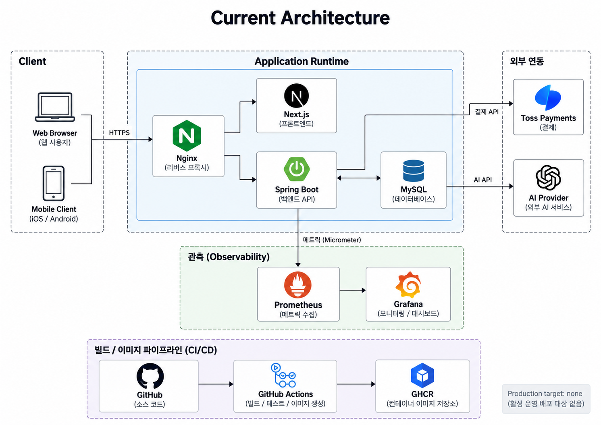
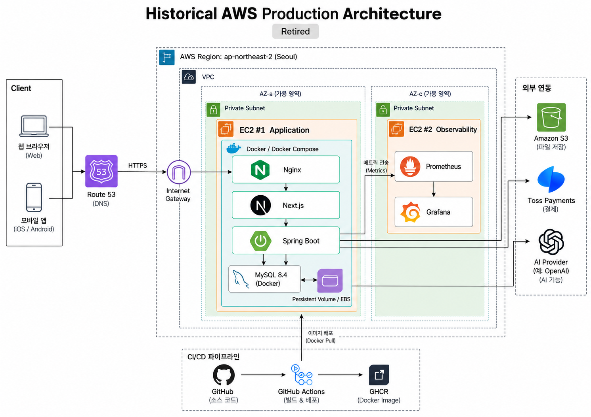

# 🐾 PawCycle Commerce

> **반려동물 반복 구매 상품의 일반 Commerce와 Subscription을 구현하고, 정합성·운영·성능·AI Harness를 실제 evidence로 검증하며 발전시키는 이커머스 프로젝트**

PawCycle Commerce는 상품 탐색부터 구매, 주문 이후 처리, 정기배송까지 이어지는 고객 경험과 이를 운영하는 관리자 기능을 함께 구현합니다.

목표는 기술 수를 늘리는 것이 아닙니다. **실제 Commerce/Subscription 제품을 만들고, 문제를 재현·측정한 뒤 필요한 코드·데이터·운영·아키텍처 변화를 선택하는 것**이 핵심입니다.

또한 AI가 구현을 돕는 환경에서도 사용자가 제품 목표·범위·위험·검증을 통제할 수 있도록 **Risk-based Lean Harness**를 저장소 개발 방식의 일부로 운영합니다.

---

## 🛒 Product

PawCycle의 핵심은 정기배송 하나가 아니라, **일반 구매와 반복 구매가 하나의 Commerce 흐름 안에서 이어지는 것**입니다.

### Customer Commerce

- 상품 검색, 카테고리·Facet 필터, 정렬, 비교
- 상품 상세와 SKU 선택
- 재고·구매 가능 상태 확인
- 리뷰와 상품 문의
- Wishlist와 Cart
- 배송지·Coupon·Checkout
- Toss Payments 기반 결제 흐름
- 주문 조회와 배송 상태
- 취소·반품·환불
- 재구매와 정기배송 전환
- 정기배송 생성·조회·변경
- Billing / Schedule / Reconciliation 상태 관리
- Pet / Address / Notification 등 회원 기능

### Admin Commerce

- 상품·카테고리·Facet·SKU 관리
- Inventory 조정
- Coupon / Membership 운영
- 주문·배송·취소·반품·환불 관리
- Payment reconciliation / retry
- Billing recovery
- Review / Q&A 운영
- Audit Log 확인

---

## 🛠 Tech Stack

### Backend

- Java 25
- Spring Boot 4.1.0
- Spring MVC
- Spring Security
- Spring Data JPA
- Spring Validation
- Spring AI 2.0.0
- Micrometer
- Gradle

### Frontend

- Next.js 16.2.10
- React 19.2.4
- TypeScript 6.0.3
- Toss Payments SDK 2.8.1

### Data / Runtime

- MySQL
- Flyway
- Docker / Docker Compose
- Nginx
- GHCR

### Observability / Engineering

- Prometheus
- Grafana
- GitHub Actions
- CodeRabbit
- ChatGPT
- Codex
- GitHub MCP

---

## 🧱 Architecture

PawCycle은 Spring Boot Backend와 Next.js Frontend를 중심으로 한 **Modular Monolith** 구조입니다.

Backend는 기능별 HTTP Adapter와 Application Service, Persistence Boundary의 책임을 분리하고 관계형 데이터 접근은 JPA를 기본으로 사용합니다. Lock, CAS, 운영 조회처럼 SQL 의미가 중요한 일부 경계에서는 직접 SQL을 제한적으로 유지합니다.

Frontend는 feature별 API module이 공통 HTTP transport를 사용하며 Session, CSRF, Idempotency, ETag 같은 서버 계약을 클라이언트 계층에서 보존합니다.

### Application Architecture

### Historical AWS Production Architecture

과거 AWS 운영에서는 Application EC2와 Observability EC2를 분리했습니다. Application EC2에서 Nginx, Next.js, Spring Boot, Docker MySQL을 운영하고 persistent volume으로 데이터를 보존했으며, 별도 Observability EC2에서 Prometheus와 Grafana를 운영했습니다. S3는 logical backup과 isolated restore에 사용했습니다.

---

## 🔐 Commerce Correctness

Commerce에서는 기능이 동작하는 것뿐 아니라 **중복 요청, 동시성, 상태 전이, 실패 복구**가 중요합니다.

PawCycle에서는 다음 경계를 코드와 테스트로 다룹니다.

- Session Authentication / Authorization / CSRF
- Idempotency reservation과 성공 결과 replay
- Cart version conflict
- Order / Payment / Inventory / Subscription 상태 전이
- Pessimistic Lock과 조건부 mutation
- Atomic upsert
- Subscription reconciliation
- Schedule별 실패 격리
- UTC 기반 시간 계약
- Validation과 공통 API error contract

Backend persistence 구조를 JPA 중심으로 수렴하면서도 기존 lock·idempotency·transaction 의미를 보존하도록 검증했습니다.

**Evidence**

- [PR #275 - Backend 구조 리팩터링](https://github.com/guseoh/pawcycle-commerce/pull/275)
- [PR #278 - Backend 구조 및 기술 부채 정리](https://github.com/guseoh/pawcycle-commerce/pull/278)
- [PR #279 - Persistence JPA 수렴](https://github.com/guseoh/pawcycle-commerce/pull/279)
- [PR #280 - HTTP Contract / Frontend Client 수렴](https://github.com/guseoh/pawcycle-commerce/pull/280)

---

## 📈 Performance

성능과 아키텍처는 기술을 먼저 선택한 뒤 이유를 붙이지 않고, **문제를 재현하고 측정한 뒤 선택**합니다.

N+1 문제를 page size별 SQL query 수로 측정한 뒤 batch 조회를 적용하고 같은 조건에서 다시 검증했습니다.

| API | Before 10 | Before 20 | Before 100 | After 10 | After 20 | After 100 |
| --- | ---: | ---: | ---: | ---: | ---: | ---: |
| Plans | 32 | 52 | 212 | 14 | 14 | 14 |
| Subscriptions | 51 | 91 | 411 | 15 | 15 | 19 |

- [PR #102 - N+1 측정](https://github.com/guseoh/pawcycle-commerce/pull/102)
- [PR #103 - Batch 조회 개선](https://github.com/guseoh/pawcycle-commerce/pull/103)

이 수치는 당시 Local Representative Fixture 기준의 측정 evidence이며 Production capacity나 SLO 수치가 아닙니다.

---

## 🔄 Reliability & Recovery

### Subscription 단위 실패 격리

여러 Subscription을 하나의 transaction으로 처리할 때 하나의 실패가 batch 전체로 전파되는 문제를 분리했습니다. 각 Subscription을 독립 transaction 경계에서 처리하여 실패 대상만 rollback하고 이후 처리를 계속할 수 있도록 검증했습니다.

**Evidence:** [PR #106](https://github.com/guseoh/pawcycle-commerce/pull/106)

### Idempotency Retention

성공 결과 replay 안전성을 유지하면서 데이터가 무한 증가하지 않도록 완료 시각, 30일 retention, bounded cleanup을 적용하고 cleanup/replay 경쟁을 검증했습니다.

**Evidence:** [PR #108](https://github.com/guseoh/pawcycle-commerce/pull/108)

### MySQL Lock 검증

Migration과 동시성 작업에서는 `FOR UPDATE`의 효과를 코드만 보고 추측하지 않고 격리된 MySQL 환경에서 실제 lock footprint를 확인했습니다.

**Evidence:** [PR #104](https://github.com/guseoh/pawcycle-commerce/pull/104)

---

## 🔭 Operations Experience

PawCycle은 저장소 안에서만 끝나는 프로젝트가 아니라 실제 배포·관측·장애 대응·복구까지 경험하고 evidence를 남겼습니다.

AWS 환경에서 다음을 구축하거나 검증했습니다.

- Docker Compose 기반 application runtime
- Nginx / HTTPS
- commit SHA + image digest 기반 release 식별
- deploy / rollback
- logical backup / isolated restore
- Session / Auth Production smoke
- Prometheus / Grafana observability
- incident 재현과 recovery runbook
- RDS Single-AZ 전환을 위한 repository readiness 검토

**관련 Evidence**

- [Production Operations Overview](docs/architecture/production-operations-overview.md)
- [PR #112 - Backend Observability](https://github.com/guseoh/pawcycle-commerce/pull/112)
- [PR #113 - Prometheus / Grafana](https://github.com/guseoh/pawcycle-commerce/pull/113)
- [PR #116 - Incident Reproduction / Recovery](https://github.com/guseoh/pawcycle-commerce/pull/116)

---

## 🤖 AI Lean Harness

PawCycle에서 AI 활용의 목표는 코드 생성량이 아니라 **AI가 구현을 돕더라도 사람이 목표·범위·위험·검증을 통제할 수 있는가**에 있습니다.

핵심 원칙은 다음과 같습니다.

- 제품·도메인·보안·비용·운영 결정은 사용자가 최종 승인
- 저장소 작업을 위험도에 따라 분류
- 저장소 변경과 실제 운영 실행을 별도 승인 경계로 분리
- 하나의 사용자 목적을 coherent work unit으로 관리
- 상세 작업 명세와 실제 AI 실행 Prompt를 분리
- Codex 실행 전 실제 변경 Delta를 추출하고 Prompt를 경량화
- 변경 영향에 맞는 CI lane과 regression 실행
- 외부 AI review를 defect-discovery input으로 사용하되 실제 코드·계약·테스트와 대조
- 실패·미실행·review 한계·남은 위험을 숨기지 않음

- [Risk-based Lean Harness](docs/runbook/lean-harness.md)
- [Repository Agent Rules](AGENTS.md)

---

## 🔎 Engineering Highlights

README에는 전체 작업을 나열하지 않고 PawCycle의 방향을 잘 보여주는 evidence만 선별합니다.

| Topic | Engineering Point | Evidence |
| --- | --- | --- |
| Product Completion | Customer/Admin Commerce flow 연결 | [PR #267](https://github.com/guseoh/pawcycle-commerce/pull/267) |
| Customer UX | 실제 Commerce 기준 Visual Closure | [PR #269](https://github.com/guseoh/pawcycle-commerce/pull/269) |
| Query Performance | N+1 측정 후 동일 조건 개선 | [#102](https://github.com/guseoh/pawcycle-commerce/pull/102), [#103](https://github.com/guseoh/pawcycle-commerce/pull/103) |
| Concurrency | 실제 MySQL lock footprint 검증 | [PR #104](https://github.com/guseoh/pawcycle-commerce/pull/104) |
| Reliability | Subscription 실패 격리 / Reconciliation | [PR #106](https://github.com/guseoh/pawcycle-commerce/pull/106) |
| Idempotency | Retention / Cleanup / Concurrency | [PR #108](https://github.com/guseoh/pawcycle-commerce/pull/108) |
| Operations | Observability / Incident / Recovery | [#112](https://github.com/guseoh/pawcycle-commerce/pull/112), [#116](https://github.com/guseoh/pawcycle-commerce/pull/116) |
| Backend Refactoring | 동작 보존 JPA persistence 수렴 | [PR #279](https://github.com/guseoh/pawcycle-commerce/pull/279) |
| HTTP Contract | Validation / REST / Frontend client 수렴 | [PR #280](https://github.com/guseoh/pawcycle-commerce/pull/280) |
| AI Harness | Risk-based Lean Harness | [PR #282](https://github.com/guseoh/pawcycle-commerce/pull/282) |

---

## 🎯 Project Focus

PawCycle Commerce에서 보여주고 싶은 것은 특정 기술을 많이 사용했다는 사실이 아닙니다.

- 실제 사용자 가치가 있는 Commerce / Subscription 제품
- 정합성과 실패 복구를 포함한 Backend 설계
- 문제 재현과 동일 조건 Before / After를 기반으로 한 성능 개선
- 배포·관측·장애 대응·복구의 운영 경험
- AI 결과의 목표·범위·위험·검증을 사람이 통제하는 Lean Harness

---

## 📚 Documentation

- Product: [`docs/product/**`](docs/product/)
- Domain: [`docs/domain/**`](docs/domain/)
- API: [`docs/api/**`](docs/api/)
- Data / Migration: [`docs/data/**`](docs/data/)
- ADR: [`docs/adr/**`](docs/adr/)
- Operations / Runbook: [`docs/runbook/**`](docs/runbook/)
- Architecture: [`docs/architecture/**`](docs/architecture/)
- Reports / Evidence: [`docs/reports/**`](docs/reports/)
- Learning History: [`docs/learning/**`](docs/learning/)
