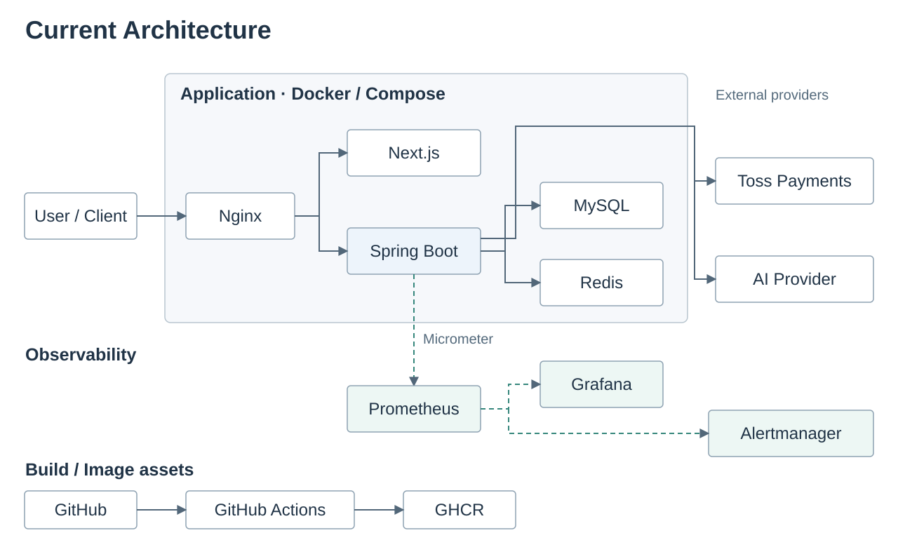
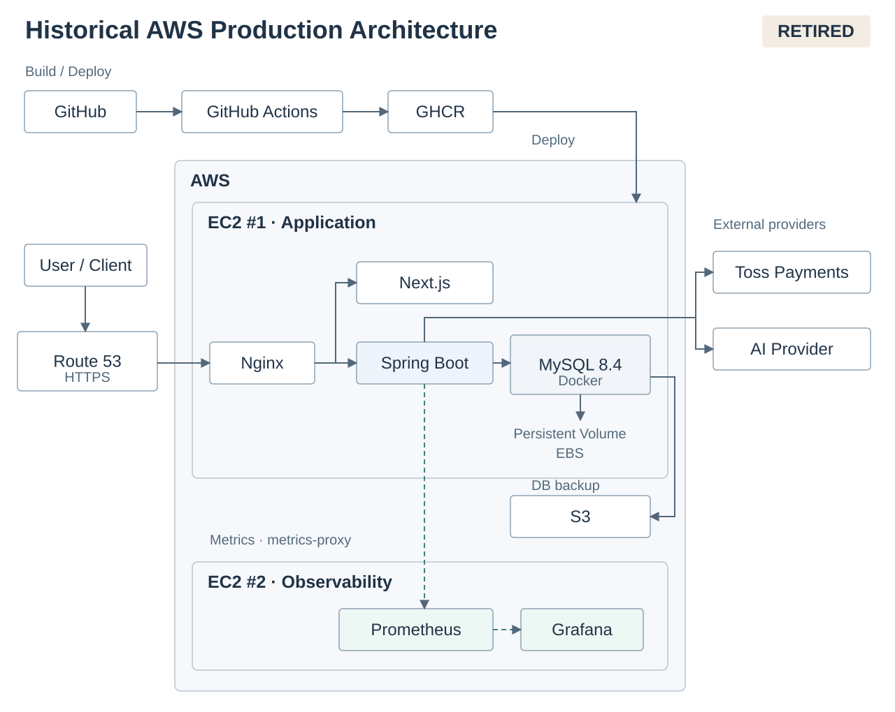

# 🐾 PawCycle Commerce

> **반려동물 반복 구매 상품의 일반 Commerce와 Subscription을 구현하고, 정합성·운영·성능·AI Harness를 실제 evidence로 검증하며 발전시키는 이커머스 프로젝트**

PawCycle Commerce는 상품 탐색부터 구매, 주문 이후 처리, 정기배송까지 이어지는 고객 경험과 이를 운영하는 관리자 기능을 함께 구현합니다.

목표는 기술 수를 늘리는 것이 아닙니다. **실제 Commerce/Subscription 제품을 만들고, 현재 구조에서 문제를 재현·측정한 뒤 필요한 코드·데이터·운영·아키텍처 변화를 선택하는 것**이 핵심입니다.

또한 AI가 구현을 돕는 환경에서도 사용자가 제품 목표·범위·위험·검증을 통제할 수 있도록 **Risk-based Lean Harness**를 저장소 개발 방식의 일부로 운영합니다.

---

## 📌 Current Snapshot

| 구분 | 현재 상태 |
| --- | --- |
| Product | Customer/Admin Commerce + Subscription 주요 흐름 구현 |
| Architecture | Spring Boot + Next.js 기반 Modular Monolith |
| Persistence | Spring Data JPA 중심, lock/CAS 등 필요한 경계에 제한적 직접 SQL |
| Authentication | Session 기반 인증 + CSRF 보호 |
| Production target | **없음** |
| Cloud | AWS active runtime 종료, OCI는 승인된 후속 방향이지만 아직 active target 아님 |
| CD / Zero-downtime | **DEFER / DEFER** |
| Performance | 과거 측정·개선 evidence 보유, 현재 구조 기준 Re-baseline 예정 |
| AI Harness | **PCC_V6** 기준 Risk-based Lean Harness |

현재 `main`은 고객·관리자 Commerce 흐름을 연결한 뒤 Backend persistence와 HTTP/Frontend client 구조를 정리했고, 종료된 AWS Production 실행 계약은 active contract에서 제거한 상태입니다.

---

## 🛒 Product

PawCycle의 핵심은 정기배송 하나가 아니라, **일반 구매와 반복 구매가 하나의 Commerce 흐름 안에서 이어지는 것**입니다.

### Customer Commerce

- 상품 검색, 카테고리·Facet 필터, 정렬, 비교
- 상품 상세와 SKU 선택
- 재고·구매 가능 상태 확인
- 리뷰와 상품 문의
- Wishlist와 Cart
- 배송지·Coupon·Checkout
- Toss Payments 기반 결제 흐름
- 주문 조회와 배송 상태
- 취소·반품·환불
- 재구매와 정기배송 전환
- 정기배송 생성·조회·변경
- Billing / Schedule / Reconciliation 상태 관리
- Pet / Address / Notification 등 회원 기능

### Admin Commerce

- 상품·카테고리·Facet·SKU 관리
- Inventory 조정
- Coupon / Membership 운영
- 주문·배송·취소·반품·환불 관리
- Payment reconciliation / retry
- Billing recovery
- Review / Q&A 운영
- Audit Log 확인

Customer Commerce의 주요 화면과 Admin 운영 흐름은 Backend API와 연결된 제품 흐름으로 관리합니다.

---

## 🧱 Architecture

PawCycle은 현재 하나의 Spring Boot Backend와 Next.js Frontend를 중심으로 한 **Modular Monolith** 구조를 유지합니다.

Backend는 기능별 HTTP Adapter와 Application Service, Persistence Boundary의 책임을 분리하고 관계형 데이터 접근은 JPA를 기본으로 사용합니다. Lock, CAS, 운영 조회처럼 SQL 의미가 중요한 일부 경계에서는 직접 SQL을 제한적으로 유지합니다.

Frontend는 feature별 API module이 공통 HTTP transport를 사용하며 Session, CSRF, Idempotency, ETag 같은 서버 계약을 클라이언트 계층에서 보존합니다.

아래 두 그림은 현재 저장소의 application/container topology와 종료된 AWS 운영 구성을 구분합니다.

### Current Architecture

현재 Production deployment target은 **없음**, CD는 **DEFER**입니다. OCI는 후속 방향이며 active Production 또는 Production Verified 상태가 아닙니다.

### Historical AWS Production Architecture

AWS runtime은 **retired** 상태이며, 이 그림은 과거 운영 구성을 보존한 역사적 evidence입니다. MySQL 8.4는 Application EC2의 Docker와 persistent volume에서 운영했고, S3는 DB 백업·격리 복원에 사용했습니다. RDS Single-AZ는 전환 준비만 수행했으며 Production cutover는 완료하지 않았습니다.

현재 Cloud/Production 실행 경계는 별도 문서에서 관리합니다.

- [Backend Persistence Convergence](docs/architecture/backend-persistence-convergence.md)
- [Production Operations Overview](docs/architecture/production-operations-overview.md)
- [Commerce Runtime Refactoring ADR](docs/adr/ARCH-009-commerce-runtime-refactoring.md)

---

## 🔐 Commerce Correctness

Commerce에서는 기능이 동작하는 것뿐 아니라 **중복 요청, 동시성, 상태 전이, 실패 복구**가 중요합니다.

PawCycle에서는 다음 경계를 코드와 테스트로 다룹니다.

- Session Authentication / Authorization / CSRF
- Idempotency reservation과 성공 결과 replay
- Cart version conflict
- Order / Payment / Inventory / Subscription 상태 전이
- Pessimistic Lock과 조건부 mutation
- Atomic upsert
- Subscription reconciliation
- Schedule별 실패 격리
- UTC 기반 시간 계약
- Validation과 공통 API error contract

최근 Backend persistence 수렴에서는 `JdbcTemplate` 기반 구현을 단순 치환하지 않고 기존 lock·idempotency·transaction 의미를 보존하면서 JPA 중심 구조로 정리했습니다.

**Evidence**

- [PR #275 - Backend 구조 리팩터링](https://github.com/guseoh/pawcycle-commerce/pull/275)
- [PR #278 - Backend 구조 및 기술 부채 정리](https://github.com/guseoh/pawcycle-commerce/pull/278)
- [PR #279 - Persistence JPA 수렴](https://github.com/guseoh/pawcycle-commerce/pull/279)
- [PR #280 - HTTP Contract / Frontend Client 수렴](https://github.com/guseoh/pawcycle-commerce/pull/280)

---

## 📈 Performance: Measure Before Scale

성능과 아키텍처는 기술을 먼저 선택한 뒤 이유를 붙이지 않고, **문제를 재현하고 측정한 뒤 선택**합니다.

과거에는 N+1 문제를 page size별 SQL query 수로 측정한 뒤 batch 조회를 적용하고 같은 조건에서 다시 검증했습니다.

| API | Before 10 | Before 20 | Before 100 | After 10 | After 20 | After 100 |
| --- | ---: | ---: | ---: | ---: | ---: | ---: |
| Plans | 32 | 52 | 212 | 14 | 14 | 14 |
| Subscriptions | 51 | 91 | 411 | 15 | 15 | 19 |

- [PR #102 - N+1 측정](https://github.com/guseoh/pawcycle-commerce/pull/102)
- [PR #103 - Batch 조회 개선](https://github.com/guseoh/pawcycle-commerce/pull/103)

이 수치는 당시 Local Representative Fixture 기준의 역사적 evidence이며, 현재 Production SLO나 현재 구조의 capacity로 해석하지 않습니다.

현재 Product Completion 구조에 대해서는 새로운 Baseline을 다시 만들고 다음 영역을 evidence 순서대로 검증할 예정입니다.

- Scale Dataset: 10K → 100K → 1M → 필요 시 그 이상
- SQL / Index / JPA Query Plan
- N+1 / Pagination / Projection
- Transaction / Lock Contention / Deadlock
- Connection Pool / JVM / GC
- Redis Cache hit·miss·staleness와 유지 범위
- Async / Queue / Kafka가 필요한 실제 조건
- Single-instance capacity와 Scale-out 필요성
- Multi-instance / Load Balancer / Distributed State
- HA / Failover / Backup / Restore의 비용과 복구 목표

---

## 🔄 Reliability & Recovery

### Subscription 단위 실패 격리

여러 Subscription을 하나의 transaction으로 처리할 때 하나의 실패가 batch 전체로 전파되는 문제를 분리했습니다. 각 Subscription을 독립 transaction 경계에서 처리하여 실패 대상만 rollback하고 이후 처리를 계속할 수 있도록 검증했습니다.

**Evidence:** [PR #106](https://github.com/guseoh/pawcycle-commerce/pull/106)

### Idempotency Retention

성공 결과 replay 안전성을 유지하면서 데이터가 무한 증가하지 않도록 완료 시각, 30일 retention, bounded cleanup을 적용하고 cleanup/replay 경쟁을 검증했습니다.

**Evidence:** [PR #108](https://github.com/guseoh/pawcycle-commerce/pull/108)

### MySQL Lock 검증

Migration과 동시성 작업에서는 `FOR UPDATE`의 효과를 코드만 보고 추측하지 않고 격리된 MySQL 환경에서 실제 lock footprint를 확인했습니다.

**Evidence:** [PR #104](https://github.com/guseoh/pawcycle-commerce/pull/104)

---

## 🔭 Operations: History and Current Boundary

PawCycle은 저장소 안에서만 끝나는 프로젝트가 아니라 실제 배포·관측·장애 대응·복구까지 경험하고 evidence를 남겼습니다.

과거 AWS 환경에서는 다음을 구축하거나 검증했습니다.

- Docker Compose 기반 application runtime
- Nginx / HTTPS
- commit SHA + image digest 기반 release 식별
- deploy / rollback
- logical backup / isolated restore
- Session / Auth Production smoke
- Prometheus / Grafana observability
- Alertmanager 기반 장애 알림
- incident 재현과 recovery runbook
- RDS 전환 준비와 운영 경계 검토

이 경험은 역사적 evidence로 보존하지만, **현재 AWS Production runtime이 존재한다는 뜻은 아닙니다.** 종료된 AWS 실행 경로는 active contract에서 제거했습니다.

현재 상태:

- Production deployment target: **없음**
- CD: **DEFER**
- Zero-downtime deployment: **DEFER**
- AWS provider-specific deploy/restore/alarm 실행 계약: **retired**
- GHCR image publish, Dockerfile, Compose, Nginx, smoke/diagnosis/observability: provider-neutral 자산으로 유지
- OCI: 승인된 후속 배포 방향이지만 아직 active Production target 또는 Production Verified 상태가 아님

새 Production target을 활성화할 때는 AWS 구조를 이름만 바꾸어 옮기지 않고 network/ingress, secret delivery, database, backup/restore, deploy/rollback, health/smoke/observability, 비용과 복구 목표를 다시 설계합니다.

**관련 문서 / Evidence**

- [Production Operations Overview](docs/architecture/production-operations-overview.md)
- [PR #112 - Backend Observability](https://github.com/guseoh/pawcycle-commerce/pull/112)
- [PR #113 - Prometheus / Grafana](https://github.com/guseoh/pawcycle-commerce/pull/113)
- [PR #116 - Incident Reproduction / Recovery](https://github.com/guseoh/pawcycle-commerce/pull/116)
- [PR #118 - Prometheus Alert](https://github.com/guseoh/pawcycle-commerce/pull/118)
- [PR #120 - Discord Alert](https://github.com/guseoh/pawcycle-commerce/pull/120)
- [PR #283 - Production Deploy 승인 경계 복원](https://github.com/guseoh/pawcycle-commerce/pull/283)
- [PR #284 - AWS 활성 운영 계약 철거](https://github.com/guseoh/pawcycle-commerce/pull/284)
- [Draft PR #277 - OCI Repository Migration Readiness](https://github.com/guseoh/pawcycle-commerce/pull/277)

---

## 🤖 AI Lean Harness

PawCycle에서 AI 활용의 목표는 코드 생성량이 아니라 **AI가 구현을 돕더라도 사람이 목표·범위·위험·검증을 통제할 수 있는가**에 있습니다.

현재 Harness는 **PCC_V6** 기준으로 운영하며, 핵심 원칙은 다음과 같습니다.

- 제품·도메인·보안·비용·운영 결정은 사용자가 최종 승인
- 저장소 작업을 `경량 / 일반 / 고위험`으로 분류
- `저장소 변경`과 `실제 운영 실행`을 별도 승인 경계로 분리
- 하나의 사용자 목적을 coherent work unit으로 다룸
- 상세 작업 명세와 실제 AI 실행 Prompt를 분리
- Codex 실행 전 현재 작업의 Delta를 추출하고 경량화
- `Final Lightweight Delta Prompt` 사용
- 변경 영향에 맞는 CI lane과 regression 실행
- CodeRabbit / Codex Review / ChatGPT review를 defect-discovery input으로 사용
- 실패·미실행·review 한계·남은 위험을 숨기지 않음
- 실제 운영 증거가 없으면 `Production Verified`라고 표현하지 않음

세부 절차를 README에 복제하지 않고 권위 원본에서 관리합니다.

- [Risk-based Lean Harness](docs/runbook/lean-harness.md)
- [Repository Agent Rules](AGENTS.md)
- [PR #282 - Lean Harness 실행 경계 재구성](https://github.com/guseoh/pawcycle-commerce/pull/282)

---

## 🧪 Validation & Evidence Levels

Repository 변경은 영향 영역에 따라 필요한 검증만 실행합니다.

- Backend: Gradle test / build + 필요한 경우 실제 MySQL integration
- Frontend: lint / typecheck / test / production build
- Harness: convention / classifier / workflow regression
- Provider-neutral Production contracts: Compose / release readiness / auth lifecycle 등 관련 정적·회귀 검증
- Browser QA: 실제 사용자 흐름의 독립 검증이 필요한 경우

CI Green만으로 의미상 정확성을 대신하지 않고 다음 수준을 구분합니다.

| 상태 | 의미 |
| --- | --- |
| Implemented | 승인된 저장소 변경 완료 |
| Verified | 정의한 테스트·CI·통합·실험 검증 완료 |
| Production Verified | 실제 운영 적용 전후와 필요한 복구 evidence까지 확보 |

---

## 🛠 Tech Stack

### Backend

- Java 25
- Spring Boot 4.1.0
- Spring MVC
- Spring Security
- Spring Data JPA
- Spring Data Redis
- Spring Validation
- Spring AI 2.0.0
- Micrometer
- Gradle

### Frontend

- Next.js 16.2.10
- React 19.2.4
- TypeScript 6.0.3
- Toss Payments SDK 2.8.1

### Data / Runtime Assets

- MySQL
- Flyway
- Redis
- Docker / Docker Compose
- Nginx
- GHCR

### Observability / Engineering

- Prometheus
- Grafana
- Alertmanager
- GitHub Actions
- CodeRabbit
- ChatGPT
- Codex
- GitHub MCP

---

## 🔎 Selected Evidence

README에는 전체 작업을 나열하지 않고 PawCycle의 방향을 잘 보여주는 evidence만 선별합니다.

| Topic | Engineering Point | Evidence |
| --- | --- | --- |
| Product Completion | Customer/Admin Commerce flow 연결 | [PR #267](https://github.com/guseoh/pawcycle-commerce/pull/267) |
| Customer UX | 실제 Commerce 기준 Visual Closure | [PR #269](https://github.com/guseoh/pawcycle-commerce/pull/269) |
| Query Performance | N+1 측정 후 동일 조건 개선 | [#102](https://github.com/guseoh/pawcycle-commerce/pull/102), [#103](https://github.com/guseoh/pawcycle-commerce/pull/103) |
| Concurrency | 실제 MySQL lock footprint 검증 | [PR #104](https://github.com/guseoh/pawcycle-commerce/pull/104) |
| Reliability | Subscription 실패 격리 / Reconciliation | [PR #106](https://github.com/guseoh/pawcycle-commerce/pull/106) |
| Idempotency | Retention / Cleanup / Concurrency | [PR #108](https://github.com/guseoh/pawcycle-commerce/pull/108) |
| Operations | Observability / Incident / Alert | [#112](https://github.com/guseoh/pawcycle-commerce/pull/112), [#116](https://github.com/guseoh/pawcycle-commerce/pull/116), [#120](https://github.com/guseoh/pawcycle-commerce/pull/120) |
| Backend Refactoring | 동작 보존 JPA persistence 수렴 | [PR #279](https://github.com/guseoh/pawcycle-commerce/pull/279) |
| HTTP Contract | Validation / REST / Frontend client 수렴 | [PR #280](https://github.com/guseoh/pawcycle-commerce/pull/280) |
| AI Harness | Risk-based Lean Harness 재구성 | [PR #282](https://github.com/guseoh/pawcycle-commerce/pull/282) |
| Operations Safety | Production 실행 승인 경계 복원 | [PR #283](https://github.com/guseoh/pawcycle-commerce/pull/283) |
| Cloud Lifecycle | AWS active contract retirement | [PR #284](https://github.com/guseoh/pawcycle-commerce/pull/284) |

---

## ➕ Next Focus

앞으로의 순서는 고정 일정표가 아니라 현재 evidence에 따라 갱신합니다.

- 현재 코드·도메인·Security·DB·Request Flow·Operations·Harness 재구성 학습
- 기존 Session 인증 구조 이해 후 JWT 기반 인증·인가 재설계
- Performance Test Environment와 representative workload 설계
- Scale Dataset model / generator와 reproducible baseline 구축
- OS / Network / JVM / Spring / JPA / DB / Application 병목 분석
- 동일 조건 Before / After 검증
- 남는 한계가 있을 때만 Redis / Async / Queue / Kafka 판단
- Single-instance capacity 이후 필요할 때 Multi-instance / Load Balancer 검증
- 새로운 Production target의 deploy / backup / restore / recovery 계약 재설계

Redis, Queue, Kafka, Multi-instance, Load Balancer, Read Replica, Sharding, Kubernetes 같은 기술은 목표가 아닙니다. **측정된 문제·정합성·운영 요구·비용·복구 목표가 있을 때만 선택합니다.**

---

## 🎯 What I Want to Prove

PawCycle Commerce에서 보여주고 싶은 것은 특정 기술을 많이 사용했다는 사실이 아닙니다.

> **AI가 구현을 돕는 환경에서도 개발자가 자신이 만든 시스템과 도메인을 이해하고 목표·범위·위험·검증을 통제하며, 실제 서비스를 운영하고, 데이터와 트래픽 증가로 드러난 문제를 근거로 코드·데이터·보안·아키텍처를 발전시킬 수 있는가?**

이를 위해 다음을 하나의 프로젝트 안에서 연결합니다.

- 실제 사용자 가치가 있는 Commerce / Subscription 제품
- 정합성과 실패 복구를 포함한 Backend 설계
- 배포·관측·장애 대응·복구의 운영 경험
- 재현 가능한 성능 측정과 Before / After
- 필요할 때만 확장하는 아키텍처
- AI 결과의 목표·범위·위험·검증을 통제하는 Lean Harness

---

## 📚 Documentation

- Product: [`docs/product/**`](docs/product/)
- Domain: [`docs/domain/**`](docs/domain/)
- API: [`docs/api/**`](docs/api/)
- Data / Migration: [`docs/data/**`](docs/data/)
- ADR: [`docs/adr/**`](docs/adr/)
- Operations / Runbook: [`docs/runbook/**`](docs/runbook/)
- Architecture: [`docs/architecture/**`](docs/architecture/)
- Reports / Evidence: [`docs/reports/**`](docs/reports/)
- Learning History: [`docs/learning/**`](docs/learning/)
