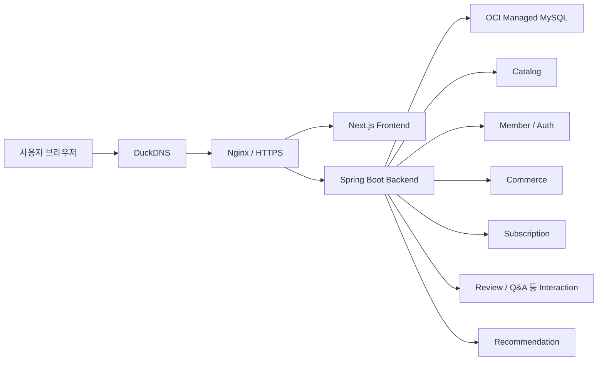
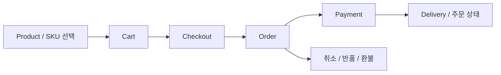
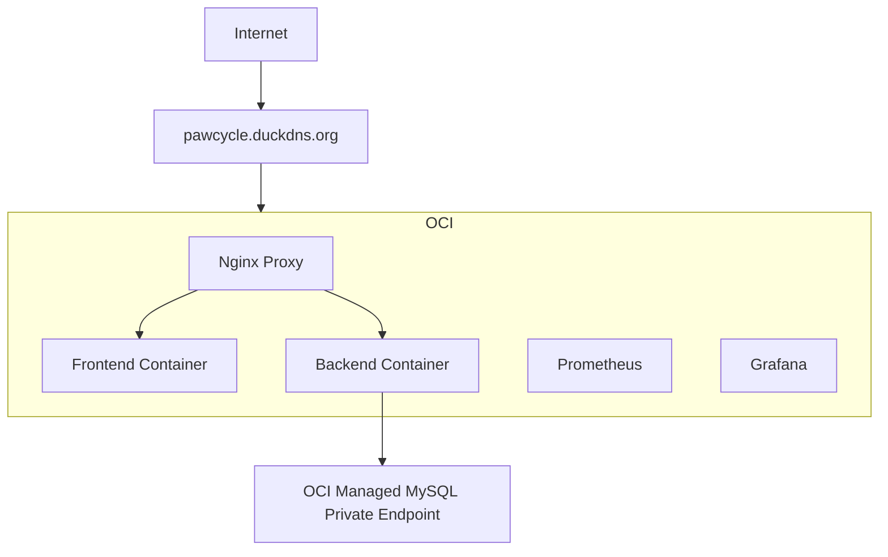

# PawCycle Commerce 현재 시스템 재구성

> 기준: `main` commit `c09302a82d541f0c351d0f619f30232c7adaca51`
>
> 목적: 성능·대규모 트래픽 단계에 들어가기 전에 현재 PawCycle Commerce를 코드와 별개로 설명할 수 있는 기준선을 만든다. 이 문서는 과거 MVP 문서를 합쳐 다시 쓰는 문서가 아니라, 최신 `main`의 제품·코드·migration·보안·운영 근거를 다시 대조해 만든 현재 상태 스냅샷이다.

## 1. 왜 다시 재구성하는가

PawCycle에는 MVP 단계별 요구사항, Subscription 중심 도메인 문서, ADR, 운영 Runbook과 과거 AWS 증거가 누적되어 있다. 하지만 현재 Backend는 `catalog`, `commerce`, `interaction`, `member`, `recommendation`, `subscription` 영역까지 확장되었고, 실제 Production은 OCI에서 동작한다.

따라서 과거 문서만 이어 읽으면 현재 시스템을 정확히 설명하기 어렵다. 특히 `docs/architecture/production-operations-overview.md`에는 Production target이 없고 OCI가 아직 Production Verified가 아니라고 남아 있어 현재 실제 운영 상태와 drift가 존재한다. 이번 재구성에서는 이런 역사 문서를 삭제하지 않고, 현재 상태 기준선을 별도로 만든다.

## 2. 현재 시스템의 큰 경계

현재 Production application topology는 Backend, Frontend, Nginx Proxy를 OCI Compute의 Docker Compose로 실행하고, 데이터베이스는 Compose 외부의 OCI Managed MySQL private endpoint를 사용한다. Prometheus와 Grafana 관측 구성도 같은 Compute에서 별도 Compose 경계로 운영한다.

## 3. Actor

현재 사용자 흐름을 설명할 때 최소 Actor를 다음과 같이 구분한다.

| Actor | 현재 의미 |
| --- | --- |
| 비회원 | 공개 Catalog 조회, 검색·필터, 공개 추천과 상품 상세 조회 |
| 회원 | 로그인 세션을 가진 사용자. Cart, Wishlist, Checkout, Order, Coupon, Subscription, 개인 Interaction 등 인증 API 사용 |
| 관리자 | `ROLE_ADMIN` 권한으로 `/api/admin/**` 영역 사용 |
| 시스템 자동화 | Subscription schedule·billing 등 백그라운드 자동화. Production one-shot Catalog import와는 별도 |
| 외부 결제 시스템 | Toss 결제 승인·실패·환불 흐름의 외부 경계 |
| 운영자 | Production release, Catalog one-shot, 관측, 복구 등 고위험 운영 절차를 승인·실행하는 사람 |

## 4. 현재 사용자 Journey 기준 Use Case

### 4.1 상품 탐색

1. 사용자가 Home 또는 상품 목록으로 진입한다.
2. 공개 Catalog discovery를 통해 Category, Brand, Facet 정보를 조회한다.
3. DOG/CAT, Category/Subcategory, Brand, Facet, 가격·구매 가능 여부 등으로 상품 목록을 좁힌다.
4. Product Detail에서 SKU option, 가격, 할인, 재고, 구독 가능 여부와 상세 정보를 확인한다.
5. 연관/보완/인기·트렌드 상품 추천으로 탐색을 확장할 수 있다.

현재 Production Customer Catalog 기준은 Product 100, SKU 166, Brand 10, Customer Category 27, DOG/CAT Product 각 50이며 실제 OCI Production에서 적용·공개 API·브라우저까지 확인됐다.

### 4.2 인증

1. Client는 CSRF token을 준비한다.
2. `POST /api/auth/login`으로 인증을 요청한다.
3. 성공하면 Session ID가 교체되고 SecurityContext가 HttpSession에 저장된다.
4. 이후 인증 API는 JSESSIONID session으로 사용자 신원을 복원한다.
5. Logout은 CSRF 처리, SecurityContext 제거, JSESSIONID 삭제를 함께 수행한다.

현재 인증은 JWT가 아니라 server-side Session 기반이다.

### 4.3 일반 구매

현재 코드에는 Cart → Checkout → Order → Payment를 분리한 API 경계가 존재한다.

Checkout에는 별도 idempotency service가 존재하므로, 이후 Transaction·정합성 재구성에서는 주문 생성과 중복 요청 방지 경계를 함께 확인해야 한다.

### 4.4 정기배송

Subscription은 단순 Product flag가 아니라 독립된 핵심 도메인이다. 회원이 구독 가능한 SKU와 주기를 선택해 Subscription을 생성하고, schedule과 billing 흐름이 이후 주문 생성·결제와 연결된다. 현재 저장소에는 Subscription self-service와 automation 요구사항·도메인 문서가 별도로 존재한다.

### 4.5 구매 후 흐름

현재 Commerce persistence에는 주문 취소, 반품, 환불, 배송, Notification, Membership, Coupon, 관리자 Audit 등 구매 이후 기능을 위한 모델이 존재한다. 따라서 현재 PawCycle은 초기 “상품 + 구독” MVP보다 넓은 Commerce lifecycle을 가진다.

## 5. Backend 논리 모듈

최신 `main`의 Backend 최상위 패키지는 다음 경계를 가진다.

| 모듈 | 책임 |
| --- | --- |
| `catalog` | Category, Brand, Product/SKU, Discovery 등 상품 카탈로그 |
| `member` | Member와 인증 |
| `commerce` | Cart, Wishlist, Checkout, Order, Payment, Coupon, Delivery, Refund 등 일반 Commerce lifecycle |
| `subscription` | 정기배송 생성·조회·변경과 schedule/billing automation |
| `interaction` | 상품과 회원의 interaction 영역 |
| `recommendation` | 인기·트렌드·연관·보완 추천 |
| `common` | Security 등 공통 Web/Application 기반 |
| `foundation` | 공통 persistence/runtime 기반 |

이 패키지 경계가 곧 DDD bounded context라고 단정하지 않는다. 실제 Transaction과 데이터 관계를 대조한 뒤 도메인 경계를 다시 판정한다.

## 6. 인증·인가 현재 구조

`SecurityConfig` 기준 현재 핵심 계약은 다음과 같다.

- Spring Security servlet filter chain을 사용한다.
- SecurityContext는 `HttpSessionSecurityContextRepository`에 저장한다.
- Session fixation 방어는 `changeSessionId` 전략을 사용한다.
- CSRF token은 HttpSession 기반이며 request header 이름은 `X-CSRF-TOKEN`이다.
- 비밀번호는 BCrypt encoder를 사용한다.
- `/api/products`, `/api/products/**`, `/api/categories`, `/api/catalog/discovery`, `/api/auth/csrf`의 일부 GET은 공개다.
- 공개 추천 GET도 허용한다.
- `/api/auth/login`은 공개, `/api/auth/logout`, `/api/auth/me`는 인증 필요다.
- `/api/admin/**`는 `ROLE_ADMIN`이 필요하다.
- 나머지 `/api/**`는 인증이 필요하다.
- 그 외 request는 deny-all이다.

이 구조는 Security 재구성 단계에서 로그인 controller/provider, principal, session lifecycle, CSRF, CORS, logout, 예외 응답까지 실제 request flow로 다시 펼친다.

## 7. 데이터 구조 재구성 방향

Flyway migration은 Subscription 중심 초기 Schema에서 시작해 RBAC/Admin Catalog, Commerce supporting domain, 공통 Order/Payment/Billing, after-sales, operations와 automation 상태를 계속 추가해 왔다. JPA entity도 Member, Brand, Category 외에 Cart/CartItem, Wishlist, Delivery, Refund, Return, Coupon, Membership, Notification, AdminAudit 등으로 확장되어 있다.

따라서 ERD는 단순히 현재 JPA entity annotation만 그리지 않고 다음 세 근거를 함께 사용한다.

1. Flyway migration의 실제 table/FK/unique/index 계약
2. 현재 JPA mapping
3. Service transaction과 business key 사용 방식

최종 ERD에는 최소 `Member → Cart/Wishlist/Order/Subscription`, `Catalog → Product/SKU/Inventory`, `Order → Payment/Delivery/After-sales`, `Subscription → Schedule/Billing/Order` 관계가 드러나야 한다.

## 8. Production 배포 구조

현재 실제 운영 기준은 다음과 같다.

- Region: `ap-tokyo-1`
- Application subnet과 DB subnet을 분리한다.
- Backend/Frontend/Proxy는 `pawcycle-production` Compose project로 운영한다.
- MySQL은 Compose lifecycle 외부에 있다.
- Backend host port는 Public으로 직접 열지 않고 Nginx를 ingress 경계로 사용한다.
- HTTPS/DNS 적용이 완료되어 실제 공개 서비스가 OCI를 가리킨다.
- Observability는 같은 Compute에서 운영하며 별도 관측용 Compute는 현재 보류 상태다.

`docs/architecture/production-operations-overview.md`의 “Production target 없음” 설명은 역사적으로 유효했던 시점의 문서지만 현재 운영 기준과 다르다. 이 drift는 이번 System Reconstruction에서 정리 대상이다.

## 9. 이번 재구성에서 아직 풀어야 할 항목

이 문서는 첫 기준선이다. 다음 항목은 코드·migration·테스트를 더 내려가며 확정한다.

1. Use Case 전체 목록과 정상/실패 흐름
2. Frontend route → Backend API → Application Service 연결
3. 전체 현재 ERD와 business key / unique / FK / index
4. 주요 request sequence
   - 공개 Product 조회
   - login/logout
   - Cart 수정
   - Checkout/Order 생성
   - Payment 승인·실패
   - Subscription 생성·변경
   - Subscription automation billing/order 생성
   - Admin 변경
5. Transaction boundary와 동시성·idempotency·재고 정합성
6. SecurityContext·Principal·CSRF·CORS·인가의 전체 실행 흐름
7. 개인정보와 Secret 흐름
8. 현재 운영 배포·관측·백업/복구 경계
9. 과거 문서 중 현재 상태와 drift가 있는 항목의 정리

## 10. 완료 기준

System Reconstruction은 문서 하나가 생겼다고 끝나지 않는다. 다음 질문에 저장소 근거로 답할 수 있어야 완료다.

- 사용자가 상품을 보고 구매하거나 정기배송을 시작할 때 어떤 컴포넌트와 데이터가 바뀌는가?
- 인증된 회원은 어떤 과정으로 식별되고 각 API에서 어떻게 인가되는가?
- 주문·결제·재고·Subscription에서 Transaction과 중복 요청을 어디까지 막는가?
- 주요 table은 왜 존재하며 어떤 FK·business key·index로 연결되는가?
- 외부 요청은 DNS부터 Nginx, Frontend/Backend, DB까지 어떤 경로로 흐르는가?
- 현재 Production을 다시 배포하거나 장애를 진단할 때 어떤 저장소 계약과 실제 운영 상태를 확인해야 하는가?

이 기준선을 완료한 뒤에 Security 재구성·보강으로 이동하고, 그 다음에야 성능 측정 단계에 들어간다.
