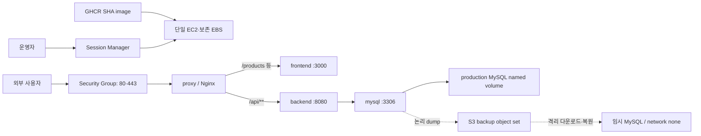

# Production 운영 아키텍처 개요

## 문서 목적과 사실 기준

이 문서는 OPS-014 시점의 production 인프라·배포·운영 구조와 이후 OPS-012 application rollback, OPS-016 EC2 최소 장애 알림, OPS-018 인증·Session Smoke와 OPS-020 인증 Smoke 회원 생성 검증 상태를 한 곳에서 설명한다. 동작의 권위 원본은 `infra/production/**`와 `.github/workflows/publish-production-images.yml`이며, 실제 적용·검증 상태는 OPS-009·010·011·012·013의 Runbook·보고서·인수인계, OPS-015·017·020 Runbook과 OPS-016·018·020 실행 보고서를 따른다. 이 문서는 실행 Runbook을 대체하지 않고 실제 AWS 식별자, hostname, 계정 정보, Secret 또는 데이터 값을 기록하지 않는다.

현재 구조는 서울 region의 단일 EC2·EBS 위에서 Docker Compose project 하나를 수동 운영하는 방식이다. GitHub Actions는 `main`의 Backend·Frontend image를 GHCR에 게시하지만 EC2 배포를 자동 실행하지 않는다. HTTPS와 운영 논리 backup·격리 복원은 실제 운영 검증을 통과했지만, 실제 production DB restore, 무중단 배포, 자동 배포, 고가용성은 완료된 상태가 아니다.

## 권위 원본 지도

| 관심사 | 구현 원본 | 운영 절차와 검증 근거 |
| --- | --- | --- |
| AWS 기반·접속 | 저장소 밖 AWS resource, `infra/production/compose.yaml` | `docs/runbook/OPS-009-aws-operations-foundation.md`, `docs/handoffs/OPS-009/sre-to-tl.md` |
| image build·게시 | `.github/workflows/publish-production-images.yml`, `infra/production/backend.Dockerfile`, `infra/production/frontend.Dockerfile` | `docs/runbook/OPS-010-production-single-release.md`, `docs/handoffs/OPS-010/sre-to-tl.md` |
| Secret materialize | `infra/production/materialize-ssm-env.sh`, `infra/production/release-common.sh`의 `validate_runtime_bundle` | OPS-010 Runbook·보고서·인수인계 |
| release 배포·복귀 | `infra/production/deploy.sh`, `infra/production/release-common.sh` | OPS-010 Runbook·보고서·인수인계, `docs/reports/OPS-021/sre-report.md` |
| 명시적 application rollback | `infra/production/rollback.sh`, `infra/production/release-common.sh` | OPS-010 Runbook, OPS-012 보고서·인수인계 |
| HTTP·HTTPS | `infra/production/nginx.conf`, `infra/production/nginx.https.conf`, `infra/production/https.sh` | `docs/runbook/OPS-011-production-https.md`, `docs/handoffs/OPS-011/sre-to-tl.md` |
| DB backup·격리 복원 | `infra/production/db-backup-restore.sh` | `docs/runbook/OPS-013-production-db-backup-restore.md`, `docs/reports/OPS-013/production-verification-2026-07-24.md` |
| EC2 최소 장애 알림 | `infra/production/*ec2-status-check-alarm*.sh` | `docs/runbook/OPS-015-ec2-status-check-alarm.md`, OPS-016 보고서·인수인계 |
| 인증·Session Smoke | `infra/production/verify-production-auth-session-smoke.sh` | `docs/runbook/OPS-017-production-auth-session-smoke.md`, `docs/reports/OPS-018/sre-report.md` |
| 인증 Smoke 회원 생성 | `infra/production/create-production-auth-smoke-member.sh` | `docs/runbook/OPS-020-production-auth-smoke-member.md`, `docs/reports/OPS-020/production-execution-report.md` |

## 1. 단일 EC2와 Docker Compose topology

OPS-009의 기반 계약은 서울 region의 Ubuntu EC2 한 대, 암호화된 보존 EBS, 고정 공인 주소, Session Manager 우선 접속이다. Security Group은 웹 요청용 `80`·`443`만 공개하고 SSH와 `3306`·`8080`·`3000`은 기본 비공개다. 실제 논리 이름과 AWS 식별자는 저장소 밖 제한된 운영 기록에서만 관리한다.

`infra/production/compose.yaml`은 `pawcycle-production` project 안에 네 service를 둔다.

| service | 역할 | 연결 network | host 공개 | 영속 상태 |
| --- | --- | --- | --- | --- |
| `proxy` | Nginx 진입점, TLS 종료, reverse proxy | `edge`, `app` | `80`, `443` | 인증서·ACME webroot volume을 읽기 전용 mount |
| `frontend` | Next.js production server | `app` | 없음 | 없음 |
| `backend` | Spring Boot API | `app`, `data` | 없음 | 없음 |
| `mysql` | production MySQL | `data` | 없음 | `pawcycle-production-mysql-data` |

`edge`는 proxy의 외부 진입용이고, `app`과 `data`는 Compose의 `internal: true` network다. Frontend는 DB network에 연결되지 않으며 Backend만 `data` network를 통해 `mysql:3306`에 접근한다. 각 container에는 health check, `restart: unless-stopped`, log rotation, memory·CPU·PID 상한이 적용된다. application과 proxy는 read-only root filesystem, 제한된 `tmpfs`, `no-new-privileges` 경계도 사용한다.

이 topology는 단일 장애 도메인이다. EC2, EBS, Docker daemon 또는 host 자원 고갈 하나가 여러 service와 같은 host의 복원 검증에 함께 영향을 줄 수 있다.

## 2. 외부 요청과 내부 network 흐름

HTTPS 활성 상태의 요청 흐름은 다음과 같다.

1. 외부 요청은 Security Group의 `80` 또는 `443`을 거쳐 `proxy`에만 도달한다.
2. `infra/production/nginx.https.conf`의 `80` listener는 승인 hostname의 ACME challenge를 제공하고 그 외 승인 hostname 요청을 HTTPS로 redirect한다. 알 수 없는 Host는 기본 server에서 거부한다.
3. `443` listener가 TLS를 종료한다. `/api/`는 `backend:8080`, 그 외 경로는 `frontend:3000`으로 전달한다.
4. Backend는 `data` network에서만 `mysql:3306`에 연결한다. MySQL·Backend·Frontend port는 host에 publish되지 않는다.
5. Nginx container 내부 `8081` listener는 host에 공개되지 않는 health·release smoke 전용이다. `release-common.sh`의 `smoke_release`가 proxy container 안에서 `/products`와 `/api/products`를 각각 확인한다.

`infra/production/nginx.conf`는 인증서 발급 전 bootstrap HTTP 설정이다. HTTPS 전환 뒤에도 application route 자체는 같고, 외부 TLS 종료·redirect·Host 거부 계약이 추가된다. 따라서 내부 `8081` smoke와 외부 HTTPS smoke는 서로 다른 경계를 검증한다.

## 3. GHCR image, SHA와 digest 관계

`.github/workflows/publish-production-images.yml`은 `main` push 또는 수동 dispatch에서 실행되지만 `main` ref만 게시한다. workflow는 정확한 commit을 checkout하고 `linux/amd64` Backend·Frontend image를 각각 production Dockerfile로 build한다.

하나의 release에는 세 식별 층이 있다.

| 층 | 의미 | 검증 위치 |
| --- | --- | --- |
| 40자 commit SHA | Backend·Frontend가 함께 사용하는 release 식별자이자 GHCR tag | publish workflow, `validate_sha` |
| OCI revision label | image가 어느 commit에서 build됐는지 표시 | `release-common.sh`의 `image_digest` |
| registry digest | registry에 저장된 불변 image content 식별자 | `image_digest`, `preflight_release` |

workflow는 두 image에 같은 SHA tag와 `org.opencontainers.image.revision` label을 붙이고 GHCR digest를 GitHub 실행 요약에 남긴다. 서버에서는 `deploy.sh`가 untagged GHCR repository와 대상 SHA를 받고, `preflight_release`가 정확한 SHA tag를 pull한 뒤 revision label과 RepoDigest를 확인한다.

`/opt/pawcycle/state/<sha>.images`는 Backend·Frontend와 digest로 고정된 MySQL·Nginx의 검증 결과를 mode `600`으로 기록한다. 같은 SHA가 이미 기록돼 있으면 새 digest 후보와 byte 단위로 비교하고 차이가 있으면 기존 기록을 덮어쓰지 않는다. 즉 SHA는 사람이 release를 선택하는 키이고, digest record는 그 SHA가 가리킨 실제 image content의 drift를 차단한다. `latest`, branch tag, 서로 다른 Backend·Frontend SHA는 허용되지 않는다.

image 게시만 GitHub Actions가 담당한다. EC2에서의 Secret materialize, preflight, activation과 rollback은 운영자가 Session Manager에서 수동 실행한다.

## 4. Runtime Secret materialize와 파일 경계

Secret의 원본은 사용자가 선택한 SSM Parameter Store prefix 아래 네 SecureString이다. 이 타입은 OPS-010에서 운영자가 준비·검증한 계약이며, `infra/production/materialize-ssm-env.sh`는 매 실행에서 `Parameter.Type`을 다시 조회하지 않는다. script는 서울 region만 허용하고 instance role로 값을 `--with-decryption` 조회해 누락·빈 값·여러 줄을 거부한다. 실제 prefix와 값은 저장소에 기록하지 않는다.

materialize 흐름은 다음과 같다.

1. output directory에 mode `700` 경계와 `flock`을 만들고 동시 writer를 거부한다.
2. 새 `.bundle.*` 임시 directory에 `mysql.env`, `backend.env`, `.complete`를 만든다.
3. MySQL 파일에는 DB 이름·application 계정·application 비밀번호·root 비밀번호를 기록한다.
4. Backend 파일에는 datasource URL·application 계정·application 비밀번호만 기록한다. MySQL root 비밀번호는 Backend에 전달하지 않는다.
5. 세 파일을 mode `600`으로 만든 뒤 `current` symlink를 원자적으로 새 bundle로 교체한다.
6. 직전 symlink target이 관리 directory 안의 예상 bundle임을 확인한 경우, 새 `current` symlink 교체 뒤 검증해 둔 `PREVIOUS_BUNDLE`을 제거한다.

하나라도 조회에 실패하거나 값이 비었으면 기존 `current`는 바뀌지 않는다. script는 shell trace를 끄고 값을 stdout에 출력하지 않는다. `release-common.sh`의 `validate_runtime_bundle`은 배포 전에 regular file·non-symlink·mode `600`·완료 marker·필수 key와 Backend root 비밀번호 부재를 다시 확인한다.

Compose는 이 파일들을 `env_file`로 MySQL과 Backend에 각각 전달한다. repository checkout, release state와 image record에는 Secret이 들어가지 않는다. 이 구조는 Secret을 image와 Git 기록에서 분리하지만, EC2 root 전용 disk에는 materialized 평문이 존재하므로 host와 root 권한 침해까지 방어하는 Secret manager는 아니다.

## 5. Deploy preflight, activation과 실패 복귀

`infra/production/deploy.sh`는 `release-common.sh`의 공통 상태기계를 사용하며 `deploy.lock`으로 다른 release 명령과의 동시 실행을 거부한다.

### Preflight

실행 중인 container를 바꾸기 전에 다음을 확인한다.

1. 대상 SHA, GHCR repository, runtime bundle과 state directory 계약
2. 현재 SHA가 있으면 현재와 대상 commit의 `infra/production/**` 동일성
3. Compose config와 MySQL·Nginx pinned digest
4. 현재 정상 release의 Backend·Frontend image와 digest로 복귀 가능한지 여부
5. 대상 Backend·Frontend의 SHA tag, revision label, registry digest
6. 기존 `<sha>.images`와 새 digest 후보의 일치

계약 차이, commit 부재, image 누락 또는 digest drift는 `compose up` 전에 중단하므로 running container와 release state를 바꾸지 않는다.

### Activation

`activate_release`는 pull을 다시 허용하지 않고 검증된 local image만 사용한다.

1. MySQL·Backend·Frontend를 올린다.
2. 세 service가 각각 healthy가 될 때까지 기다린다.
3. proxy를 강제로 재생성해 새 upstream을 연결한다.
4. proxy health, 실행 image reference와 revision label을 확인한다.
5. 내부 Frontend·Backend smoke를 각각 확인한다.
6. HTTPS marker가 있으면 인증서 SAN·최소 유효기간, HTTPS 두 경로와 HTTP redirect도 확인한다.

모든 gate가 성공한 뒤에만 기존 `current-sha`를 `previous-sha`로 옮기고 대상을 `current-sha`로 기록한다.

### 실패 복귀

대상 activation이 실패하고 기존 SHA가 있으면, 미리 preflight한 기존 release를 다시 `activate_release`한다. 복귀 성공도 대상 배포 성공으로 기록하지 않는다. 기존 SHA가 없는 첫 배포 실패는 proxy·frontend·backend를 정지하고 MySQL과 production volume을 보존한다. 대상과 기존 release 모두 활성화에 실패해도 script는 MySQL volume을 삭제하지 않는다.

이 과정에서 proxy 재생성과 single release 교체가 일어나므로 무중단 배포를 보장하지 않는다. 자동 복귀는 동일한 `infra/production/**` 계약 안의 application release에만 허용된다.

## 6. Release·image·HTTPS 상태

기본 state directory는 `/opt/pawcycle/state`이며 root 전용으로 준비된다.

| 상태 | 작성 주체 | 의미와 경계 |
| --- | --- | --- |
| `current-sha` | 성공한 deploy·rollback | 현재 정상으로 검증된 application release |
| `previous-sha` | 기존 release가 있던 성공한 deploy·rollback | 다음 명시적 rollback의 기본 대상 |
| `<sha>.images` | `preflight_release` | 해당 SHA의 application·base image digest record |
| `https-domain` | `https.sh issue` | 인증서 검증 뒤 승인된 단일 hostname |
| `nginx.https.conf` | `https.sh issue` | 승인 hostname을 반영하고 `nginx -t`를 통과한 생성 설정 |
| `https-enabled` | `https.sh` | 값이 `enabled`인 경우 Compose가 HTTPS 설정을 선택하는 marker |

최초 `issue` 실패 시 잔존 상태는 실패 단계에 따라 다르다. Certbot 또는 인증서 검증이 `approve_https_domain` 전에 실패하면 `https-domain`은 생성되지 않는다. 승인 뒤 후보 config 생성·검증이 실패하면 `https-domain`은 남을 수 있고 marker는 없으며 후보 파일만 종료 trap이 정리한다. config가 state 경로로 승격된 뒤 검증이 실패하면 승인 domain과 생성 config가 남고 marker는 없을 수 있다. `enable_https`의 proxy·path·redirect 검증이 실패하면 marker와 생성 config는 제거되고 bootstrap 복구를 시도하지만 승인된 `https-domain`은 제거하지 않는다. 어떤 경우에도 자동 domain state rollback을 가정하거나 state 파일을 수동 삭제하지 않고, 현재 파일·proxy·certificate volume 상태를 비민감 방식으로 확인한 뒤 별도 승인 전까지 중단·에스컬레이션한다.

`previous-sha`는 마지막 두 release가 실제로 존재할 때만 만들어진다. OPS-012에서 검증용 release 배포 후 원래 release로 실제 application rollback이 완료됐고 최종 `previous-sha`는 검증용 release로 확인됐다. 이 결과는 rollback 메커니즘을 검증했지만, 두 release 사이에는 Backend·Frontend 기능 차이가 없고 OPS-010 문서만 다르므로 현재 기본 대상은 application regression 복구 후보가 아니다. 기능 차이가 있는 정상 release가 `previous-sha`를 갱신하기 전에는 승인된 대상 SHA를 명시한 rollback에 application 차이·GHCR image 존재·production 계약·DB schema 호환성 검사를 적용한다. 이 결과는 DB restore를 대신하지 않으며 state 파일을 수동 편집해 경계를 우회하지 않는다.

영속 Docker volume은 역할이 다르다.

- `pawcycle-production-mysql-data`: production DB data
- `pawcycle-production-letsencrypt`: 인증서와 개인 키
- `pawcycle-production-certbot-webroot`: HTTP-01 challenge

배포·rollback·HTTPS 실패 복구는 이 volume들을 삭제하지 않는다.

## 7. HTTPS bootstrap, 갱신과 재부팅 복구

`infra/production/https.sh`는 `bootstrap`, `issue`, `renew`, `status`, `disable` 상태 전이를 제공한다.

### 최초 활성화

`bootstrap`은 application과 MySQL을 바꾸지 않고 proxy만 HTTP 설정으로 재생성한다. 내부 release smoke와 로컬 HTTP-01 webroot를 검증하지만 이 성공만으로 hostname을 승인하지 않는다.

`issue`는 bootstrap 확인 뒤 Certbot HTTP-01을 실행한다. 요청 hostname에 대한 인증서 SAN과 최소 잔여 유효기간이 성공해야만 `approve_https_domain`이 domain state를 기록한다. 그 뒤 후보 Nginx 설정을 render하고 별도 container의 `nginx -t`를 통과시켜 승격한다. HTTPS proxy와 두 application 경로·redirect 검증까지 성공해야 marker가 유지된다. `enable_https` 단계의 전환 실패는 marker와 생성 설정을 제거하고 bootstrap HTTP 복구를 시도하지만, 이미 승인된 domain state는 남을 수 있어 자동으로 최초 상태까지 돌아간다고 해석하지 않는다.

이 순서 때문에 certificate validation 이전의 domain 후보는 운영 승인 상태가 아니다.

### 갱신

`renew --dry-run`은 Nginx를 reload하지 않는다. 실제 `renew`는 Certbot 성공, 인증서 재검증, 실행 중 Nginx config 검증 뒤에만 reload하고 application 경로를 다시 확인한다. 실패 상태는 다음처럼 구분한다.

- Certbot 실패는 reload 전이지만 certificate volume이 완전히 이전 상태라고 단정하지 않는다.
- Certbot 성공 뒤 인증서 검증 또는 `nginx -t` 실패도 reload 전이므로 실행 중 worker는 이전에 적재한 상태를 유지하지만 volume 파일은 이미 바뀌었을 수 있다.
- reload 호출 실패에는 certificate volume 자동 rollback이 없으며, 실행 중 worker와 실제 적재 인증서를 확인해야 한다.
- reload 성공 뒤 path·redirect 검증 실패는 새 worker가 갱신된 인증서를 사용 중일 수 있고 이전 worker·인증서로 자동 복귀한다는 보장이 없다.

모든 단계에서 script는 certificate volume을 이전 버전으로 되돌리지 않는다. 실패하면 Secret이나 인증서를 출력하지 않고 실행 중 worker·volume·HTTPS path 상태를 확인한 뒤 별도 승인 전까지 중단·에스컬레이션한다. 자동 갱신 schedule은 구현돼 있지 않아 운영자가 승인 절차에 따라 만료 전에 수동 실행해야 한다.

### 재부팅

Compose의 `restart: unless-stopped`와 Docker 자동 시작이 기본 복구 수단이다. OPS-011 운영 검증에서는 재부팅 뒤 같은 application SHA, MySQL·인증서·webroot volume, HTTPS marker, 네 service health와 HTTPS status 복구가 확인됐다. 다만 명시적으로 stop한 container는 재부팅만으로 시작되지 않을 수 있어 같은 SHA의 `deploy.sh`로 config·digest·health·smoke를 다시 검증한다.

## 8. MySQL volume, S3 backup과 isolated restore

`infra/production/db-backup-restore.sh`는 production MySQL에 논리 backup을 수행하고 별도 임시 MySQL에서 복원 가능성을 검증한다. production volume에 dump를 restore하는 기능이 아니다.

### S3와 source 계약

실행 전 운영자가 준비·검증해야 하는 전제와 script가 매 실행 확인하는 gate를 구분한다.

운영자는 OPS-013 전용 신규 빈 private bucket과 지정 bucket·prefix로 제한된 instance role 정책을 준비한다. 2026-07-24 실행에서는 이 전제와 초과 권한 부재를 별도로 검증했다. 그러나 script는 bucket의 생성 이력·object 목록·전용성이나 IAM policy 문서를 조회하지 않으므로 이를 매 실행 증명하지 않는다.

script가 매 실행 확인하는 항목은 다음과 같다.

- healthy한 production MySQL 한 개, production과 같은 pinned image, `pawcycle-production-mysql-data`
- 서울 region, expected bucket owner
- bucket의 Public Access Block 4/4
- SSE-S3 `AES256`, versioning 비활성
- 지정 prefix의 유일한 14일 lifecycle
- ambient credential·profile·endpoint override 부재와 일반 AWS endpoint 경계
- disk·available memory, dump·metadata object size 제한

bucket 속성 조회가 실패하면 dump 전에 중단한다. 반면 object 쓰기·읽기 권한 부족은 local dump와 snapshot manifest 생성 뒤 upload·download에서 발견될 수 있고, 초과 IAM 권한은 script가 탐지하지 않는다. bucket 또는 IAM 불일치를 발견하면 실행 중 resource를 즉석 수정하지 않고, 사용자가 별도 승인된 준비 단계에서 수정·사전 검증한 뒤 전체 계약을 처음부터 다시 확인한다.

### Backup과 snapshot manifest

backup은 migration과 `ALTER`, `CREATE`, `DROP`, `RENAME`, `TRUNCATE`가 없는 저부하 시점에만 consistent logical dump를 압축한다. 일반 row write는 계속될 수 있지만 이 DDL 금지 전제가 깨지면 중단한다. 그 dump를 `--network none` 임시 MySQL에 먼저 import하며, schema·Flyway history·핵심 table count manifest는 live production DB를 다시 읽어 만드는 것이 아니라 이 복원된 dump snapshot에서 생성한다. 따라서 dump 이후 production row write가 이어져도 manifest의 비교 기준은 dump와 같은 snapshot이다.

dump·manifest·checksum의 크기를 검사한 뒤 S3에 올리고, S3 object size·SSE-S3·재다운로드 checksum을 확인한다. completion marker는 production MySQL identity·health를 다시 확인한 뒤 마지막에만 업로드된다. marker가 없는 부분 object set은 restore 입력으로 사용할 수 없고 14일 lifecycle 대상이다.

### Isolated restore

`restore-verify`는 completion marker와 모든 object의 size·encryption을 download 전에 확인하고 checksum filename·hash, gzip과 실제 압축 해제 크기를 검증한다. 복원 대상은 production과 같은 pinned MySQL image를 사용하지만 다음과 같이 격리된다.

- `--network none`
- host port publish 없음
- 고유 temporary named volume
- production MySQL volume mount 없음
- mode `600` temporary credential file
- memory·CPU·PID 상한

복원 뒤 dump snapshot manifest와 schema fingerprint, Flyway fingerprint·history, 핵심 table count를 비교한다. 정상·오류 종료의 `cleanup_trap`은 현재 실행이 보유한 `TEMP_CONTAINER`·`TEMP_VOLUME` 이름을 바로 제거하며 삭제 직전 label·network·production volume 경계를 재검증하지 않는다. 강제 종료 뒤 운영자가 실행하는 명시적 `cleanup --backup-id`만 OPS-013 label, `none` network, production volume 미사용과 volume 이름을 확인한 resource를 제거한다. 두 경로 모두 production container·volume·release·HTTPS state와 S3 object를 삭제 대상으로 삼지 않지만 검증 수준은 같지 않다.

2026-07-24 사용자 검증에서 S3·IAM 계약, 운영 논리 backup, upload·무결성, S3에서 재다운로드한 object set의 isolated restore, 데이터 비교, production 보존, service smoke와 cleanup이 통과했다. application 세 service의 일시 중지는 사용자가 짧은 중단을 수용한 일회성 유지보수 예외였으며 기본 절차가 아니다. 실제 production DB에는 restore하지 않았다.

## 9. Application rollback과 DB restore의 차이

| 구분 | application rollback | isolated restore 검증 | actual production DB restore |
| --- | --- | --- | --- |
| 현재 도구 | `infra/production/rollback.sh` | `db-backup-restore.sh restore-verify` | 구현·승인된 실행 절차 없음 |
| 대상 | Backend·Frontend image SHA | 임시 MySQL과 전용 volume | production MySQL data |
| production MySQL volume | 유지 | mount하지 않음 | 변경이 필요하므로 별도 고위험 승인 대상 |
| DB schema·Flyway | 변경·downgrade하지 않음 | dump snapshot과 비교만 함 | 호환성·중단·복구 계획 필요 |
| network | 기존 Compose network | `none` | 미정 |
| 현재 운영 상태 | 2026-07-27 OPS-012 실제 운영 검증 완료 | 실제 운영 검증 완료 | 미실행·미완료 |

application rollback은 같은 production 계약 안에서 image만 이전 SHA로 돌리는 절차다. DB migration 차이나 schema downgrade가 필요하면 중단한다. isolated restore는 backup의 복원 가능성을 production과 분리해 증명하지만 production 장애 복구 실행 자체는 아니다. 따라서 backup·격리 복원 성공을 application rollback 또는 actual production restore 완료로 확대하지 않는다.

## 10. 처음부터 끝까지의 운영 흐름

1. 사용자가 OPS-009 기반의 비용·IAM·network·EC2·EBS·Session Manager·Docker gate를 확인한다.
2. `main` commit이 병합되면 publish workflow가 같은 SHA의 Backend·Frontend image를 GHCR에 게시한다.
3. 운영자는 Session Manager에서 최신 control source와 대상 SHA·image 게시 성공을 확인한다.
4. instance role로 SSM SecureString을 root 전용 runtime bundle에 materialize한다.
5. `deploy.sh`가 현재 복귀 release와 대상 release의 계약·image digest를 preflight한다.
6. 대상 release를 활성화하고 health·내부 smoke·활성 HTTPS gate를 통과한 뒤 release state를 갱신한다.
7. 외부 HTTPS·공개 API와 필요 시 재부팅 복구를 별도로 확인한다.
8. migration과 `ALTER`, `CREATE`, `DROP`, `RENAME`, `TRUNCATE`가 없는 승인된 저부하 시점에 DB logical backup과 S3 검증을 수행한다.
9. 같은 object set을 격리 MySQL에 restore해 dump snapshot manifest와 비교하고 temporary resource를 정리한다.
10. 장애 종류에 따라 application image 문제는 rollback 경계로, DB 손상은 아직 승인되지 않은 actual production restore 경계로 분리해 에스컬레이션한다.

## 11. 현재 검증 상태와 미완료 항목

| 항목 | 현재 상태 |
| --- | --- |
| 단일 EC2의 Compose release, SSM materialize, 내부·외부 smoke, 재부팅 복구 | 운영 검증 완료 |
| HTTPS 발급·SAN·경로, 수동 갱신 rehearsal·갱신, 재부팅 복구 | 운영 검증 완료 |
| S3 계약·IAM 최소 권한, production logical backup, isolated restore, production 보존·cleanup | 2026-07-24 운영자 검증 완료. script가 IAM policy·bucket 전용성을 매 실행 증명하는 것은 아님 |
| 실제 이전 SHA application rollback | 2026-07-27 OPS-012 운영자 검증 완료 |
| OPS-021 Application·Control 상태 분리와 `contract-sha` 계약 | 저장소 구현·정적 lifecycle 검증 완료. 새 Control 계약의 Production 채택·배포·rollback은 미실행 |
| EC2 `StatusCheckFailed` ALARM·OK SNS email 알림 | 2026-07-27 OPS-016 운영자 검증 완료. 기존 alarm 계약·confirmed subscription 확인, cleanup 미실행 |
| 실제 production DB restore와 복구 훈련 | 미실행·미완료 |
| 자동 서버 배포·무중단 배포·Blue/Green | 미구현 |
| Load Balancer·다중 EC2·DB replica를 포함한 고가용성 | 미구현 |
| HTTPS 자동 갱신 schedule·certificate backup | 미완료 |
| backup schedule·실패 알림·cross-region·장기 보존·versioned backup·RPO/RTO | 미완료 |
| 운영 login/logout, CSRF·Session 회전, 현재 회원 식별과 logout 후 stale Session 거부 | 2026-07-29 OPS-018 운영자 검증 완료 |
| Production 인증 Smoke 회원 생성 | 2026-07-29 OPS-020 사용자 승인 실행 완료. 회원 한 명 유지, 직접 SQL·기존 회원 변경 없음 |
| 외부 unknown Host 검증 | 미실행 |
| 지속 부하에서 CPU·memory·OOM·장기 성능 | 미확정 |

S3 bucket의 versioning 비활성은 검증이 끝난 현재 계약이다. 미완료인 것은 versioning 활성화와 versioned backup 보존 전략이다. backup object는 지정 prefix의 14일 lifecycle 대상이며 instance role에 자동 삭제 권한을 추가하지 않았다.

## 12. 운영 안전성 기준선 판정

OPS-024와 OPS-026의 `Decision Required` 판정은 각 시점의 역사적 판정으로 보존한다. OPS-028 실행 증거를 반영한 현재 판정 권위 원본은 `docs/reports/OPS-029/tl-report.md`이며, 현재 상태는 `OPS-VERIFY-001 = Verified`다. 이 판정은 OPS-026의 일곱 최소 운영 안전성 기준선에만 한정되며 최신 `main` 전체가 Production에 배포됐다는 뜻은 아니다.

| 최소 기준 | 증거 평가 | 현재 경계 |
| --- | --- | --- |
| HTTPS 운영 접속과 Production Secret 분리 | 충족 | OPS-010·011 결과와 Secret materialize 계약에 근거한다. 자동 갱신 schedule·certificate backup은 미완료다. |
| 공개 상품 및 인증·Session 핵심 Smoke | 충족 | OPS-018의 다섯 단계 PASS와 OPS-017 계약에 근거한다. 장기 Session·부하·다중 Instance는 미검증이다. |
| DB 데이터와 Production volume 보존 | 충족 | OPS-010·012·013의 volume 보존과 schema 비변경 증거에 근거한다. Actual Production DB restore는 미실행이다. |
| 배포 실패 복귀와 실제 Application rollback | 충족 | OPS-010·012의 기존 증거에 더해 OPS-028에서 현재 Control 계약 채택, 실제 rollback과 원래 Release 재배포를 확인했다. |
| 논리 Backup과 승인된 isolated restore 검증 | 충족 | OPS-013 실행 결과에 근거한다. 자동 schedule·cross-region·장기 보존·RPO/RTO는 미완료다. |
| 최소 장애 알림 | 충족 | OPS-016의 기존 alarm 계약, confirmed subscription과 ALARM·OK 수신에 근거한다. 실제 EC2 장애 유발과 자동 복구는 미실행이다. |
| 배포·복구 Runbook | 충족 | Application 배포·rollback, HTTPS, backup·isolated restore, Actual Production DB restore 준비, 알림과 인증 검증 Runbook이 있다. Actual Production DB restore 실행·훈련 완료를 뜻하지 않는다. |

OPS-024와 OPS-026의 보고서는 당시 증거와 판정을 설명하는 역사 원본이다. 현재 일곱 기준의 상세 대조와 `Verified` 경계는 OPS-029를 따른다.

`Verified`는 전체 운영 완성 판정이 아니다. Actual Production DB restore·schema downgrade 실행, RTO, 무중단, 자동복구, 고가용성, 물리 MySQL volume·EBS·instance 장애 복구는 미완료다. 외부 unknown Host 검증, HTTPS 자동 갱신 schedule·certificate backup, backup schedule·실패 알림·cross-region·장기 보존·versioning, 장기 부하·capacity·성능 기준선과 credential 수명 관리도 남아 있다. OPS-028에서 관찰된 Certbot external/named volume 경고는 실행을 차단하지 않았지만 근본 원인이 해결되지 않아 인증서 저장·갱신 경로의 후속 확인이 필요하다.

## 13. 장애 도메인과 트레이드오프

- **단일 host:** 구조와 비용은 단순하지만 EC2·EBS·Docker 장애가 proxy, application, DB와 같은 host의 restore 검증에 함께 영향을 준다.
- **수동 release:** 운영자가 gate를 직접 확인할 수 있지만 배포 자동화가 아니며 사람의 실행 순서와 비민감 기록 품질에 의존한다.
- **single release 교체:** Blue/Green보다 자원 사용이 작지만 proxy·container 교체 중 짧은 중단이 가능하고 무중단을 보장하지 않는다.
- **SHA와 digest 이중 확인:** release 추적성과 image drift 차단은 강화되지만, application rollback은 두 commit의 `infra/production/**`가 같고 과거 image가 남아 있어야 한다.
- **root 전용 runtime file:** Secret이 Git·image·일반 로그에서 분리되지만 materialized 평문이 단일 host disk에 존재한다.
- **수동 HTTPS 갱신:** 실패 단계에 따라 volume과 실행 중 worker 상태가 달라지며 자동 인증서 rollback이 없다. schedule도 없어 만료 전 운영자 실행·상태 확인이 필요하다.
- **논리 backup과 격리 복원:** application rollback과 독립된 DB 복원 가능성을 확인하지만 같은 EC2 자원을 사용하며 actual production restore 절차·RPO/RTO를 증명하지 않는다.
- **14일·versioning 비활성 S3 계약:** 최소 권한과 단순한 단기 보존을 유지하지만 장기 보존, 삭제 복원, cross-region 장애 대응은 제공하지 않는다.
- **관측성:** container health와 smoke는 배포 gate로 사용하고 EC2 기본 `StatusCheckFailed`의 ALARM·OK email은 검증했지만, CPU·memory·disk·application 상태나 중앙집중식 장기 metric·log·alert 체계가 완료된 것은 아니다.

## 14. 이해 확인 질문

1. 외부 사용자가 `/api/products`를 호출할 때 어떤 port, container, Docker network를 순서대로 지나며 MySQL port가 외부에 보이지 않는 이유는 무엇인가?
2. Git commit SHA, GHCR tag, OCI revision label과 registry digest는 각각 무엇을 식별하고 어떤 함수가 서로의 일치를 검증하는가?
3. GitHub Actions가 자동으로 하는 일과 운영자가 Session Manager에서 수동으로 해야 하는 일의 경계는 어디인가?
4. SSM materialize가 네 Secret을 두 env 파일로 나누는 이유와 Backend에 MySQL root 비밀번호를 넣지 않는 이유는 무엇인가?
5. deploy preflight가 running container를 바꾸기 전에 현재 release까지 다시 검증하는 이유는 무엇인가?
6. 대상 activation 실패 시 기존 SHA가 있는 경우와 첫 배포인 경우에 각각 어떤 상태가 남는가?
7. `current-sha`, `previous-sha`, `<sha>.images`, `https-domain`, `https-enabled`는 누가 언제 기록하며 서로 무엇이 다른가?
8. 인증서 발급 과정에서 bootstrap 성공만으로 domain을 승인하지 않고 certificate validation 뒤에만 승인하는 이유는 무엇인가?
9. OPS-013 manifest를 live production DB가 아니라 dump를 복원한 임시 DB에서 생성하는 이유와 completion marker를 마지막에 올리는 이유는 무엇인가?
10. application rollback, isolated restore 검증과 actual production DB restore는 각각 무엇을 바꾸며 현재 어떤 항목이 실제로 완료되지 않았는가?
