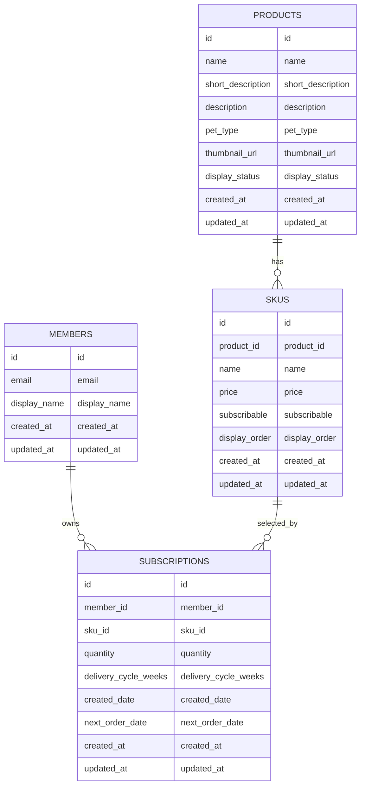

# DATA-002 첫 수직 MVP 논리 ERD 초안

## 문서 상태

- 작업 ID: `DATA-002`
- 역할: Backend Engineer
- 결정 상태: Proposed Logical ERD
- 기준 입력: `PS-002`, `DOMAIN-001`, `UX-002`, `ARCH-001`, `DATA-001`, `API-001`

이 문서는 첫 수직 MVP의 논리 ERD 초안이다. 사용자 승인 전까지 `Approved`로 표시하지 않는다.

## 작업 목적

첫 수직 MVP의 상품 탐색, 구독 생성, 내 구독 목록 조회, 내 구독 상세 조회를 지원하기 위해 `members`, `products`, `skus`, `subscriptions`의 관계, 주요 필드 후보, 제약 조건 후보, 인덱스 후보, 날짜 기준과 요구사항 추적성을 정리한다.

이번 작업은 후속 Backend 구현이 Flyway 마이그레이션과 JPA Entity를 작성하기 전에 사용할 논리 설계 입력을 제공한다. 실제 SQL DDL, DB 타입, FK 이름, 인덱스 이름, JPA 매핑은 확정하지 않는다.

## 승인된 입력

- 비회원과 로그인 회원은 상품 목록, 상품 상세, SKU와 구독 가능 여부를 확인할 수 있다.
- 구독 생성, 내 구독 목록, 내 구독 상세는 로그인한 회원만 사용할 수 있다.
- 첫 MVP 테이블 후보는 `members`, `products`, `skus`, `subscriptions`다.
- Product 1:N SKU 관계를 사용한다.
- Member 1:N Subscription 관계를 사용한다.
- SKU 1:N Subscription 관계를 사용한다.
- 구독 하나는 SKU 하나만 대상으로 한다.
- SKU는 구독 가능 여부를 가진다.
- 구독 생성 시 SKU가 존재하고 `subscribable=true`여야 한다.
- 수량은 1~10이다.
- 배송 주기는 2주, 4주, 8주다.
- 다음 주문 예정일은 서버가 계산한 확정값이다.
- 날짜 계산 기준은 `Asia/Seoul` 날짜 단위다.
- API 날짜 표현 후보는 ISO-8601 local date 문자열이다.
- 휴일, 주말, 영업일 보정은 적용하지 않는다.
- 다음 배송 예정일은 포함하지 않는다.
- 결제, 재고, 배송, 구독 상태, 삭제 정책은 첫 MVP에서 제외한다.
- soft delete, hard delete, 삭제·탈퇴·보관·익명화 정책은 DATA-002에서 확정하지 않는다.

## ERD 범위

- `members` 논리 테이블 후보
- `products` 논리 테이블 후보
- `skus` 논리 테이블 후보
- `subscriptions` 논리 테이블 후보
- 회원과 구독의 소유 관계
- 상품과 SKU의 구성 관계
- SKU와 구독의 선택 대상 관계
- 상품 탐색과 구독 조회에 필요한 표시 필드 후보
- 구독 생성 불변 조건을 보조하는 제약 후보
- 후속 Flyway/JPA/Repository 구현으로 넘길 결정 분리

## 제외 범위

- Flyway 마이그레이션 작성
- SQL DDL 확정
- 실제 DB 타입 확정
- FK 이름, 인덱스 이름, CHECK 이름 확정
- JPA Entity 구현
- Repository, Service, Controller 구현
- API 계약 변경
- HTTP 상태와 오류 코드 변경
- Frontend 구현
- 테스트 코드 작성
- OpenAPI 생성
- 신규 의존성 추가
- Spring Security 구현 방식 확정
- 결제, 재고, 배송, 구독 상태 모델 추가
- soft delete, `deleted_at`, `is_deleted` 추가
- 삭제·탈퇴·보관·익명화 정책 확정
- 관리자 기능
- 성능 최적화
- CodeRabbit 설정 변경
- GitHub Actions 변경
- 자동 병합

## ERD 설계 원칙

- 첫 MVP의 상품 탐색, 구독 생성, 내 구독 조회에 필요한 최소 논리 구조만 둔다.
- 구독 하나는 SKU 하나만 참조한다.
- SKU 구독 가능 여부는 재고, 품절, 일반 판매 상태와 연결하지 않는다.
- Subscription은 `member_id`와 `sku_id`를 통해 소유자 검증과 단일 SKU 구독을 지원한다.
- 수량 1~10과 배송 주기 2/4/8은 도메인/애플리케이션 검증과 DB 제약 후보로 함께 기록한다.
- 다음 주문 예정일은 서버 계산 확정값으로 보존하는 방향을 ERD 후보에 반영한다.
- `created_date`, `next_order_date`는 날짜 단위 의미를 가진다.
- `created_at`, `updated_at`은 감사 목적의 시각 후보로 둔다.
- 실제 DB 타입, CHECK 적용 여부, FK/인덱스 이름은 후속 Flyway/JPA 구현에서 확정한다.

## 논리 ERD

Mermaid 필드 표기는 논리 필드 후보다. 실제 SQL 타입, FK 이름, 인덱스 이름, 제약 이름은 확정하지 않는다.

## 테이블 요약

| 테이블 후보 | 주요 책임 | 주요 관계 | 첫 MVP 포함 이유 |
| --- | --- | --- | --- |
| `members` | 구독 생성 주체와 본인 구독 조회 기준 | `members` 1:N `subscriptions` | 인증 회원의 구독 생성과 소유자 검증 |
| `products` | 상품 목록·상세 표시 정보 제공 | `products` 1:N `skus` | 공개 상품 탐색 |
| `skus` | 실제 구독 선택 단위와 구독 가능 여부 제공 | `skus` N:1 `products`, 1:N `subscriptions` | 구독 하나가 SKU 하나를 대상으로 함 |
| `subscriptions` | 회원의 SKU 정기배송 구독 정보 보존 | N:1 `members`, N:1 `skus` | 구독 생성, 목록, 상세, 다음 주문 예정일 확인 |

## members

| 필드 후보 | 의미 | 제약 후보 | DATA-001 근거 | API-001 사용처 |
| --- | --- | --- | --- | --- |
| `id` | 회원 식별자 | PK 후보, nullable false 후보 | Member 식별과 구독 소유자 기준 | 보호 API의 인증 회원 식별, 구독 생성·조회 |
| `email` | 로그인 식별 또는 연락 기준 | unique 후보, nullable false 후보 | 첫 MVP Member 최소 필드 후보 | API 응답에는 직접 노출하지 않음 |
| `display_name` | 사용자 표시명 | nullable false 후보 | 첫 MVP Member 최소 필드 후보 | API-001 필수 응답 후보 아님 |
| `created_at` | 회원 레코드 생성 시각 | nullable false 후보 | 공통 감사 필드 후보 | API-001 사용처 없음 |
| `updated_at` | 회원 레코드 수정 시각 | nullable false 후보 | 공통 감사 필드 후보 | API-001 사용처 없음 |

비밀번호, OAuth 계정, 세션, 토큰, 권한 모델은 DATA-002에서 확정하지 않는다.

## products

| 필드 후보 | 의미 | 제약 후보 | DATA-001 근거 | API-001 사용처 |
| --- | --- | --- | --- | --- |
| `id` | 상품 식별자 | PK 후보, nullable false 후보 | 상품 목록·상세 조회 기준 | `productId` |
| `name` | 상품명 | nullable false 후보 | 상품 목록·상세 표시 | 상품 목록, 상품 상세, 구독 목록·상세의 상품 요약 |
| `short_description` | 목록용 짧은 설명 | nullable false 후보 | 상품 목록 표시 | 상품 목록 `shortDescription` |
| `description` | 상품 상세 설명 | nullable 후보 | 상품 상세 표시 | 상품 상세 `description` |
| `pet_type` | 대상 반려동물 | nullable false 후보, enum/string 후보 | 개·고양이용 사료 검증 범위 | 상품 목록·상세 `petType` |
| `thumbnail_url` | 대표 이미지 | nullable 허용 여부 후속 결정 | 상품 목록 응답 후보 | 상품 목록·상세 `thumbnailUrl` 후보 |
| `display_status` | 공개 목록·상세 노출 가능 여부 후보 | nullable false 후보 | 상품 목록 공개 조회 후보 | 공개 상품 조회 필터 후보 |
| `created_at` | 상품 레코드 생성 시각 | nullable false 후보 | 공통 감사 필드 후보 | API-001 사용처 없음 |
| `updated_at` | 상품 레코드 수정 시각 | nullable false 후보 | 공통 감사 필드 후보 | API-001 사용처 없음 |

`display_status`는 상품 노출 후보일 뿐 재고, 품절, 판매 상태, 구독 상태를 의미하지 않는다.

## skus

| 필드 후보 | 의미 | 제약 후보 | DATA-001 근거 | API-001 사용처 |
| --- | --- | --- | --- | --- |
| `id` | SKU 식별자 | PK 후보, nullable false 후보 | 구독 생성 시 참조 | `skuId` |
| `product_id` | SKU가 속한 상품 | FK 후보, nullable false 후보 | Product 1:N SKU | 상품 상세 SKU 목록, 구독 조회 상품 조인 |
| `name` | SKU명 또는 용량·구성 | nullable false 후보 | 상품 상세 SKU 표시 | `skuName` |
| `price` | SKU 표시 가격 | nullable false 후보, 0 이상 후보 | SKU별 표시 가격 | 상품 목록·상세, 구독 상세 `price` |
| `subscribable` | 구독 가능 여부 | nullable false 후보 | 구독 가능 SKU만 구독 가능 | 상품 목록 요약, 상품 상세, 구독 생성 검증 |
| `display_order` | SKU 표시 순서 | nullable false 또는 기본값 후보 | SKU 목록 표시 순서 후보 | 상품 상세 SKU 정렬 후보 |
| `created_at` | SKU 레코드 생성 시각 | nullable false 후보 | 공통 감사 필드 후보 | API-001 사용처 없음 |
| `updated_at` | SKU 레코드 수정 시각 | nullable false 후보 | 공통 감사 필드 후보 | API-001 사용처 없음 |

재고 수량, 품절, 일반 판매 상태, SKU별 배송 주기 제한 정책은 DATA-002에서 추가하지 않는다.

## subscriptions

| 필드 후보 | 의미 | 제약 후보 | DATA-001 근거 | API-001 사용처 |
| --- | --- | --- | --- | --- |
| `id` | 구독 식별자 | PK 후보, nullable false 후보 | 생성 성공 후 상세 이동과 조회 | `subscriptionId` |
| `member_id` | 구독 소유 회원 | FK 후보, nullable false 후보 | 본인 구독 조회와 소유자 검증 | 구독 생성, 내 구독 목록·상세 |
| `sku_id` | 구독 대상 SKU | FK 후보, nullable false 후보 | 구독 하나는 SKU 하나 | 구독 생성, 내 구독 목록·상세 |
| `quantity` | 구독 수량 | nullable false, 1~10 후보 | 수량 1~10 | `quantity` |
| `delivery_cycle_weeks` | 배송 주기 | nullable false, 2/4/8 후보 | 배송 주기 2/4/8 | `deliveryCycleWeeks` |
| `created_date` | 구독 생성일 | nullable false 후보 | `Asia/Seoul` 날짜 단위 | `createdDate` |
| `next_order_date` | 다음 주문 예정일 | nullable false 후보, `created_date`보다 이후 후보 | 서버 계산 확정값 | `nextOrderDate` |
| `created_at` | 구독 레코드 생성 시각 | nullable false 후보 | 공통 감사 필드 후보 | API-001 사용처 없음 |
| `updated_at` | 구독 레코드 수정 시각 | nullable false 후보 | 공통 감사 필드 후보 | API-001 사용처 없음 |

구독 상태, 결제 상태, 배송 상태, 주문 생성 상태, 변경·해지·일시정지·재개·건너뛰기 관련 필드는 추가하지 않는다.

## 관계와 카디널리티

| 관계 | 카디널리티 | 설명 | 구현 전 주의사항 |
| --- | --- | --- | --- |
| `members` - `subscriptions` | 1:N | 회원 하나는 여러 구독을 가질 수 있다 | 본인 구독 조회와 소유자 검증 기준 |
| `products` - `skus` | 1:N | 상품 하나는 여러 SKU를 가질 수 있다 | 상품 상세의 SKU 목록 조회 기준 |
| `skus` - `subscriptions` | 1:N | SKU 하나는 여러 구독의 대상이 될 수 있다 | 구독 하나는 SKU 하나만 참조 |

후속 JPA 구현에서 단방향/양방향 연관관계, fetch 전략, cascade 사용 여부를 확정한다.

## 제약 조건 후보

| 대상 | 제약 후보 | 이유 | 적용 위치 후보 |
| --- | --- | --- | --- |
| `subscriptions.quantity` | 1 이상 10 이하 | 승인된 수량 범위 | 도메인/애플리케이션 검증 + DB CHECK 후보 |
| `subscriptions.delivery_cycle_weeks` | 2, 4, 8 중 하나 | 승인된 배송 주기 | 도메인/애플리케이션 검증 + DB CHECK 후보 |
| `subscriptions.member_id` | nullable false, FK 후보 | 구독 소유자 필요 | DB FK 후보 |
| `subscriptions.sku_id` | nullable false, FK 후보 | 구독 대상 SKU 필요 | DB FK 후보 |
| `subscriptions.created_date` | nullable false | 구독 생성일 필요 | 도메인/애플리케이션 검증 + DB NOT NULL 후보 |
| `subscriptions.next_order_date` | nullable false | 다음 주문 예정일 필요 | 도메인/애플리케이션 검증 + DB NOT NULL 후보 |
| `subscriptions.next_order_date` | `created_date`보다 이후이며 `created_date + delivery_cycle_weeks`로 계산 | 날짜 불변 조건 보존 | 도메인/애플리케이션 검증 후보 |
| `skus.subscribable` | nullable false | 구독 가능 여부 판단 필요 | DB NOT NULL 또는 기본값 후보 |
| `skus.product_id` | nullable false, FK 후보 | SKU는 상품에 속함 | DB FK 후보 |
| `skus.price` | 0 이상 | 표시 가격 음수 방지 | 도메인/애플리케이션 검증 + DB CHECK 후보 |
| `products.name` | nullable false | 상품 목록·상세 표시 필요 | DB NOT NULL 후보 |

MySQL CHECK 제약의 실제 적용 여부, DDL 표현, 제약 이름은 후속 Flyway 작업에서 검증한다.

## 인덱스 후보

| 인덱스 후보 | 대상 조회 | 이유 | 확정 여부 |
| --- | --- | --- | --- |
| `skus(product_id)` | 상품 상세의 SKU 목록 | 상품별 SKU 조회 | 후보 |
| `subscriptions(member_id, id)` | 내 구독 목록·상세 | 회원별 목록 조회와 소유자 검증 | 후보 |
| `subscriptions(member_id, next_order_date)` | 내 구독 목록 정렬 후보 | 다음 주문 예정일 표시와 정렬 가능성 | 후보 |
| `products(display_status, id)` | 상품 목록 공개 조회 후보 | 공개 노출 상품 조회 가능성 | 후보 |

성능 측정 전 최종 인덱스로 확정하지 않는다. 실제 인덱스명과 생성 DDL은 후속 마이그레이션 작업에서 확정한다.

## 날짜와 시간 기준

- `created_date`, `next_order_date`는 날짜 단위 의미를 가진다.
- `next_order_date`는 서버 계산 확정값이다.
- 계산 기준은 `Asia/Seoul`이다.
- `next_order_date`는 `created_date + delivery_cycle_weeks`로 계산한다.
- 휴일, 주말, 영업일 보정은 없다.
- 다음 배송 예정일은 저장하지 않는다.
- API 날짜 표현 후보는 ISO-8601 local date 문자열이다.
- 사용자 화면 날짜 표시는 `YYYY. M. D.`다.
- `created_at`, `updated_at`은 감사 목적의 시각 후보다.
- 실제 DB 타입은 후속 Flyway/JPA 구현에서 검증한다.

## DATA-001 매핑

| DATA-001 항목 | ERD 반영 |
| --- | --- |
| Member 데이터 모델 | `members` 후보와 `id`, `email`, `display_name`, 감사 필드 후보로 반영 |
| Product 데이터 모델 | `products` 후보와 상품 목록·상세 표시 필드 후보로 반영 |
| SKU 데이터 모델 | `skus` 후보와 `product_id`, `price`, `subscribable` 후보로 반영 |
| Subscription 데이터 모델 | `subscriptions` 후보와 소유자, SKU, 수량, 배송 주기, 날짜 필드 후보로 반영 |
| Product - SKU 1:N | `PRODUCTS ||--o{ SKUS` 관계로 반영 |
| Member - Subscription 1:N | `MEMBERS ||--o{ SUBSCRIPTIONS` 관계로 반영 |
| SKU - Subscription 1:N | `SKUS ||--o{ SUBSCRIPTIONS` 관계로 반영 |
| 제약 조건 후보 | 수량, 배송 주기, 날짜, `subscribable`, 가격, 상품명 제약 후보로 반영 |
| 인덱스 후보 | `skus(product_id)`, `subscriptions(member_id, id)`, `subscriptions(member_id, next_order_date)`, `products(display_status, id)` 후보로 반영 |

## API-001 매핑

| API-001 API | 주요 테이블 | 주요 필드 | 비고 |
| --- | --- | --- | --- |
| `GET /api/products` | `products`, `skus` | product 표시 필드, sku 가격·구독 가능 요약 | 공개 API |
| `GET /api/products/{productId}` | `products`, `skus` | 상품 상세, SKU 목록 | 공개 API |
| `POST /api/subscriptions` | `members`, `skus`, `subscriptions` | `member_id`, `sku_id`, `quantity`, `delivery_cycle_weeks`, `next_order_date` | 인증 필요 |
| `GET /api/subscriptions` | `subscriptions`, `skus`, `products` | `member_id`, `next_order_date`, 상품/SKU 요약 | 본인 구독만 |
| `GET /api/subscriptions/{subscriptionId}` | `subscriptions`, `skus`, `products` | `subscription_id`, `member_id`, 상품/SKU 상세 | 소유자 검증 |

## 요구사항 추적성

| 요구사항 | 인수 조건 | ERD 반영 | 관련 데이터/API 설계 | 후속 구현 | 상태 |
| --- | --- | --- | --- | --- | --- |
| `REQ-PRODUCT-001` | `AC-PRODUCT-001-01` 외 | `products`, `skus`, SKU 구독 가능 요약과 가격 후보 | DATA-001 상품 목록 데이터, API-001 `GET /api/products` | BE, FE, QA | Proposed |
| `REQ-PRODUCT-002` | `AC-PRODUCT-002-01` 외 | `products` 1:N `skus`, `skus.subscribable`, `skus.price` | DATA-001 SKU 데이터, API-001 `GET /api/products/{productId}` | BE, FE, QA | Proposed |
| `REQ-SUB-001` | `AC-SUB-001-01` 외 | `subscriptions.member_id`, `sku_id`, `quantity`, `delivery_cycle_weeks`, `created_date`, `next_order_date` | DATA-001 Subscription, API-001 `POST /api/subscriptions` | BE, QA | Proposed |
| `REQ-SUB-002` | `AC-SUB-002-01` 외 | `subscriptions(member_id, id)` 조회 후보와 상품/SKU 조인 후보 | DATA-001 인덱스 후보, API-001 `GET /api/subscriptions` | BE, FE, QA | Proposed |
| `REQ-SUB-003` | `AC-SUB-003-01` 외 | `subscriptions.member_id` 소유자 검증과 `skus`, `products` 조인 후보 | DATA-001 소유자 검증, API-001 `GET /api/subscriptions/{subscriptionId}` | BE, FE, QA | Proposed |
| `REQ-SUB-004` | `AC-SUB-004-01` 외 | `created_date`, `next_order_date`, `Asia/Seoul` 날짜 단위 | DATA-001 날짜 저장 기준, API-001 ISO-8601 local date 문자열 후보 | BE, FE, QA | Proposed |
| `REQ-AUTH-001` | `AC-AUTH-001-01` 외 | 보호 기능 데이터는 인증 회원의 `members.id`를 기준으로 생성·조회 | ARCH-001 인증 경계, API-001 `AUTH_REQUIRED` 후보 | 인증 설계, BE, FE, QA | Proposed |
| `REQ-AUTH-002` | `AC-AUTH-002-01` 외 | `subscriptions.member_id`로 본인 구독 목록·상세 소유자 검증 | DATA-001 소유자 검증, API-001 `SUBSCRIPTION_NOT_FOUND` 후보 | BE, QA | Proposed |

## Backend 구현으로 넘길 결정

- 실제 SQL DDL
- Flyway 마이그레이션 파일명과 내용
- DB 타입
- FK 제약 이름
- 인덱스 이름
- CHECK 제약 실제 적용 여부
- JPA Entity 구조
- JPA 연관관계 방향
- fetch 전략
- cascade 사용 여부
- enum 저장 방식
- 값 객체의 JPA 매핑 방식
- Repository 쿼리 방식
- 테스트 데이터와 seed 정책
- `Clock` 또는 동등한 날짜 공급 추상화 사용 여부
- 감사 필드의 생성·수정 시각 처리 방식

## Deferred Technical Decision

- Product와 SKU Aggregate 경계
- Subscription과 SKU 참조 방식
- `subscribable`의 최종 타입 표현
- `delivery_cycle_weeks`의 enum 또는 숫자 저장 방식
- `pet_type`과 `display_status` 저장 표현
- 인증 테이블과 `members`의 관계
- 로그인 복귀 경로 저장 구조
- 삭제·탈퇴·보관·익명화 정책
- API 버전 전략
- 페이지네이션, 검색, 정렬 정책

## 위험과 제한

- 이 문서는 Proposed Logical ERD이며 사용자 승인 전 최종 DB 설계가 아니다.
- 실제 SQL DDL, DB 타입, FK/인덱스 이름은 확정하지 않았다.
- MySQL CHECK 제약 지원과 표현은 후속 Flyway 작업에서 검증해야 한다.
- 구독 가능 여부는 재고·품절·판매 상태와 분리했으므로 후속 결제·재고 MVP에서 재검토가 필요할 수 있다.
- 인증 구현 방식이 확정되지 않아 `members`와 인증 모델의 상세 관계는 설계하지 않았다.
- soft delete, hard delete, 삭제·탈퇴·보관·익명화 정책은 확정하지 않았다.

## 후속 작업 순서

1. 사용자 검토로 DATA-002 Proposed Logical ERD 승인 또는 수정
2. Backend 구현: Flyway 마이그레이션, JPA Entity, 값 객체 매핑, Repository 쿼리 작성
3. Backend API 구현: Controller, DTO, Service, 예외 처리, 인증 컨텍스트 연동
4. Backend 테스트: 도메인 규칙, Repository 조회, API 통합 테스트 작성
5. FE 구현: API-001과 UX-002 기준 화면·API 연동 구현
6. QA: PS-002, DATA-001, API-001, DATA-002 기준 테스트 계획과 검증 수행
