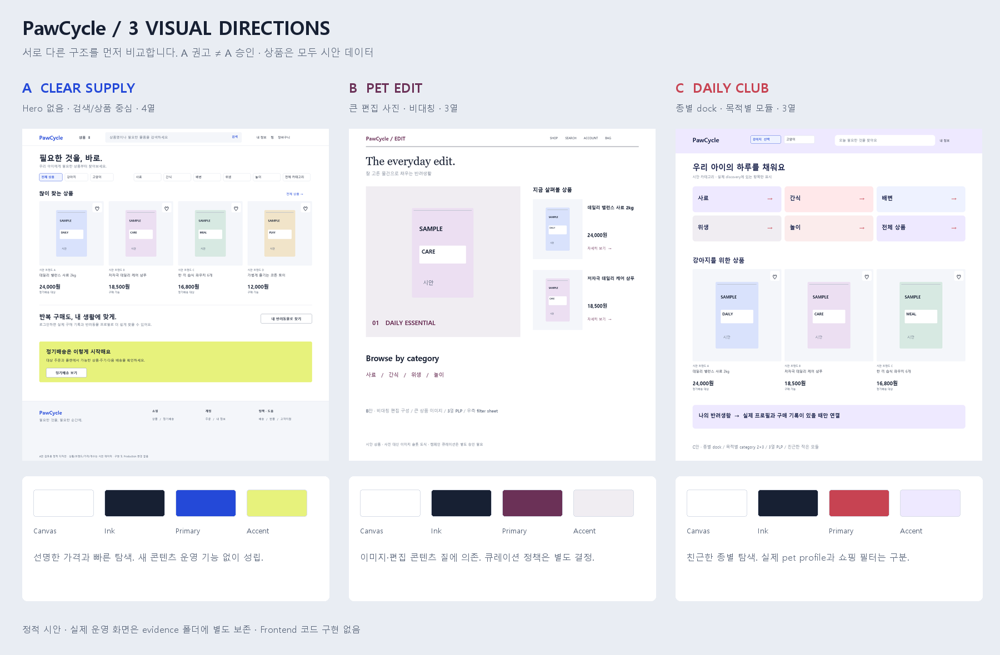

# MVP4-UX-005 Customer Commerce Visual Redesign

- 작업 ID: MVP4-UX-005 / 등급: 일반 / 실행 구분: 저장소 변경 / 역할: UX/UI Designer
- 기준: `main`, `bec817d` (2026-08-30 origin fetch 확인, PR #255 포함)
- 작업 branch: `design/ux/MVP4-UX-005`, 별도 worktree. 기존 FE branch·고유 commit·미추적 파일 보존.
- 승인 입력: 이번 사용자 요청 및 추가 Visual Direction 보정 지시. 승인된 범위는 조사·설계·정적 시각 자료 작성이다.
- 상태: **PROPOSED — DESIGN APPROVAL REQUIRED. 구현 승인 아님.**
- 작성일: 2026-08-30, Asia/Seoul. Production은 공개 페이지 조회와 탐색만 수행했다. 운영 데이터 변경·로그인 제출·주문·결제·배포 없음.

## 읽는 순서와 근거

1. [Production Visual Audit](production-audit.md): 직접 확인한 문제와 확인하지 못한 범위.
2. [External Commerce Benchmark](commerce-benchmark.md): 실제 rendered page, 채택·변형·거부 판정.
3. 이 문서의 **세 가지 Visual Direction**과 [비교 보드](visuals/directions.png).
4. [Visual Design System](visual-system.md): 상세 검토용 A안의 토큰·컴포넌트. A안 선택을 기정사실화하지 않는다.
5. [Screen Redesign](screen-redesign.md): Home / PLP / PDP / Cart / Login, Checkout·공통 영역.
6. [Interaction / Responsive Contract](interaction-responsive.md): 입력·URL·상태·포커스·5개 너비의 구성.

시안 이미지는 **정적 디자인 문서**다. 상품·브랜드·가격·개수는 `시안 데이터`이며 Production 재현 또는 판매 제안이 아니다. 단순 포장 도형은 상품 이미지 슬롯의 크기와 위계를 보여주는 도식으로, 실제 상품 사진이나 승인된 브랜드 에셋이 아니다. React/HTML 앱·프로토타입·제품 코드는 만들지 않았다. 캡처된 기존 Production과 시안은 디렉터리도 `evidence/`와 `visuals/`로 분리한다.

## 왜 기존 설계의 연장이 아닌가

색 변경보다 먼저 아래 구조를 폐기 후보로 둔다. 기능·접근성 계약은 남긴다.

| 기존 기본값 | 재검토 판정 | 새 검토안 |
| --- | --- | --- |
| cream canvas + forest green 전체 체계 | 버림 | 세 후보 모두 별도 palette와 명암 역할 |
| 소개 문구 + 우측 정기배송 카드 Hero | 삭제 | A는 Hero 없이 탐색과 상품 선반, B는 상품 편집 사진, C는 종별 쇼핑 입구 |
| 반복되는 대형 둥근 section card | 삭제 | A는 열린 grid와 구분선, B는 비대칭 편집면, C는 목적별 작은 모듈 |
| 검색·브랜드·계정 + 별도 일반 메뉴 2단 Header | 재구성 | A는 단일 masthead와 결과 맥락, B는 축약 탐색 + 검색 panel, C는 종별 dock |
| PLP 고정 왼쪽 form sidebar | 삭제 | A 상단 filter popover, B 우측 filter sheet, C 종별 선택 + 하단 drawer |
| 브라우저 기본 select/fieldset 외형 | 삭제 | 명시적 치수·선택 표시를 가진 radio list / filter chip / custom select |
| Login 가운데 테두리 카드 + 전체 Commerce shell | 삭제 | 전용 인증 shell, 복귀 맥락과 form 중심 |
| Home Help 구획과 Footer 링크 중복 | 통합 | Footer 지원 입구 1개 + 정책/쇼핑/계정 위계 |

## 세 가지 Visual Direction — 아직 미선택

동일 기능 범위·동일 시안 상품으로 비교한다. 서비스 규모가 크거나 개인화 데이터가 있다는 가정은 하지 않는다.

| 비교 항목 | A · Clear Supply / 선명한 상점 | B · Pet Edit / 편집형 쇼룸 | C · Daily Club / 일상형 상점 |
| --- | --- | --- | --- |
| Palette | white `#FFFFFF`, ink `#172033`, cobalt `#2449D8`, citron `#E7F27C` | white `#FFFFFF`, graphite `#19191C`, plum `#6B3157`, mist `#F0EDF2` | white `#FFFFFF`, navy `#202850`, coral `#C74352`, lilac `#EEE9FF` |
| Typography | system sans, 제목 36/44 700, 가격 24/30 700, 정렬된 수치 | sans 본문 + 시스템 명조 display 52/60 500, 가격 22/28 700 | sans 제목 32/40 700, label 15/22 700, 가격 24/30 700 |
| Home layout | Hero 없음. 검색 → 종별·카테고리 strip → 상품 4열 → 재구매·개인화 → 짧은 배송 안내 | 편집 타이틀 + 좌측 큰 상품 사진 / 우측 2개 상품 → 3열 선반 → 관련 카테고리 → 배송 안내 | 종 선택 → 빠른 카테고리 2×3 → 해당 종 상품 3열 → 로그인 시 일상 구매 모듈 |
| PLP layout | 상단 filter bar + 4열, 결과가 주인공 | 제목 옆 filter sheet trigger + 3열, 큰 사진 | 종별 segment + 가로 category + 3열, mobile 2열 |
| Product presentation | 1:1 중립 image stage, title 2줄, 판매가 1순위, 최소 badge | 4:5 큰 image stage, brand·title 여백, 할인 보조 | 1:1 image stage, 분류 label, 눈에 잘 띄는 상태·가격 |
| Navigation | 한 줄 검색 중심 Header, 전체 카테고리 panel, 계정은 보조 | 작고 얇은 masthead, 검색은 넓은 overlay, 카테고리는 편집 인덱스 | dog/cat 선택이 상단에 지속, 모바일 Home/상품/내 정보 3개 dock |
| Component style | radius 6, border 1, card 외곽 없음, 초점은 파란 ring | radius 0–2, 검은 hairline, 텍스트 링크와 얇은 button | radius 12, soft fill, 명확한 outline·선택 check, 카드 군집 |
| Density | 중간~높음, 첫 900px에 상품 4개 이름·가격 | 낮음~중간, 첫 화면 2~3개 상품을 깊이 소개 | 중간, 빠른 경로가 상품보다 1단 먼저 |
| Brand mood | 정확한 구매·재구매 도구, 선명하고 실용적 | 취향과 상품 이해, 차분한 전문 편집 상점 | 반려생활의 친근함, 작은 선택의 반복 |
| 위험 / trade-off | 사진이 부족하면 건조해질 수 있음; 타이포·포장 사진 질이 중요 | 편집 이미지와 노출 상품 운영 기준 필요; 상품 접근이 A보다 한 단계 느림 | 장식 과다와 가입 유도 앱처럼 보일 위험; 고정 dock가 구매 CTA와 경쟁 |
| 승인 전 콘텐츠 제약 | 추천 API 응답만 사용, 없는 상품 선반 숨김 | 편집용 merchandising API 없음. 수동 캠페인/큐레이션은 별도 Proposal; 우선 실제 추천 첫 항목으로만 구성 가능 | petType은 쇼핑 필터일 뿐 저장 프로필 아님; 임의 루틴·소비 예측 금지 |

### 비교 판정

**A를 상세 검토 후보로 권고**한다. 좁은 카탈로그에서도 검색과 구매 판단을 우선할 수 있고 신규 콘텐츠 운영 기능 없이 성립한다. 이는 사용자 승인 또는 최종 선택이 아니다. B/C를 선택하면 해당 방향의 화면별 상세 설계를 다시 승인받으며 A의 토큰을 섞어 자동 구현하지 않는다. 장점만 합쳐 기존 구조로 돌아가는 절충도 하지 않는다.

세 안의 차이는 색상 교체로 환원되지 않는다. A는 Hero 제거와 4열, B는 비대칭 큰 사진과 3열, C는 종별 입구와 목적별 모듈이다. 비교 보드는 Home 중심이므로 B/C의 PDP·Cart·Login이 완성됐다고 주장하지 않는다. A의 5개 상세 시안은 다음 문서에서 확인한다.

## 기능 보존과 문서 권위

사용자 요청 > 승인 제품·API 조건 > 본 제안. [PS-003 로그인 복귀·공개 탐색 결정](../../product/PS-003-ux-product-decisions.md), [API-009 탐색](../../api/API-009-mvp4-recommendation-and-product-discovery-api.md), [API-010 PDP/Review/Q&A](../../api/API-010-mvp4-product-detail-trust-api.md), [API-012 추천·반복 구매](../../api/API-012-mvp4-final-product-backend-api.md)를 제약으로 사용한다.

- [이전 Visual spec](../MVP4-UX-003-visual-design-spec.md)의 cream/green 보존·Home hero·sidebar 관련 시각 조항은 **SUPERSEDED 후보**다. 기존 파일 삭제·수정·승인 상태 변경 없음.
- 사용자 명칭 `UX-004`와 별개로 최신 main의 실제 디자인 파일명은 `MVP4-UX-003-*`다. 찾지 못한 `UX-004` 파일을 존재한다고 기록하지 않는다. PR #255 및 실제 코드의 기능을 참고한다.
- 이후 승인 시 화면·시각 조항에 한해 대체 범위를 명시한다. 인증, CSRF, 서버 금액, 품절, 옵션 조합, 로그인 후 mutation 자동 실행 금지 등의 기존 계약은 대체하지 않는다.
- `ui-ux-pro-max`는 시각 방향의 권위가 아니다. 최초 로컬 추천의 Claymorphism·스크롤 storytelling은 거부했다. 로컬 검색은 외부 조사 근거에 포함하지 않는다. 이후에는 focus, contrast, responsive, 상태 누락 점검에만 사용한다.

## Visual Approval Gate

| 승인 항목 | 사용자가 직접 비교할 자료 | 현재 상태 |
| --- | --- | --- |
| A/B/C 방향 선택과 버릴 안 | 위 비교 보드·표 | PENDING |
| Header·Hero 삭제·탐색 순서·Footer 통합 | Home, PLP, Login 데스크톱/모바일 시안 | PENDING |
| 색·폰트·숫자·버튼·필터·선택 상태 | Visual System + state board | PENDING |
| 상품 있음/없음의 균형 | populated 5개 시안 + empty/state board | PENDING |
| 320/375/768/1024/1440 구성 | Responsive Contract·치수 표 | PENDING |
| 상품 사진 / 폰트 asset 정책 | 시스템 폰트·중립 슬롯 기본, 실제 상품 사진은 카탈로그 권위 source | PENDING |
| 조사 제한 수용 또는 추가 증거 | 사용자 Screenshot 미제공, populated PDP·인증 Cart/Checkout 미검증 | PENDING |
| 최종 Design Approval | 사용자와 ChatGPT가 선택 방향·문서 revision·화면·미해결 항목을 명시 | **미승인** |

사용자 Screenshot 원본은 이번 첨부에 없었다. 원본이 오면 독립 증거로 비교해야 하며 직접 캡처한 화면을 사용자 제공물로 바꿔 부르지 않는다. 이는 남은 증거 항목이지 FE 구현을 시작할 근거가 아니다.

승인 기록에는 `선택안`, `문서 commit`, `승인한 화면/상태`, `보류 Proposal`, `사용자 승인`, `ChatGPT 검토 확인`이 필요하다. **문서 완성·Draft PR 생성·병합은 Design Approval이나 FE 착수 승인을 자동 대체하지 않는다.** Ready for review·merge·배포는 수행하지 않는다.
