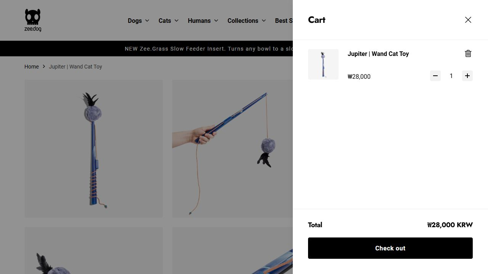

# External Commerce Benchmark

조사일 2026-08-30 KST. [Production Audit](production-audit.md)와 독립적인 외부 조사다. 실제 Chrome rendered page·스크린샷·공개 DOM·선택 동작이 근거이며 이전 문서의 Reference 표를 재사용하지 않았다. 브랜드 외형·이미지·문구를 새 시안에 복제하지 않는다. 아래 수치/평가는 해당 관찰 시점에만 유효하다.

## 접근 기록

| ID / URL | 웹 텍스트 접근 | 실제 브라우저 결과 / 캡처 |
| --- | --- | --- |
| B01 [올리브영](https://www.oliveyoung.co.kr/store/main/main.do?oy=0) | 본문 0줄 | 성공. [937 CSS px Home](evidence/benchmark-oliveyoung-937.jpg) |
| B02 [컬리](https://www.kurly.com/main) | 본문 0줄 | 성공. [937 Home](evidence/benchmark-kurly-937.jpg), [베스트](evidence/benchmark-kurly-best.jpg), [가격 선택](evidence/benchmark-kurly-filter.jpg), [PDP](evidence/benchmark-kurly-pdp.jpg) |
| B03 [오늘의집 Commerce](https://store.ohou.se/) | pixel 링크 정도, UI 판단 불가 | 성공. [937 Home](evidence/benchmark-ohou-937.jpg), [후속 1440](evidence/benchmark-ohou-wide.jpg) |
| B04 [무신사](https://www.musinsa.com/main/musinsa/recommend?gf=A) | 본문 0줄 | 성공. [937 Home](evidence/benchmark-musinsa.jpg). 검색 레이어 click 확인; 개인 최근검색 노출 가능성이 있어 검색 캡처는 보존하지 않음 |
| B05 [쿠팡](https://www.coupang.com/) | 403 Forbidden | **브라우저 성공**, [937 Home](evidence/benchmark-coupang.jpg). HTTP 차단을 화면 접근 실패로 일반화하지 않음 |
| B06 [펫프렌즈](https://m.pet-friends.co.kr/main/tab/2) | 의미 있는 본문 부족 | 성공. [초기 937 앱 유도](evidence/benchmark-petfriends.jpg), [375 category·상품](evidence/benchmark-petfriends-categories.jpg) |

컬리 실제 이동: [베스트 목록](https://www.kurly.com/collection-groups/market-best-category?site=MARKET) → [5,000원 미만 선택](https://www.kurly.com/collection-groups/market-best-category?site=MARKET&page=1&collection=market-best-logic&filters=price%3A-5000) → [공개 PDP](https://www.kurly.com/goods/1000480296?collectionCode=market-best-logic). 페이지의 공개 링크를 눌러 이동했고 결제·담기는 수행하지 않았다.

펫프렌즈 앱 유도 overlay 닫기 후 상품과 category 탐색을 관찰했다. 로그인/가입 진입 시도에서는 상담 overlay가 화면을 덮었고 URL은 Home에 남았다. [차단 상태](evidence/benchmark-petfriends-blocked-navigation.jpg)를 로그인 화면으로 해석하지 않는다. 외부 Login·Cart·Checkout 비교는 **UNVERIFIED**. 해당 패턴을 본 것처럼 근거로 삼지 않는다.

937px 일부 PC 사이트는 고정폭 콘텐츠가 가로로 넘쳤다. 이를 해당 서비스의 전체 반응형 품질 평가로 확장하지 않고, 그 viewport에서 보이는 영역만 관찰했다. 별도로 실측하지 않은 px/폰트 값을 외부 서비스의 정확한 값으로 기록하지 않는다.

## 패턴별 판정

| 근거 | 실제 관찰한 패턴 | 판정 | PawCycle 변환 / 버리는 부분 |
| --- | --- | --- | --- |
| B01 Header | category와 캠페인 nav가 분리되고 검색이 상단 중심에 있음 | **ADAPT** | search 우선순위 채택, 적은 taxonomy 규모에 맞춰 단일 masthead로 축소 |
| B01 category/hero | Hero 옆 계층 category로 상품 탐색과 promotion이 함께 보임 | **ADAPT** | category 계층은 별도 panel. 실제 캠페인 데이터 없는 PawCycle에는 대형 promotion Hero 미사용 |
| B01 animation | carousel 화살표·페이지·pause 컨트롤 노출 | **REJECT** | A는 carousel 자체 없음. 적은 상품을 자동 회전으로 가리지 않음 |
| B02 Home | 넓은 검색, category/nav와 첫 상품 shelf의 위계, 상품 이미지 중심 | **ADAPT** | 상품 shelf 우선, 신규 가입 팝업·상단 혜택 band는 넣지 않음 |
| B02 PLP | 왼쪽 filter의 category·가격 구분, 오른쪽 결과 수·sort, 선택 가격이 결과 위 removable label | **ADOPT** | 적용된 조건을 결과 바로 위에서 확인/삭제. `선택한 필터` accessible name |
| B02 PLP | 상시 filter sidebar와 category별 결과 개수 | **REJECT** | A는 toolbar/popover. PawCycle discovery는 facet별 count를 제공하지 않으므로 개수 금지 |
| B02 price filter | 가격 radio 선택 후 선택값·결과 수·URL 변경, 5천원 미만 범위 표시 | **ADAPT** | 가격 범위 의미를 쉽게 읽게 함. PawCycle은 min/max 직접 입력만 기본; 임의 가격대 preset은 추가하지 않음 |
| B02 cards | 큰 이미지→담기 control→상품명→원가/할인/판매가. 할인 강조색과 숫자 굵기 차이 | **ADAPT** | 판매가 최우선·비교가 보조. 카드 즉시 담기는 옵션을 알 수 없어 미채택; PDP로 이동 |
| B02 PDP | 좌 gallery / 우 상품명·판매가·배송 항목. 여러 혜택 가격을 별도 색으로 노출 | **ADAPT** | 옵션별 확정 금액 우선. 회원별 혜택가·쿠폰 중복 계산·내일 도착 약속은 PawCycle 서버 계약 없어 거부 |
| B02 scroll | 선택 가격을 확인할 때 상단이 category/nav와 축약 검색으로 바뀐 상태를 관찰 | **ADAPT** | 탐색 가용성은 유지. A는 높이 변화 없는 고정 Header로 focus/CLS 예측 가능하게 함 |
| B03 Home | 이미지 2장 중심 캠페인, 쇼핑 active underline, category 별도 구획 | **ADAPT** | A active underline, B 편집 구획 비교안. 오늘의집 blue·이미지·프로모션은 복제 안 함 |
| B03 navigation | 커뮤니티와 쇼핑 구분, shopping 내부 nav가 촘촘함 | **REJECT** | PawCycle에 community/기획전/라이브 목적지를 만들지 않음 |
| B04 Home | dark masthead와 밝은 상품 영역, 얕은 탭과 대형 editorial image, 여러 compact 모듈 | **ADAPT** | B의 큰 사진과 작은 masthead 대안. A에는 dark full header·캠페인 난립 없음 |
| B04 search | 검색 action이 별도 큰 overlay로 전환되고 닫기 제공 | **ADAPT** | B 후보에서 search overlay. A mobile은 펼쳐진 search. 자동완성/인기검색 API가 없으므로 검색 랭킹 표시 금지 |
| B05 Home | 검색이 거의 전체 폭을 차지하고 category가 search와 연계. cart count 노출 | **ADOPT** | A의 항상 찾을 수 있는 검색과 cart count. count unknown을 0으로 속이지 않음 |
| B05 merchandising | 배너·배송 브랜드·혜택·재구매 진입이 높은 밀도로 배치 | **ADAPT** | 로그인 이후 실제 재구매 근거가 있는 때만 compact module. 무료배송·도착일·membership은 가져오지 않음 |
| B06 species/category | 강아지 종 선택과 사료/간식/용품 탭, 작은 category 그림+label, 하단 탐색 dock | **ADAPT** | C의 종별 진입, A의 dog/cat 링크. 등록 pet과 쇼핑 petType을 구분. 없는 taxonomy는 만들지 않음 |
| B06 card | image, 상품명, 할인·판매가, 적립·배송·평점으로 이어지는 촘촘한 위계 | **ADAPT** | price/availability·review만 API 값으로. 첫구매 혜택가·적립·재구매율·배송 badge는 추가하지 않음 |
| B02/B06 overlays | 진입 후 가입/앱 설치 overlay가 탐색을 가림 | **REJECT** | 자동 가입 popup 없음. 로그인은 사용자가 보호 action을 선택한 때에만 |
| B06 footer/dock | mobile 바닥에 주요 목적지, 지원 bubble·혜택 banner도 겹침 | **REJECT** | A는 floating 지원 bubble·고정 광고 없음. PDP/Cart action bar는 하나만 |

## 근거에서 설계로의 연결

외부 사이트들은 상품/이미지/가격을 핵심 콘텐츠로 다루지만 현재 PawCycle은 서비스 설명과 빈 card가 주인공이다. 따라서 A는 Hero를 제거하고 상품 grid를 첫 콘텐츠로 올린다. B/C는 외부 사례의 editorial·종별 접근을 각각 독립 방향으로 비교한다. 사이트마다 보기 좋은 요소를 수집해 기존 cream/green card 구조에 얹지 않는다.

R0에서는 외부 wishlist mutation, empty/no-result, login 성공, cart, checkout, modal focus trap 전수검사를 하지 않았다. R1에서 아래 Cart/Checkout/Login 화면 관찰을 추가했다. 새 상태 계약은 해당 사이트의 전체 기능 검증 결과가 아니라 PawCycle 기능 제약과 명시적인 디자인 제안이다.

## R1 Cart/Checkout/Login 추가 조사

2026-08-30 약11:10–11:25 KST, Codex in-app browser의 실제 rendered UI를 관찰했다. 기존 R0 Chrome 관찰과 별도 세션이다. 텍스트 검색이나 로컬 UI 데이터 검색으로 대체하지 않았다. 아래는 직접 접속·탐색 후 저장한 screenshot이다. 캡처 이미지의 pixel 크기는 browser CSS viewport와 구분해 manifest에 기록한다.

| ID / 목적 | 실제 접근과 관찰 | 증거 |
| --- | --- | --- |
| R1-B01 Login | [컬리 로그인](https://www.kurly.com/member/login): Home 로그인 진입→아이디/비밀번호, primary 로그인, secondary 회원가입, 별도 간편 로그인. 로그인 제출 없음 | [Login 캡처](evidence/r1-kurly-login.jpg) |
| R1-B02 Cart | [컬리 Cart](https://www.kurly.com/cart): Header cart 진입. 0/0 선택 disabled, 중앙 empty, 오른쪽 금액 rail·로그인 CTA. 쿠폰 금액은 ‘로그인 후 확인’ | [Empty Cart 캡처](evidence/r1-kurly-cart-empty.jpg) |
| R1-B03 populated Cart | [Zee.Dog Jupiter PDP](https://www.zeedog.com/products/jupiter-wand-cat-toy)→비회원 조사 세션에 상품1개 담기→Cart drawer. 작은 썸네일/제목/금액/수량/삭제, 하단 합계·Check out | [Cart drawer 캡처](evidence/r1-zeedog-cart.jpg) |
| R1-B04 Checkout | R1-B03에서 Check out 진입, Zee.Dog의 실제 hosted Checkout. Contact→Delivery→Shipping method→Payment, 오른쪽 상품·금액 summary, brand logo와 Cart만 남긴 shell | [전체 Checkout 캡처](evidence/r1-zeedog-checkout-full.jpg), [Payment 구획](evidence/r1-zeedog-checkout.jpg) |

Checkout 주소는 세션별 경로·queue 값이 포함되어 원문 URL을 저장하지 않는다. 위 공개 PDP와 ‘담기→Cart→Check out’ 경로로 재현한다. 개인정보·주소·카드·쿠폰·로그인 입력 없음. **Pay now/express pay/등록·구매·결제 제출 없음**. 외부 비회원 조사 cart에1개를 담은 행위는 수행했다. 기존 사용자 cart는 먼저 빈 상태임을 확인했으며 기존 계정·상품을 수정하지 않았다. 로그인/구매 결과 검증은 아니다. PawCycle Production mutation은 전혀 수행하지 않았다.

초기 Cart 링크 click은 추가 후 accessible name이 ‘Cart 1’로 변해 매칭되지 않았다. 새 DOM 확인 후 해당 링크로 열었다. 초기 Checkout capture가 Payment 위치에 있어 Email field focus 후 full-page screenshot으로 Contact부터 전체 위계를 확인했다. 이 실패를 성공 관찰처럼 생략하지 않는다.

### 관찰에서 PawCycle 설계로

| 실제 pattern | 판정 | PawCycle 반영/제외 |
| --- | --- | --- |
| 컬리 Login의 채워진 primary와 외곽 secondary | ADAPT | 주목적 로그인1개, 상품 탐색은 작은 link. 없는 회원가입/소셜 auth/계정찾기는 복제 안 함 |
| 컬리 Login의 placeholder 의존 label·큰 전역 navigation | REJECT | 항상 보이는 field label과 복귀 맥락, 독립 인증 shell로 집중 |
| 컬리 empty Cart에서도 유지되는 금액 rail·disabled 선택 | ADAPT / REJECT | 금액 row 위계는 참고. PawCycle empty에서는 허구 0원 계산과 주문 rail을 제거하고 탐색 회복만 제공; 선택주문 기능도 없음 |
| Zee.Dog Cart drawer의 짧은 상품 행과 하단 total/action | ADAPT | Cart 행·summary의 역할 분리. PawCycle에는 독립 Cart page를 유지, 근거 없는 thumbnail은 text-only 행으로 해결 |
| Zee.Dog Checkout의 구매 전용 shell·좌 form/우 summary | ADOPT / ADAPT | 독립 Checkout 보드: 배송지/상품/쿠폰 main, 금액/CTA rail. 회원 배송지 선택과 기존 Toss 연동 계약에 맞춤 |
| Checkout 배송지 미입력 시 배송비 확인 안내 | ADAPT | 불확실한 금액/배송을 확정값처럼 표시하지 않음. PawCycle은 자체 서버 pricing만 권위 |
| Country/Region의 디자인된 select, radio 결제 선택, input | ADOPT 원칙 | native semantics와 외형을 분리. 단순 선택에 불필요 custom select 강제하지 않음. OS popup 외형 허용 |
| 기본 checked 뉴스/혜택, express wallet, 세금 추정/코드 입력 | REJECT | PawCycle에 없는 마케팅 동의·지갑·할인코드·해외 세금 UI를 만들지 않음. 쿠폰은 기존 member coupon만 |
| Pay now로 끝나는 즉시 결제 절차 | ADAPT | PawCycle ‘주문 및 결제 준비’와 ‘결제수단 선택’ 구분. 준비 성공을 결제 완료로 부르지 않음 |

이번 추가로 **실제 Login, empty Cart, populated Cart, Checkout 화면** 근거를 확보했다. 해외 Checkout 최종 결제/오류/입력 validation, 국내 인증 Checkout, mobile 각 폭 및 keyboard focus trap은 미검증이다. 어느 사이트의 동작도 PawCycle의 서버 계약이나 PO 결정에 우선하지 않는다.
