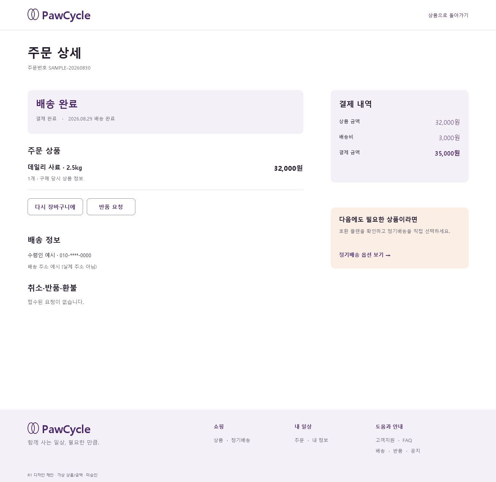
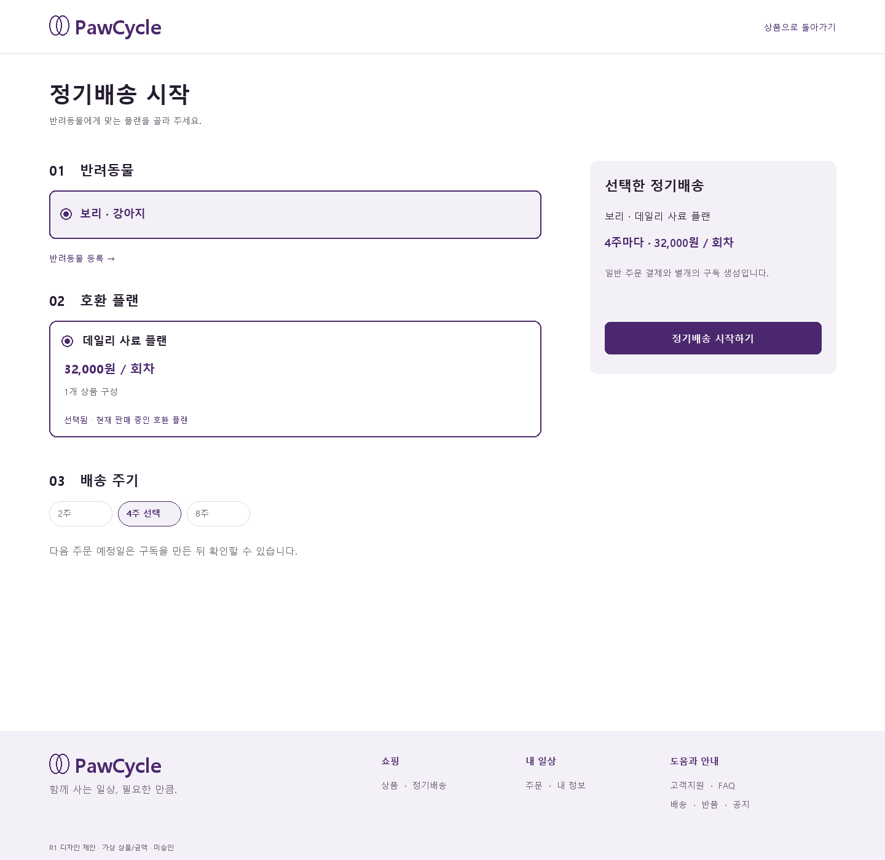
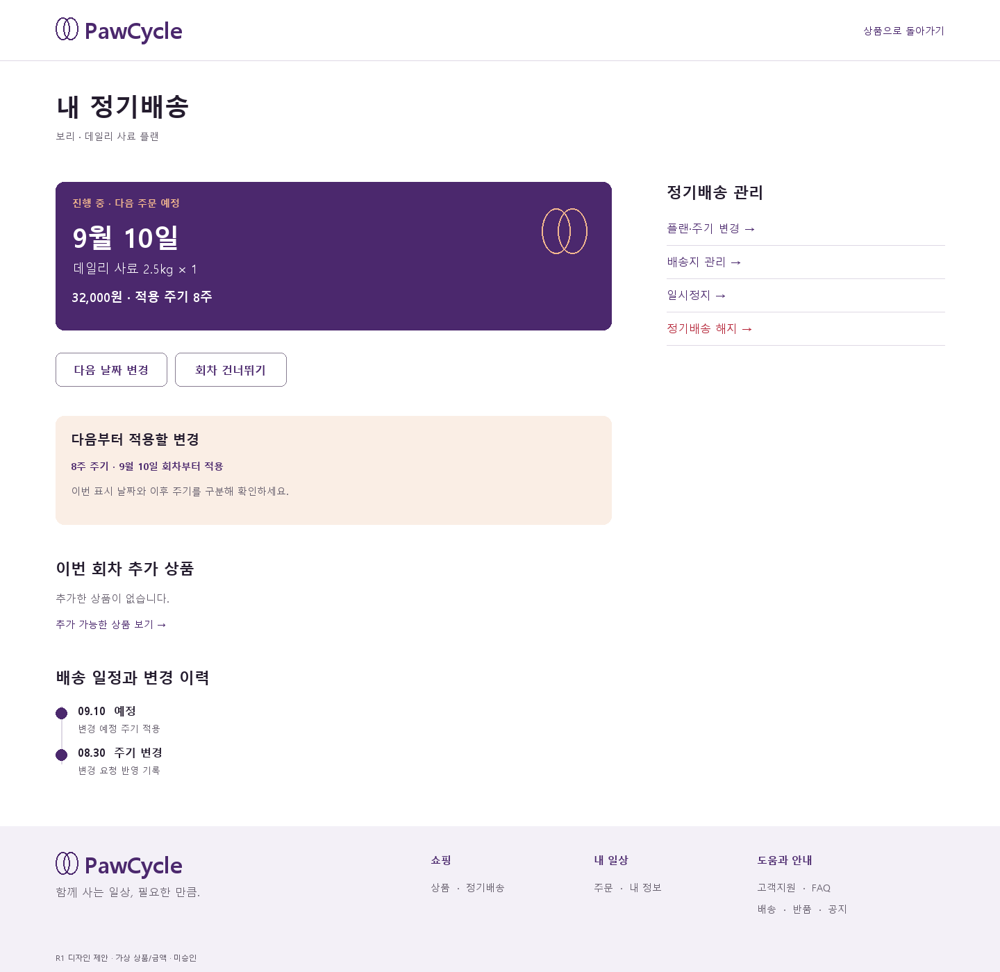

# Customer page families · A R1

**제안 / 미승인.** 새 기능이나 API를 승인하는 문서가 아니다. [R1 visual](review-r1.md), [기존 interaction](interaction-responsive.md), [PS-003](../../product/PS-003-ux-product-decisions.md), [API-008 구독 관리](../../api/API-008-mvp4-subscription-self-service-api-contract.md), [API-012](../../api/API-012-mvp4-final-product-backend-api.md)를 따른다. 현재 코드의 route/type은 표시할 수 있는 정보의 경계를 확인하기 위한 보조 근거다.

## 전체 범위와 family 구성

관리 화면 전체를 반복 card dashboard로 만들지 않는다. desktop은 얕은 계정 navigation(200w) + 열린 main(최대1000), mobile은 페이지 제목 옆 ‘내 정보 메뉴’ disclosure로 전환한다. 주문/구독 상세·생성은 좁은 navigation 대신 목록 복귀 링크와 넓은 읽기/입력 공간을 사용한다. 상단 검색은 상품 탐색 shell에만 항상 표시하고 Checkout/Login/구독 생성은 compact shell. 사용자에게 보이지 않는 admin family는 범위 밖이다.

| Family / 기존 경로 | 주요 구성과 대표 action | 빈 상태·실패·모바일 계약 |
| --- | --- | --- |
| Wishlist `/wishlist` | h1+개수, 상품 이름·등록일+삭제·상품 보기. 현재 WishlistItem에는 가격/사진 없음 | 없으면 ‘아직 찜한 상품이 없어요’+상품 탐색. 조회 실패는 retry, 삭제 실패는 행 유지. detail hydration 미승인 시 가짜 카드가격/사진 금지. mobile 한 열 text row |
| Compare `/compare` | 2~3개 선택, 상품 열+고정 항목 이름, 사실값 위에 가격/구매상태. 관련 상품으로 이동 | 0~1개면 필요한 개수 설명+상품 찾기. 320은 항목별 accordion으로 상품2~3개 값 세로 나열, 가로 페이지 overflow 금지. canonical 실패와 AI 설명 unavailable 분리 |
| Orders `/orders` | 주문번호·일시·상태·paymentAmount 행, 상세보기. 최신순은 실제 응답 순서/명시 정렬만 | OrderSummary에 상품 thumbnail/title 없음. 허구 대표 상품/배송 ETA 금지. mobile 주문번호+상태→날짜→금액, 전체 행 link와 내부 action 중첩 금지 |
| Order Detail `/orders/{id}` | 상태, 구매 당시 상품, 배송, 결제, 요청·환불 기록, 재구매와 구독 진입 | 아래 상세 계약. 주문 없음/권한 없음은 타인 주문 존재를 노출하지 않는 안내. 일부 추천 오류는 주문 조회 차단 안 함 |
| Subscription List `/subscriptions` | pet·plan·status·서버 next date·현재 주기, 상세보기, 새 정기배송 | ACTIVE/PAUSED/CANCELED를 label로. 검색/필터는 서버 보장 전체 결과에 대해서만; page 결과를 전체 count처럼 표시하지 않음. empty→시작 |
| Subscription New `/subscriptions/new` | pet→호환 PlanVersion→허용 cycle→검토·명시 생성 | 아래 상세. query 추천은 재검증 후에만 선택, auth 이후 입력 자동복원 약속 없음 |
| Subscription Detail `/subscriptions/{id}` | 이번 예정회차→pending→추가상품→관리→일정/이력 | 아래 상세. PAUSED/CANCELED에 가짜 다음 날짜 없음. availableActions에 없는 command는 숨김 |
| My `/my` | 주문·정기배송·반려동물·배송지·결제·알림의 목적별 text links. 실제 로그인 정보 | unknown count를 0으로 만들지 않고 count 자체 생략. 추천/회원등급 카드 창작 없음. mobile 구매 관리와 내 정보 두 묶음 |
| Pet `/pets` | 이름·종·품종·체중·profileComplete, 등록/수정 form | 이름+종 필수; breed/weight는 실제 schema. profile 미완성은 중립 안내, 건강 평가 아님. 삭제 기능을 API 없이 만들지 않음. mobile 단일열 form |
| Address `/addresses` | 별칭·수령인·연락처·주소·기본 label, 추가/수정/기본설정/삭제 | 기본설정·삭제 각각 busy. 실패 행 유지, 삭제 confirm은 별칭+안전한 일부 주소. Checkout 복귀는 안전 path. 주소록 기본설정과 구독 배송지 변경을 동일 mutation으로 취급하지 않음 |
| Billing `/billing-methods` | Toss 설정/등록 여부, 기존 등록 흐름으로 이동 | configured=false는 기능 준비 안내, registered=false는 등록 안내. 없는 카드번호·카드명·월간청구 통계 금지. 등록 완료 조회 확인 뒤 상태 갱신, token/원시 키 표시 금지 |
| Notification `/notifications` | 종류·관련 목적지·일시·읽음 상태. 행 읽기, 모두 읽음 | dot+‘읽지 않음’ label, 배경색만 의존 안 함. mutation 실패 시 읽음 처리로 속이지 않음. 0건 중립 안내. 구독 날짜/reference가 없으면 조작한 링크 금지 |
| Support `/support` | 주문/구독 문제 해결 입구, FAQ/배송/반품/공지 링크 | 서비스 연락 수단이 확정되지 않으면 가짜 chat·전화·운영시간 없음. 접수 API 없이 문의 전송 form 생성 금지. 문서 링크는 로그인 불필요 |
| FAQ `/faq` | 배송/결제/구독 분류, 질문 disclosure→답변, 지원 경로 | disclosure는 button+expanded+controls 또는 details/summary. 답변은 승인된 정책만. 320 제목 줄바꿈, 여닫기44h 이상 |
| Notice `/notice` | 공지 제목·실제 날짜·본문 disclosure/페이지내 anchor | 별도 detail route 없는 경우 없는 링크 생성 안 함. 공지 없으면 안내, error와 구분. 가짜 행사/신규 정책 금지 |
| Shipping `/shipping` | 비용/절차/확인 위치의 읽기 문서 + 주문 조회 | 금액·지역·도착일 정책을 디자인이 확정하지 않음. 제목/본문 max720, mobile 16/26, 고객지원 링크 |
| Returns `/returns` | 반품 절차·상태 확인·주문 상세 진입 | 일률 반품기한·무료반품 창작 없음. 실제 요청은 주문 상세 availableActions. 요청 접수≠승인≠환불 완료를 분리 |

이 표는 모든 family의 visual/interaction 최소 계약이다. 6개 대표 화면 외에 모든 route를 high-fidelity로 그렸다는 뜻은 아니다. **Order Detail와 Subscription New/Detail은 아래 원본6개와 상세 계약까지 제공**한다.

## Order Detail — 구매의 기록과 다음 구매

[Desktop](visuals/r1-order-detail-desktop.png) · [Mobile](visuals/r1-order-detail-mobile.png)

1440: compact masthead88 → 목록 복귀/h1·orderNumber → 왼쪽800, gap80, 오른쪽400. 왼쪽 상태 band126h, 주문 상품 행, 배송 정보, 취소·반품·환불 이력. 오른쪽 결제 내역과 정기배송 옵션. desktop 상태28/36, 번호14/22, 금액28/36. 모바일16 gutter/343w, status→상품→배송→요청·환불→결제→구독 제안, sticky 구매 CTA 없음. 재구매는 명시적인 새 행동이며 원 주문의 상태 변경처럼 배치하지 않는다.

| 구획 | Visual contract | 데이터와 상태 |
| --- | --- | --- |
| 상태 band | surface fill, 가장 큰 주문 상태, 아래 결제·배송 별도 label | order.status/payment.status/delivery.status 별도. 결제 완료만으로 배송 완료 timeline 채우지 않음 |
| 상품 | 상품명18/26 bold, SKU14/22, unitPrice·quantity·lineAmount, 24 간격 구분선 | OrderItem snapshot 사용. 현재 PDP명/가격으로 과거 내역 덮기 금지. image 없는 행 완성형 |
| 배송 | 수령인·주소·연락처를 label/value; carrier/tracking 있을 때 표시 | 없는 운송장 ‘확인 중’ 또는 항목 생략, 임의 택배사 외부 URL 금지. 서버 shipped/delivered 시간만 단계 날짜로 표시 |
| 결제 | 상품원금/할인/배송비/paymentAmount, provider·status | null payment→준비 중, UNKNOWN→warning+확인 필요. 이 금액을 프론트가 다시 합산해 권위값 대체 안 함 |
| 취소/반품 | 상품 위쪽 secondary action, 실행 시480w confirm, 사유 textarea min112h | availableActions의 REQUEST_CANCELLATION/REQUEST_RETURN만. 사유 검증, 진행중 busy. 취소 기본 focus, 완료 후 재조회 |
| 요청·환불 이력 | 요청/승인/환불 각각 행, 14px timestamp, status badge | REQUESTED/REFUND_PENDING/COMPLETED 등을 분리. 환불 FAILED/UNKNOWN은 error/warning+지원, 성공으로 합치지 않음 |
| 다시 담기 | ‘다시 장바구니에’ secondary, 진행중 같은 폭 | 기존 reorder 계약. 성공 added/skipped 내역+Cart link. 일부 누락은 이유를 상품별 표시, 결제/주문 자동 실행 없음 |
| 정기배송 옵션 | muted apricot 면, 낮은 우선 제목, pet+호환 플랜+주기 선택으로 이어지는 link | API-012 subscription-options만. 없으면 구획 생략, 오류면 해당 구획 retry. 연결 fromOrderId/petId/planVersionId/cycle는 새 화면에서 재검증 |

정기배송 옵션은 이미 배송된 주문의 상태 옆에 ‘즉시 전환’ 토글로 붙이지 않는다. 현재 주문을 구독으로 변환하거나 과거 가격을 새 플랜 가격으로 고정한다는 인상을 피한다. 모바일 confirmation은 좌우16, 최대90dvh 내부 scroll; summary focus와 원 trigger return, 실패 시 사유 보존.

## Subscription New — 승인할 구성을 명확히

[Desktop](visuals/r1-subscription-new-desktop.png) · [Mobile](visuals/r1-subscription-new-mobile.png)

1440 grid800/400, main의 01 Pet/02 호환 플랜/03 주기는 열린 세 구획이며 stepper가 숨겨진 페이지 전환을 암시하지 않는다. sidebar는 선택된 내용과 52h 생성 CTA. 375는 세 구획 다음 summary·CTA. 생성 전 정확한 예정일 달력 또는 도착 예정일을 표시하지 않는다.

1. **Pet 선택**: label+native radio row78h, selected 2px brand+dot+이름 bold. 별도 등록은 이름/종 form으로 펼침. pet 없으면 등록 form만 우선, 플랜 영역은 ‘반려동물을 먼저 선택해 주세요’. 변경 시 이전 plan/cycle 지우고 loading; 타 종 선택이 이전 승인값을 유지하지 않는다.
2. **호환 플랜**: 조회값만 노출. planName20/28, packagePrice18/26, 구성 개수14/22, ‘상세 선택’44h. 실제 SKU 이름/사진 조회가 없으면 가상 imagery 대신 text-only. 선택 후 detail을 재검증하며 실패하면 이전 가격으로 생성 불가. 없는 플랜은 빈 호환 목록 안내·pet 재선택, 무한 skeleton 금지.
3. **주기**: allowedDeliveryCycleWeeks만 label+radio chip44h. 2/4/8주를 고정 상수처럼 전부 활성화하지 않음. suggestion은 선택 권고일 뿐 명령 아님. 시안은 허용된 2/4/8 중4주 선택 예시. 현재 `PlanVersion.sale.onSale`은 판매 가능 조건이지 할인율 배지 근거가 아니다.
4. **검토**: pet·planVersion·SKU 구성·주기·packagePrice를 표시. 생성 전 ‘다음 주문 예정일은 구독을 만든 뒤 확인할 수 있습니다.’ 필수. 일반 Cart/Toss 결제와 다른 구독 생성임을 밝힌다. 없는 할인·첫배송일·최소기간·무료배송 약속 금지.
5. **생성**: 현재 계약 petId+planVersionId+cycle만 제출하는 명시 action. 모든 선택 완료 전 disabled+누락 안내; 진행중 lock/aria-busy. 동일 의도 재시도는 같은 idempotency key, 선택 변경은 새 의도. 성공은 생성된 subscription detail로 이동, success banner·ID·서버 next date. 영구 생성완료 페이지 만들지 않음.

| 예외 | visual / 회복 |
| --- | --- |
| 주문에서 전달된 pet/plan/cycle 부적합 | 상단 warning ‘이전 선택을 확인할 수 없어 직접 선택해 주세요’. 가짜 선택 유지 금지 |
| PLAN_NOT_AVAILABLE / PET_TYPE_MISMATCH | 해당 구획 inline error+상단 summary, 목록 재조회 후 사용자 선택. 자동 다른 플랜 생성 금지 |
| CYCLE_NOT_ALLOWED | 주기 오류, 허용 목록 재확인; 가장 가까운 값 자동 확정 금지 |
| 응답 불명확·network | 입력 유지, 실패를 확정 성공처럼 표시하지 않음. 명시 재시도·중복 방지 |
| auth/CSRF | 로그인 안전 GET 복귀 또는 보안 정보 재확인 안내. password·request key·원시 응답 로그 노출 없음 |

## Subscription Detail — 이번과 다음을 나눠 보여주기

[Desktop](visuals/r1-subscription-detail-desktop.png) · [Mobile](visuals/r1-subscription-detail-mobile.png)

최상단에는 subscription status와 서버 nextDelivery, 그 아래 pendingChange를 별도의 apricot 구획으로 둔다. 오른쪽 관리 rail은 현재 가능한 action만. ‘현재 플랜’ currentSnapshot, ‘다가오는 회차에 적용되는 구성’ nextDelivery, ‘예약한 변경’ pendingChange를 하나의 값처럼 합치지 않는다. 예시의 current 주기가4주이고 pending이9월10일에8주 적용이면 nextDelivery의 effective 주기는8주이므로 날짜 band에도 **적용 주기8주**를 표시한다.

| 구획 | 시각 규격 | 계약 |
| --- | --- | --- |
| 이번 예정 회차 | brand band213h, label14, 날짜38/46, 상품18/26, total18/26; 장식 궤도는 보조 | nextDelivery.scheduledDate/items/deliveryCycleWeeks/orderTotalKrw 사용. 도착일이 아니라 주문 예정일. PAUSED/CANCELED/null은 날짜 band 대신 상태 설명 |
| 현재/변경 예정 | current summary는 작은 text, pending 별도 pad24/radius12, 적용일 bold | pendingChange.appliesOn/구성/price/cycle. target 날짜가 변하면 서버 재조회값 반영; 프론트 날짜 산출 금지 |
| 추가상품 | 이번 회차 전용 label, product/SKU/qty/lineAmount + 제거 | addOns/addOnTotalKrw/orderTotalKrw, server availableActions. 추가상품 없는 예시 제공. 추가/제거 뒤 확정 summary 갱신; 정기 구성 영구 변경으로 표현하지 않음 |
| 추천 주기 | 현재/권고 주기와 근거, secondary ‘변경 내용 확인’ | API suggestion null이면 자연 생략, 실패해도 구독 관리 가능. 권고만 보고 명령 전송 금지 |
| 관리 | 날짜 변경/건너뛰기는 상단, 플랜·주기/배송지는 rail, 일시정지·해지는 하단 | availableActions 허용만, status로 임의 추정하지 않음. 해지는 red text+확인, 초점 기본 취소 |
| 일정·이력 | 날짜·상태·기록 수직 목록, 실제 페이지별 더보기 | schedules와 commandHistory 구분. SCHEDULED/SKIPPED/HELD/CANCELED label. 연결 orderId가 없으면 ‘연결 주문’ link를 만들지 않음. 보드는 주기 변경 기록으로 표시 |

### 명령별 confirmation

desktop480w, mobile 좌우16/max90dvh. 제목22/30→대상 회차14→변경 전/후 각각 label/value→영향 설명16/26→취소/확인48h. 결과는 기존 페이지 최신 상세를 갱신하고 focus를 상태 summary로 반환한다. 다른 command 진행 중에는 충돌 가능한 command를 잠그며 disabled 이유 제공.

| Action | 입력·명시 확인 | 성공 / 제한 |
| --- | --- | --- |
| 날짜 변경 | 기존 날짜와 새 날짜, native date input48h의 스타일링 허용 | Asia/Seoul 미래·같은 구독 일정 중복 불가. 409는 inline, 입력 보존. 예상 도착일로 표현 안 함 |
| 플랜/주기 변경 | 현재와 변경될 구성·금액·주기, 적용일은 서버 확정값만 | pending snapshot 하나. 플랜 변경/주기 변경 간 현재 pending의 다른 축 보존. ‘즉시 적용 완료’로 쓰지 않음 |
| 건너뛰기 | 대상 회차·날짜와 ‘이번 회차를 건너뛸까요?’ | 다음 날짜 client+4주 계산 금지, 명령 응답값 표시 |
| 일시정지/재개 | 상태별 영향과 confirmation | PAUSED는 nextDelivery null. 재개 후 실제 일정 조회, 재개 클릭 전 확정일 없음 |
| 해지 | 구독명+취소 기본 focus+해지 명시 | 해지 후 없는 재개 버튼 제안 금지. 과거 주문 환불과 별개 |
| 배송지 변경 | 현재 구독 주소와 입력값, 변경 확인 | 주소록 기본설정과 별도. 저장 실패 form 보존. 문제 보완은 별도 retry command 아님 |
| 추가상품 | 선택 SKU·수량·이번 회차만 표시 | 서버 허용 범위·재고 검증, stale/품절이면 row 안내·재조회. 새 영구 플랜 구성 아님 |

### 핵심 상태 표현

| 상태 | 표현 / action |
| --- | --- |
| ACTIVE + SCHEDULED | 예정일과 구성, 허용 관리 action. 화면 시안 기본 |
| ACTIVE + HELD | **구독 HELD라는 새 상태를 만들지 않음**. 구독 진행 중 + 해당 회차 보류 warning. issue message와 허용 복구만 |
| SHIPPING_ADDRESS_REQUIRED | 주소 등록/변경. 회차 정상화는 기존 서버 로직, 별도 ‘재실행’ 버튼 없음 |
| BILLING_METHOD_REQUIRED | 결제수단 등록. Toss 복귀 후 조회하여 실제 상태 확인 |
| PAYMENT_SUPPORT_REQUIRED / STOCK_UNAVAILABLE | 지원 안내 또는 재고 보류 설명. 무조건 다시 결제/재주문 금지 |
| PAUSED | ‘일시정지 중’, 날짜 대신 설명, RESUME 등 실제 actions만 |
| CANCELED | ‘해지됨’, 과거 정보 read-only. 신규 생성은 별도 flow, 재개로 표현 금지 |
| 412 version mismatch | 상단 error ‘다른 변경이 먼저 반영됐어요’, 최신 상세 조회→재검토. 자동 command replay 없음. 회차 보류의 warning과 구분 |
| loading / error | 해당 구획 skeleton·retry, 정보 없는데 가격0/날짜오늘 표시 금지. critical detail 실패시 command unavailable |

## Family 공통 acceptance

- 320/375:16 gutter, 768:24,1024:32,1440:80. 관리 navigation은 <1024 collapse. form 단일열 min-width0; 긴 주소/주문번호는 wrap, 금액은 숫자+원 묶음. 확대 시 복잡한 표는 항목별 세로 구조로 전환한다.
- 내 정보 navigation active는 underline+aria-current, count가 없어도 목적지 label 유지. 상태 badge는 text, error는 message, 선택은 native checked와 시각 표시를 같이 가진다.
- 조회 loading/error/empty/auth-required를 구별. auth-required는 오류색 금지; 실제 조회 오류만 error+retry. 성공 toast만으로 중요한 결제/구독 결과를 전달하지 않는다.
- optimistic 금액·날짜·결제성공 표시 금지. 개인 데이터는 계정 확인 전 출력 안 하며 snapshot/PR/시안은 가상 데이터만.
- keyboard focus, 200% zoom, screen reader, SDK/서버 transition은 이후 승인된 FE/QA 단계의 검증 대상이다. 이번 정적 보드로 PASS 처리하지 않는다.
