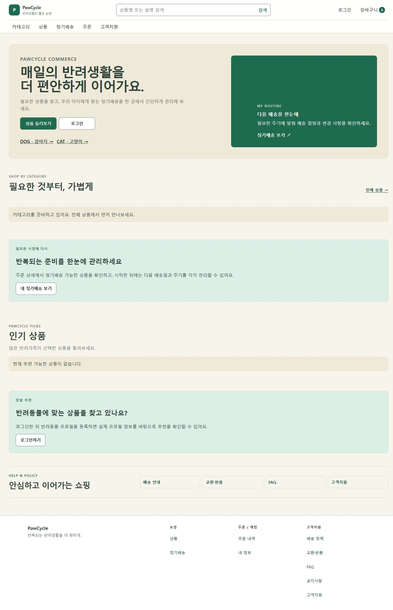
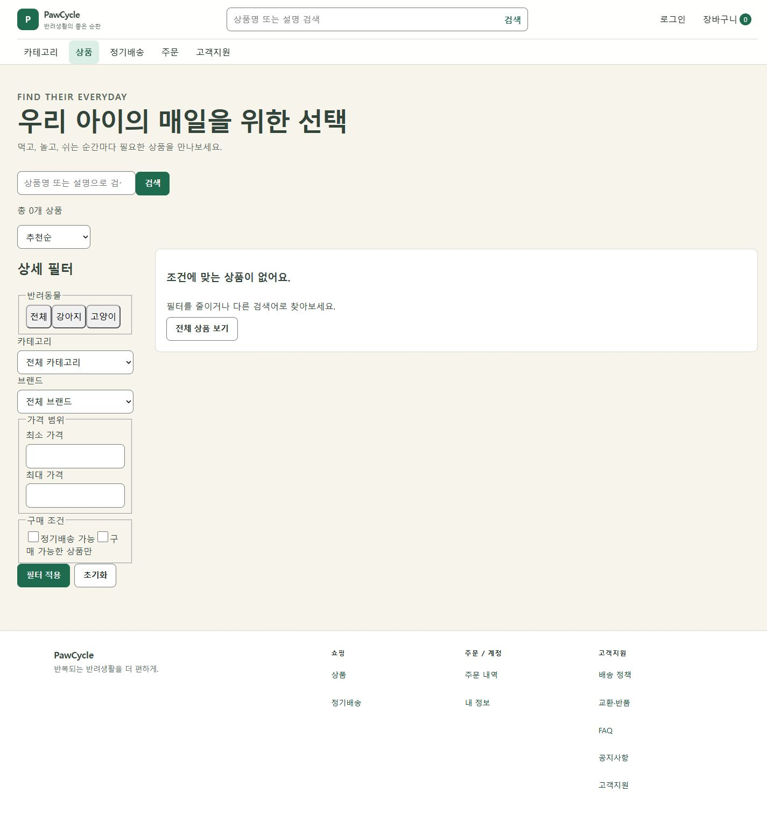

# Production Visual Audit

상태: **PARTIAL VERIFIED**. 공개 Home·PLP·Login·공통 shell 및 anonymous Cart/Checkout를 직접 렌더링했다. populated PDP·인증 이후 Cart/Checkout 전체 감사는 완료하지 못했다. 사용자 Screenshot은 미첨부였으나 직접 Production 재캡처로 핵심 대조를 충족했으며 R1에서 승인 blocker에서 제거했다. [승인 관문](README.md#visual-approval-gate).

## 관찰 방법과 증거 한계

- 일시: 2026-08-30 약 10:20–10:45 KST. 공개 사이트를 연결된 Chrome에서 열고 화면 캡처·DOM·실제 click·scroll·keyboard·viewport 변경을 함께 확인했다.
- 요청 URL: [Home](https://pawcycle.duckdns.org/), [PLP](https://pawcycle.duckdns.org/products). 둘 다 성공. HTTP source만으로 화면을 봤다고 판단하지 않았다.
- 비로그인 상태. 개인정보 입력, 회원 로그인, 장바구니 mutation, 주문/결제, Production catalog import 없음. 조회가 발생시키는 일반 사이트 telemetry 외 운영 작업 없음.
- main `bec817d`에 PR #255가 포함됨을 확인했다. 운영 배포 SHA를 별도 시스템에서 대조하지는 않았다. 배포되었다는 전제는 사용자 입력이다.
- 사용자가 제공한 첨부 디렉터리에는 `pasted-text.txt`만 존재했다. 사용자 Screenshot은 **UNVERIFIED / NOT PROVIDED**. 아래 이미지는 모두 이번 작업에서 직접 캡처한 것이다. R1 지시에 따라 이 재캡처로 핵심 대조가 충족되었으며 Screenshot 미첨부는 승인 blocker가 아니다.
- 상품 0개는 해당 시점 공개 화면의 관찰이다. 운영 DB가 비었거나 앞으로도 비어 있다는 단정은 하지 않는다. 정렬·필터 API의 실제 데이터 정확성도 0개 화면만으로 증명하지 않는다.
- 브라우저 viewport capability가 당시 선택된 탭에 적용되어 초기 mobile Login 캡처 1회는 여전히 1440이었다. 잘못 이름 붙인 파일을 제거하고 별도 Production 탭에서 실제 `innerWidth`를 확인한 375 캡처로 교체했다. Reference는 초기 기본 937 CSS px, 일부 후속 페이지는 1440/375이며 파일별로 구분한다. 스크롤바로 이미지 폭은 CSS viewport보다 작을 수 있다.

## 캡처 목록

| ID | 파일 / 상태 | 실제 확인 |
| --- | --- | --- |
| P01 | [Home 1440 전체](evidence/production-home-1440.jpg) | 큰 소개 Hero, 우측 정기배송 카드, 빈 category, 반복 안내, Footer |
| P02 | [PLP 1440 전체](evidence/production-plp-1440.jpg) | 0개, 검색 중복, filter sidebar, 기본 form 외형 |
| P03 | [카테고리 overlay](evidence/production-category-1440.jpg) | title/닫기만 있는 빈 dialog |
| P04 | [필터 적용](evidence/production-filter-applied-1440.jpg) | 강아지 선택 후 apply, `petType=DOG`, raw DOG chip |
| P05 | [스크롤 Header](evidence/production-plp-scrolled.jpg) | scrollY=500에서도 header top=0, 두 줄 shell 유지 |
| P06 | [Login 1440](evidence/production-login-1440.jpg) | 구독에만 한정된 설명, 중앙 카드, 전체 Footer |
| P07 | [PLP 375](evidence/production-plp-375.jpg) / [필터 drawer](evidence/production-filter-375.jpg) | 큰 타이틀, 검색·필터가 수직으로 쌓임, full-height form drawer |
| P08 | [모바일 메뉴](evidence/production-menu-375.jpg) | 링크 목록 + 내용 없는 category 구획 |
| P09 | [Home 375](evidence/production-home-375.jpg) / [Login 375](evidence/production-login-375.jpg) | Hero 한국어 어절 분리, 구독 카드가 첫 viewport를 차지, Login 큰 외곽 여백 |
| P10 | [320](evidence/production-plp-320.jpg), [768](evidence/production-plp-768.jpg), [1024](evidence/production-plp-1024.jpg) | 320/768/1024에서는 filter trigger, 1440에서 sidebar. 각 캡처 높이 900 |
| P11 | [Cart anonymous](evidence/production-cart-anonymous-1440.jpg) / [Checkout anonymous](evidence/production-checkout-anonymous-1440.jpg) | 로그인 안내를 오류성 `확인할 수 없음` 상자로 제시 |
| P12 | [Header hover](evidence/production-header-hover.jpg) / [keyboard focus](evidence/production-header-focus.jpg) | category hover 배경, 상품 링크 파란 focus ring |

## 화면별 감사와 새 방향

심각도는 기능 장애 판정이 아닌 구매 판단·탐색 위계에 대한 디자인 우선순위다. 전환율 개선은 측정하지 않았다. 참조 B번호는 [Benchmark](commerce-benchmark.md)의 직접 관찰이다. 모든 치수는 새 설계값이며 현 화면을 측정한 수치와 혼동하지 않는다.

| 화면 / Evidence | Current Problem → Commerce 부족 이유 | Reference 대안 → New PawCycle 설계 | Visual Detail → Interaction → Responsive |
| --- | --- | --- | --- |
| Home / P01,P09 / 높음 | 소개와 배송관리 안내가 상단을 점유하고 동일 의미의 구독 안내가 다시 나옴. 상품 탐색 전 설명이 길다. 빈 추천·카테고리도 큰 section 높이를 소비 | B01/B02의 상품 노출, B06의 종별 탐색 → A는 Hero 삭제, 검색·종·실제 category·인기 상품 순. 관리 안내는 상품 뒤 1개 구획으로 축소 | h1 36/44, 상품 4열, section 56 간격 → petType GET 링크, 실제 상품 상세 진입 → mobile 제목 28/36·2열, 안내를 먼저 길게 쌓지 않음 |
| PLP / P02,P04,P07,P10 / 높음 | 타이틀이 구매 맥락보다 브랜드 문구, Header와 본문 search 중복, 결과보다 form이 지배. 구매조건 checkbox가 좁은 줄에서 끊김. raw DOG chip, 미필터 0개에도 조건 완화 안내 | B02 선택 chip·가격 스캔 → 타이틀 `전체 상품`/현재 category/검색어, search 1개, 상단 filter popover, 결과 4열, 빈 catalog와 no-result 분리 | tool 44h, chip 32 visual/44 target, select 160w → draft/apply·clear one/all → 320/375 bottom drawer, 768 compact toolbar, 1024부터 desktop filter |
| PDP / UNVERIFIED / 설계 검토 | 공개 목록 0개라 유효 PDP 링크를 발견하지 못함. 임의 ID를 정상 상품으로 간주하지 않음. 코드에서는 gallery/options/price/stock/cart/찜/신뢰 섹션 존재 확인. 현 실화면의 결함으로 단정하지 않음 | B02 실제 PDP의 gallery/가격/옵션 분리 → A는 3영역(thumb, gallery, buy column), 이미지 아래 순서형 상세·review·Q&A | gallery 1:1, buy column 448, 52h CTA → 옵션 확정 전 mutation 금지 → mobile 이름/가격→gallery→옵션 순, 하단 조건부 CTA |
| Cart / P11 anonymous; populated UNVERIFIED / 높음 | 비회원의 정상 인증 진입을 오류처럼 표현. 코드의 populated Cart는 텍스트 중심 SKU 행과 수량 적용·삭제. thumbnail은 Cart 계약에 없음 | B02 이미지/가격 위계는 조건부 참고, external Cart 직접 미검증 → 열린 상품 행과 별도 금액 rail, 단가/행합계 구별, anonymous는 neutral 인증 설명 | 128 최소 row, 320 summary → draft 수량 명시적 적용·서버 금액 반영 → mobile row 재배열·바닥 합계, 선택 주문 checkbox 금지 |
| Checkout / P11 anonymous; populated UNVERIFIED / 높음 | 비회원 오류성 안내. 코드에서는 주문 상품 옆 좁은 sidebar에 배송지·쿠폰·금액이 함께 몰림. 이 배치 문제는 코드 기반 가설 | B02 구매정보 구획화 원리만 ADAPT → 넓은 본문에 배송지→상품→쿠폰, 별도 좁은 금액 rail. 주문 준비와 실제 결제 명확히 분리 | section 간 32, rail 320 → version/멱등키·Toss 상태 유지 → mobile 정상 DOM 순서, CTA footer 충돌 금지 |
| Login / P06,P09 / 높음 | 구매·장바구니에서 와도 구독만 설명. 빈 canvas 중앙 테두리 카드, 작은 form에 전체 상품 navigation/Footer 부착 | B04의 명확한 surface 전환 원리 → 전용 인증 shell, 복귀 맥락 제목, 외곽 card 제거, 왼쪽 목적 안내와 오른쪽 form | form 400w, field 52h, no shadow → 안전한 returnTo, 비밀번호 보기·에러 연결 → mobile 장식 제거, form 먼저, compact policy footer |
| Header / P01,P05,P12 / 중간 | 작은 카탈로그에도 account·shopping·management를 두 줄 동등 링크로 나열. 모바일 menu/search/cart가 큰 높이. 긍정: focus와 현재 위치 표시 있음 | B05 search dominance, B04 active underline → A 단일 80h masthead, search 최대640, category 1입구, account compact | logo wordmark·search 48h·icon 20 → 고정 높이 sticky, 메뉴 click 기반 → mobile 56+48 search, 로그인 페이지는 검색 제거 |
| Category Navigation / P03,P08 / 높음 | 빈 taxonomy인데 제목/닫기만 출력. Home에서 category 준비 안내와 다르게 회복 행동 없음 | B01 계층과 B06 pet/category 구분 → 실제 taxonomy 있으면 2-depth panel, 없으면 `카테고리 준비 중`+`전체 상품` | desktop 640w/최대480h, 44h rows → click/Escape/outside/focus return 보존 → mobile 100%w drawer, petType을 프로필로 오인시키지 않음 |
| Footer / P01,P06 / 중간 | Home Help와 지원 링크 중복, 짧은 Login에도 큰 3열 구조. 브랜드 설명보다 정책을 찾는 목적이 불명확 | B03의 목적별 navigation 분리를 정보 구조 원리로만 ADAPT(타사 Footer 직접 감사는 미실행) → A 지원 1입구, 쇼핑/계정/정책 구분, 인증에 compact footer | bg #F4F6FA, top border, 48 padding → 실제 경로만 링크, 가짜 전화·영업시간 없음 → mobile accordion 44h; 중요 support 입구는 항상 노출 |

## 상호작용 실제 확인

| Action | 관찰 결과 | 판정 |
| --- | --- | --- |
| desktop category click / outside click | dialog 열림 / 본문 제목 클릭 후 dialog 0개 | 동작 보존, 빈 콘텐츠를 재설계 |
| Escape / focus return | 닫기에서 Escape 후 `aria-expanded=false`, activeElement `카테고리` | VERIFIED |
| Home→PLP 링크 | 상품 둘러보기 click 후 실제 `/products` | VERIFIED; click 직후 DOM은 이전 화면일 수 있어 안정된 다음 관찰 사용 |
| pet filter/apply | 강아지 선택→필터 적용→`/products?size=12&sort=RECOMMENDED&petType=DOG` | VERIFIED; 즉시 선택이 아닌 적용 기반 |
| 선택/active | 강아지 pressed, 상품 nav active, `DOG` chip | 기능 유효·고객용 label 결함 |
| scroll | PLP scrollY=500, header top=0 | VERIFIED; compact 전환 안 보임 |
| mobile menu/filter | 375에서 별도 drawer 열림. filter Escape 후 filter trigger로 focus 복귀 | VERIFIED |
| hover/focus | category hover fill, Tab 이후 상품 focus ring | VERIFIED; 모든 컨트롤 pressed/hover를 전수 테스트한 것은 아님 |
| search submit / sort / clear / 가격 오류 | UI·코드 존재 확인. 이번 audit에서 전체 왕복 미실행 | INTERACTION UNVERIFIED; 제안 계약과 QA 항목으로 명시 |
| 로그인 성공/오류, cart count mutation, sticky buy | 인증·상품 데이터가 필요. 실행하지 않음 | UNVERIFIED |

## 추가 발견과 남은 검증

- 375 Home 제목이 `반려생활을`, `이어가요` 어절 내부에서 끊긴다. 시안은 `word-break: keep-all`, 축소 제목·짧은 문구·자연 줄바꿈으로 해결하도록 명시한다.
- 브랜드 선택 목록에서 demo 명칭이 보였다. 이는 공개 metadata 관찰일 뿐 실제 상품 판매 근거가 아니다. 새 디자인이 DB 값을 바꾸거나 숨겨 정제하는 작업은 하지 않으며 catalog owner 확인 항목으로 둔다.
- 현재 1024는 sidebar 대신 filter trigger다. 새 설계는 1024에서도 sidebar를 되살리지 않는다.
- 320/375/768/1024 PLP에서 `scrollWidth <= innerWidth`를 확인했다. 이 결과는 populated 긴 상품명·다국어·200% zoom·실기기 키보드까지 검증했다는 의미가 아니다.
- 실제 populated PDP, 인증 Cart·Checkout, 긴 목록/오류/재시도, 실기기 Safari·스크린리더는 후속 검증 필요. **Production Visual Audit 전체 완료라고 선언하지 않는다.**
