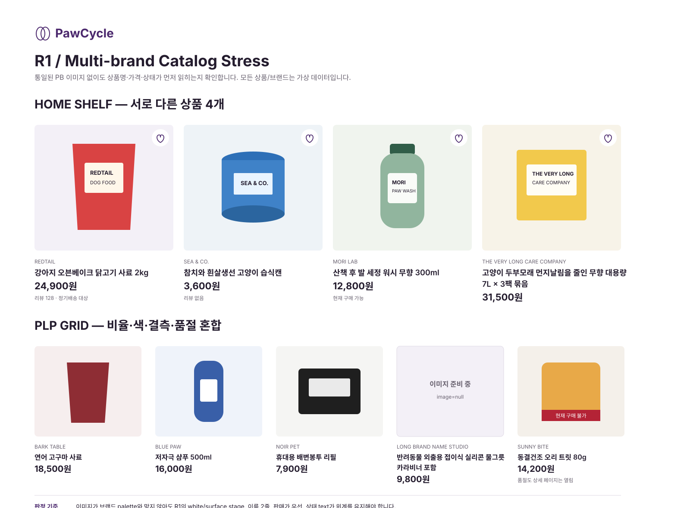
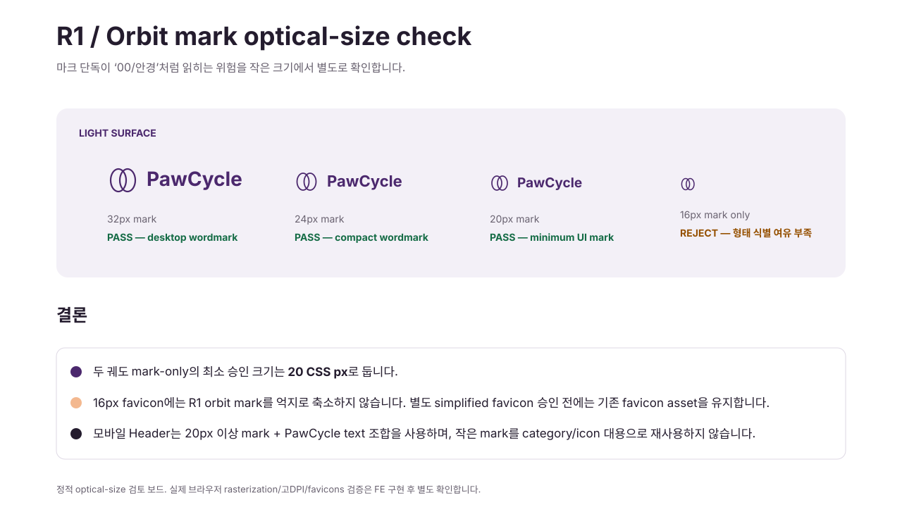

# MVP4-UX-005 · R1 최종 승인 및 보정 기록

2026-08-30 / UX/UI Designer / 일반 / 저장소 변경. **A/R1의 정보 구조와 브랜드 방향을 최종 Visual Direction으로 선택한다.** 이번 보정은 새 방향 탐색이 아니라 최종 Design Approval 전에 남은 시각 리스크와 오래된 계약 충돌을 닫기 위한 것이다. Frontend 구현, Ready for review, merge, Production 실행은 이 기록만으로 승인하지 않는다.

## 1. Multi-brand catalog stress

R1의 가상 PawCycle 패키지 4종은 브랜드 방향을 이해하는 데 유효하지만, 통일된 PB imagery가 실제 multi-brand Commerce보다 화면을 쉽게 정돈해 보이게 할 수 있다. 따라서 별도 [heterogeneous catalog stress board](visuals/r1-catalog-stress.svg)를 추가한다.

보드는 R1 palette에 맞춰 재색칠한 상품이 아니라 서로 다른 빨강·파랑·초록·노랑·검정 계열의 패키지, 세로·원통·병·상자 비율, 긴 브랜드명, 두 줄 상품명, 이미지 없음, 구매 불가 상태를 의도적으로 섞은 가상 데이터다. 실제 외부 브랜드나 Production 상품을 재현하지 않는다.

### 판정

- **PASS — R1의 핵심 위계는 PB imagery에 의존하지 않는다.** 상품 사진의 고유 색을 억지로 aubergine/apricot으로 맞추지 않고 white/surface image stage가 배경을 맡는다.
- Product Card의 권위는 `image → brand → product name → selling price → trust/status` 순서다. 상품 고유 색이 강해도 primary action·focus·selected state만 PawCycle brand color를 사용한다.
- 긴 브랜드는 1줄 고정 높이로 잘라 핵심 상품명을 밀어내지 않는다. 실제 구현에서는 brand는 1줄 ellipsis를 기본으로 하되 원문 문자열 자체는 DOM에서 접근 가능하게 유지한다.
- 상품명은 2줄까지 시각 clamp하되 접근 가능한 이름은 전체 문자열을 유지한다. 가격·구매 가능 여부·오류 메시지는 clamp하지 않는다.
- `image=null`은 generic package/동물 사진을 생성하지 않고 같은 image stage 안에서 `이미지 준비 중` text로 복구한다.
- purchasable=false 상품은 상세 탐색을 막지 않으며, 이미지 색상만 흐려 구분하지 않고 `현재 구매 불가` text/status를 함께 표시한다.
- 이 보드는 정적 시각 스트레스 검토다. 실제 카탈로그의 다양한 aspect ratio, 투명 PNG, 긴 한글/영문 혼합, 200% zoom에서의 최종 PASS는 FE 구현 후 실제 fixture로 검증한다.

## 2. Orbit mark small-size check

R1의 두 궤도 mark는 큰 wordmark에서는 브랜드 서명으로 기능하지만 작은 크기에서 `00`, 안경, 단순 Venn diagram처럼 읽힐 위험이 있다. [small-mark board](visuals/r1-small-mark.svg)에서 32/24/20/16px를 분리해 검토한다.

### 판정

- 32px: desktop wordmark 사용 가능.
- 24px: compact wordmark 사용 가능.
- **20px: UI에서 허용하는 mark-only 최소 크기.** mobile Header의 mark+PawCycle text 조합은 20px 이상 mark를 사용한다.
- **16px: R1 두 궤도 mark 사용 금지.** 형태 식별 여유가 부족하므로 favicon을 새 orbit mark로 강제 교체하지 않는다. 별도의 simplified favicon이 승인되기 전에는 기존 favicon asset을 유지한다.
- 두 궤도는 category, success, subscription status 같은 기능 icon으로 재사용하지 않는다. 브랜드 서명과 기능 icon의 의미를 분리한다.
- 실제 브라우저 font/icon rasterization, 고DPI, pinned tab, favicon rendering은 정적 SVG로 PASS 처리하지 않고 구현 후 확인한다.

## 3. R0 stale contract 정리 원칙

R0 `screen-redesign.md`는 구조 탐색 기록만 남기고 **구현 치수의 권위를 제거한다.** Header 80/56, Login 56, old citron/blue 등의 R0 수치를 구현자가 선택할 수 있는 대안처럼 남기지 않는다.

현재 구현 권위는 다음 순서다.

1. 제품/API/도메인 승인 계약
2. `review-r1.md`의 핵심6개 화면과 R1 브랜드 방향
3. `customer-page-families.md`의 주문·구독·관리 화면 계약
4. `visual-system.md`의 R1 token/component
5. `interaction-responsive.md`의 R1 interaction/breakpoint
6. `screen-redesign.md`는 **ARCHIVED R0 STRUCTURE ONLY — DO NOT IMPLEMENT DIMENSIONS**

문서끼리 수치가 충돌하면 R0를 선택하지 않는다. R1에서도 충돌이 새로 발견되면 구현자가 임의 선택하지 않고 승인 계약 기준으로 정정한다.

## 4. Design Approval

### 선택안

**A/R1 · Daily Orbit — DESIGN APPROVED**

- 기준 설계 snapshot: `11854358e1e950e37e919e053441779287958e92`
- 사용자 승인 입력: 2026-08-30 현재 대화에서 최종 검토 이후 `진행하자`로 A/R1 Design Approval 진행 승인
- ChatGPT 검토 확인: Production 감사, 외부 Commerce benchmark, 핵심6개 Desktop/Mobile, Order Detail/Subscription New/Detail, Customer page family, multi-brand stress, orbit small-size 보정까지 검토 후 승인

### 승인한 범위

- A의 검색·상품 우선 Information Architecture
- Home Hero 제거와 상품/탐색 우선 구성
- aubergine `#4B286D` + apricot `#F3B88F` 중심 R1 visual system
- Daily Orbit wordmark/brand expression. 단, orbit mark는 UI 최소20px, 16px 사용 금지
- Home / populated PLP / PDP / Cart / Checkout / Login의 R1 Desktop/Mobile 설계
- Order Detail / Subscription New / Subscription Detail의 상세 visual contract
- Wishlist/Compare/Orders/My/Pet/Address/Billing/Notification/Support 계열의 Customer page-family contract
- button/form/filter/chip/badge/product card/empty/loading/error/drawer/dialog 등 R1 component/state contract
- 320/375/768/1024/1440 responsive contract와 keyboard/focus/reduced-motion 요구
- heterogeneous multi-brand catalog에서도 PawCycle palette를 상품 사진에 강제하지 않는 원칙
- 기존 R0 visual 치수는 구현 권위에서 제외

### 승인하지 않은 것 / 구현 후 검증으로 넘긴 것

- 가상 PawCycle PB 패키지를 실제 Production 상품/브랜드 asset으로 채택하는 결정
- 새 16px orbit favicon. 별도 simplified favicon 승인 전 기존 favicon 유지
- 실제 상품 이미지 촬영/편집 정책 변경
- B editorial 또는 C bottom-dock 방향 혼합
- Backend/API/DB/결제/정기배송 도메인 계약 변경
- Cart thumbnail 보강 같은 별도 FE 데이터 보강 Proposal
- Production populated PDP·인증 Cart/Checkout가 이미 새 UI에서 검증됐다는 주장
- 실제 브라우저 keyboard, drawer focus trap, 200% zoom, screen reader, Toss SDK 상태 전환 검증 완료 주장

### 후속 Gate

이 Design Approval로 **Frontend 구현 설계 입력은 확정**된다. 하지만 다음은 별도 사용자 승인 없이 수행하지 않는다.

- PR #256 Ready 전환 또는 merge
- main 변경
- Frontend 구현 PR 생성/병합
- Production 배포 또는 운영 데이터 변경

Production populated PDP·인증 Cart/Checkout 미검증은 디자인 승인을 막지 않으며, 구현 후 실제 fixture/Production QA에서 별도 검증한다.
