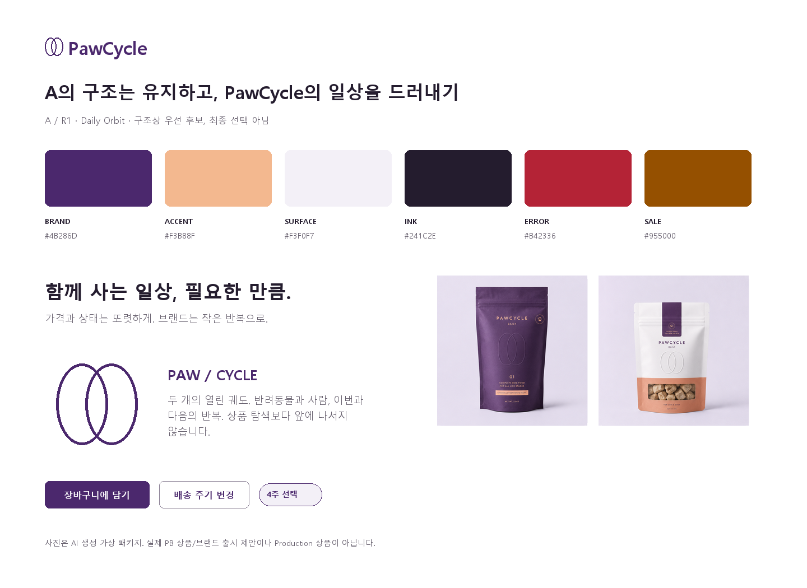
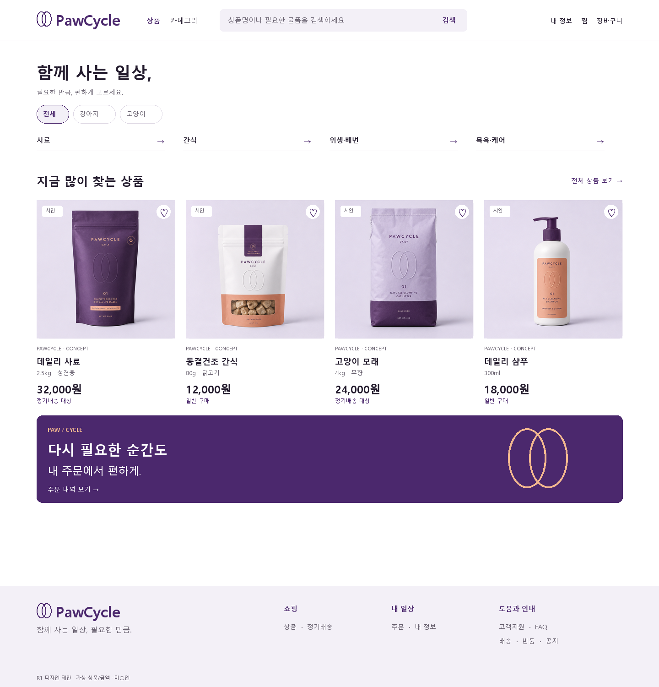
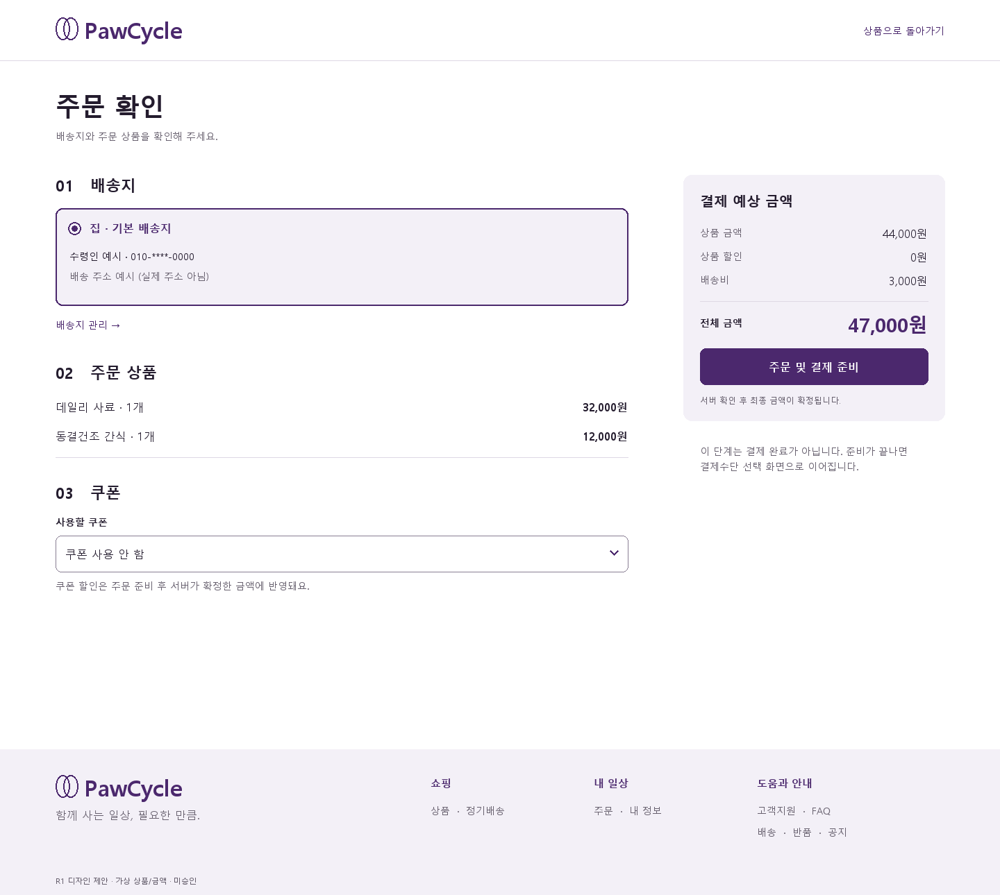
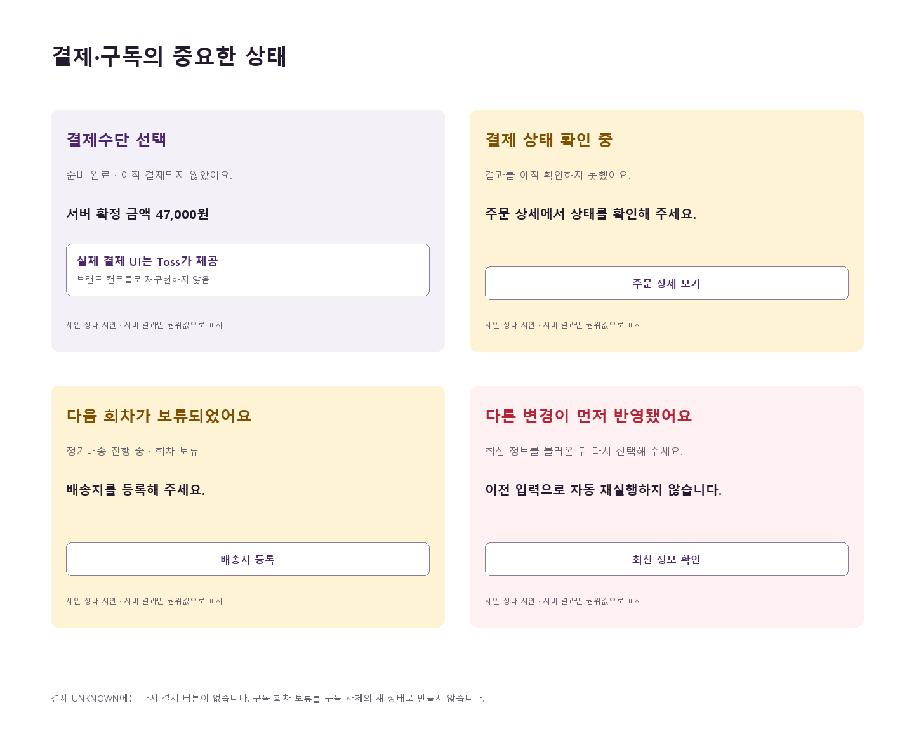

# MVP4-UX-005 · 1차 리뷰 보정 R1

2026-08-30 / UX/UI Designer / 일반 / 저장소 변경. **A는 구조상 우선 후보이며 최종 선택·승인 아님.** Frontend 구현, Ready, merge, Production 실행 금지. 기존 A/B/C 탐색과 Production Audit의 관찰 결과는 유지한다.

## 이번 검토의 기준

R0의 파란 CTA·system sans·중립 상자만으로는 일반 utility shop과 구별하기 어렵다. 단순 색 교체를 넘어 상품 사진, 브랜드 서명, 반복 구매의 표현을 함께 구체화한다. R1의 이름은 **Daily Orbit**: 사람과 반려동물이 함께 사는 일상, 그리고 이번 회차와 다음 회차를 두 궤도로 표현한다. A의 검색·상품 우선 순서, Hero 제거, 열린 4열 grid, 상단 filter, 독립 Login 구조는 유지한다. B의 비대칭 편집형 Home이나 C의 mobile dock를 섞지 않는다.

R1 화면은 실제 사진 질감의 가상 제품 imagery, 한국어 카피, 숫자 위계, 선택·비활성 상태, 주문 내역을 포함하는 **high-fidelity 정적 시안**이다. 제품 앱/HTML prototype이 아니다. 정적 화면으로 interaction 구현 검증을 대체하지 않는다. R0 box/wireframe만으로 승인을 요청하지 않으며 아래 6개 핵심 화면과 3개 핵심 관리 흐름을 검토 대상으로 삼는다.

## Brand expression

| 수준 | R1 제안 | 사용 제한 |
| --- | --- | --- |
| Color | aubergine `#4B286D`, white, lavender-gray `#F3F0F7`, apricot `#F3B88F`, ink `#241C2E` | cream/green 회귀 없음. 살구색은 브랜드 구획·변경 예정 설명에만, 입력 오류나 할인율의 의미를 겸하지 않음 |
| Typography | 단단한 한국어 sans 36/46 제목, 16/26 본문, 24/32 가격; 영문 wordmark 32/40 bold + 두 궤도 | 화면은 Malgun Gothic으로 정확히 렌더. 시스템 stack 유지. 영문 대문자 12/18은 서명에만; 본문을 작고 자간 넓은 글자로 바꾸지 않음 |
| Wordmark | 두 타원 궤도 + PawCycle. 축소형 24, 데스크톱 32, 주변 최소 mark 폭의 1/2 여백 | 승인 전 기존 상표의 확정 교체 아님. 제품 평가, 품질 인증, 재활용 인증처럼 사용하지 않음 |
| Imagery | 중립 무채색 배경, 실물 질감과 부드러운 그림자, 포장 전체가 보이는 1:1 사진 | 외부 판매 이미지 복제 없음. 실제 카탈로그 사진을 purple로 재색칠하지 않음. 브랜드는 UI에도 있어야 하며 PB 상품에 의존하지 않음 |
| Iconography | 20px/1.75px 일정한 선, chevron·search·close·check 등 기능 icon; 두 궤도는 브랜드 서명 | 카테고리 asset 없으면 **text-only 링크가 기본**. 강아지·고양이 emoji, 의미 없는 원/상자/generic glyph로 빈자리를 채우지 않음 |
| Repetition | 재구매 band, 구독 next/pending의 작은 반복, Footer 서명 | 전역 배경 패턴·자동 animation 없음. 상품 탐색 전의 큰 브랜드 Hero 복원 없음 |

가상 포장 4종은 [원본 contact sheet](assets/packaging-concept-r1.png)를 imagegen으로 새로 생성했다. 원본을 보존하고 정적 보드의 image slot에서 사분면을 배치했다. 패키지 안의 문구·브랜드·수량·성분은 생성 시안이며 실제 판매, 효능, 상품 출시 또는 PB 결정이 아니다. 카탈로그/운영 업로드 없음. Cart/Order의 현재 응답에는 thumbnail이 없으므로 해당 시안은 **사진 없는 타이포 행**을 사용한다. Subscription New도 현재 PlanVersion이 제공하는 플랜명·가격·구성 개수와 선택 상태만 표시한다. 없는 photo/상품명을 보강 조회가 승인된 것처럼 사용하지 않는다.

## 핵심 6개 화면 — Desktop + Mobile

각 링크는 축소 montage가 아니라 읽을 수 있는 독립 원본이다. desktop 1440, mobile 375. 320/768/1024는 [반응형 계약](interaction-responsive.md)에 따라 reflow하며 해당 폭의 새 구현을 검증했다고 주장하지 않는다.

| 화면 | Desktop | Mobile | R1 검토 초점 |
| --- | --- | --- | --- |
| Home | [1440 시안](visuals/r1-home-desktop.png) | [375 시안](visuals/r1-home-mobile.png) | Hero 없이 taxonomy→상품 선반. 브랜드 표현은 상품 사진과 선반 아래 재구매 band |
| populated PLP | [1440 시안](visuals/r1-plp-desktop.png) | [375 시안](visuals/r1-plp-mobile.png) | 8개 예시 결과, 열린 상품 grid, 4열→2열, styled native 정렬, 비교 checkbox |
| PDP | [1440 시안](visuals/r1-pdp-desktop.png) | [375 시안](visuals/r1-pdp-mobile.png) | 큰 실제 질감 사진, SKU 선택·품절·수량·판매가, 일반 구매와 정기배송 진입 분리 |
| Cart | [1440 시안](visuals/r1-cart-desktop.png) | [375 시안](visuals/r1-cart-mobile.png) | 사진 없는 상품 행도 완결된 위계. 수량 draft/적용 분리, 전체 주문만 |
| Checkout | [1440 독립 시안](visuals/r1-checkout-desktop.png) | [375 독립 시안](visuals/r1-checkout-mobile.png) | 배송지→주문 상품→쿠폰 + 금액 rail. ‘주문 및 결제 준비’≠결제 성공 |
| Login | [1440 시안](visuals/r1-login-desktop.png) | [375 시안](visuals/r1-login-mobile.png) | 독립 인증 shell, cart 복귀 맥락, 항상 보이는 label. 모바일 장식 panel 제거 |

### 화면 치수와 범위

- desktop content max1280, 좌우80 at1440. Header는 R1에서88h, mobile64h+검색 영역72h, 인증·주문은 compact64h. A의 단일 masthead 정보 구조는 불변. 1024에서는 기존 responsive compact 규칙에 맞춰 축소한다.
- 4열302px/gap24, 모바일2열166px/gap11(실제 CSS는 (343-12)/2=165.5px). 보드의 1px 반올림은 layout 변경이 아니다. 상품 이미지는 contain, 이름/옵션/가격/상태 순서.
- control radius8, image8, 선택 chip20, 브랜드 panel12. 기본 button48h, primary 구매52h, small44h. 본문16/26, helper14/22, caption12/18. 11px `시안` 표시 등은 검토용 watermark로 실제 UI 스펙에서 제외한다.
- 재구매 band는 로그인 여부와 안전한 목적지를 따른다. 추천 선반은 실제 API 결과가 있을 때만. 시안의 가상8개가 Production catalog 존재를 뜻하지 않는다.
- Cart 1440 왼쪽824/right376/gap80; Checkout도 같은 grid. 1024는 main min520/rail320/gap32 안에서, 768 이하는 단일열. 모바일의 시안은 전체 page flow 상태이며 별도 fixed bar는 원래 action이 안 보이고 키보드가 없을 때만 사용한다. 하나의 action을 이중 focus로 만들지 않는다.
- Footer는 쇼핑·주문/계정·도움/정책 분리. compact 인증 Footer에서도 고객지원·안내는 남긴다. 법정 문구/연락처는 승인된 값이 없어 창작하지 않는다.

## Checkout의 다음 상태

독립 시안은 ‘주문 준비 전, 주소 선택됨, 쿠폰 사용 안 함’이다. 다음 상태는 같은 화면을 덮어 성공처럼 꾸미지 않는다.

| 상태 | 보여줄 것 | action / focus |
| --- | --- | --- |
| 주소 없음 | 01 배송지에 중립 안내 + 배송지 등록; 금액은 조회값 | 등록 경로, 주문 준비 disabled+이유. 로그인/empty와 구분 |
| 쿠폰 조회 실패 | 쿠폰 구획 warning, ‘쿠폰을 확인하지 못했어요’ | 명시적 재조회 또는 쿠폰 없이 진행. 실패한 할인을 금액에 적용하지 않음 |
| 주문 준비 중 | CTA 폭 유지 spinner + 준비 중, rail busy | 중복 요청 금지, 입력값 보존 |
| CART_CHANGED | 상단 warning + 재조회된 현재 상품/금액, 변경 사실 | 최신 내용을 사용자가 다시 확인·준비. 자동 재주문 없음 |
| 준비 완료 | h1 ‘결제수단 선택’, 서버 확정 금액32px, 주문번호, Toss 결제 영역 | 실제 제공 SDK 영역은 브랜드 form으로 재구현하지 않음. 이전 준비 CTA 제거 |
| 결제 확인 중 | 중립 status와 진행 설명, 주문 상세 경로 | 재결제 버튼 숨김, 확인된 서버 결과만 사용 |
| UNKNOWN | warning ‘결제 상태를 확인하고 있어요’ + 주문 상세/고객지원 | 실패·성공으로 추정하지 않음, 다시 결제 유도 금지 |
| FAILED / SUCCEEDED | 실패 원인/허용 복구 또는 성공 상태·주문 확인 | 새 요청·재시도 가능 여부는 기존 계약. 페이지 새로고침만으로 재결제 없음 |

## Error와 Sale 분리

`feedback.error=#B42336`, soft `#FFF0F2`: 오류·destructive 전용. `commerce.sale=#955000`, soft `#FFF2D8`: 서버가 제공한 실제 할인·promotion 전용. 두 색의 대비뿐 아니라 ‘입력 확인’, ‘10% 할인’ 등의 문구와 icon/위치를 구분한다. 할인 UI는 error border/alert/role=alert를 사용하지 않는다. 살구 accent는 sale token의 alias가 아니다. 상품 화면에는 근거 없는 할인율·정가 취소선을 넣지 않았다. 상태 보드의10%는 token의 독립성을 비교하는 명시적 예시다.

## Controls: 외형과 native semantics

‘unstyled native control을 완료 시안으로 남기지 않는다’는 ‘native semantics를 버린다’와 다르다. 정렬/쿠폰처럼 단순 single-value 목록은 **styled native select가 기본 후보**다. input·select·checkbox·radio의 label, focus, keyboard, disabled semantics를 보존하고 치수·테두리·chevron·accent-color를 디자인한다. OS option popup 외형은 플랫폼 고유로 허용한다.

브랜드명 검색/다중 facet을 포함하는 filter는 button+dialog/popover 내부의 native radio/checkbox로 구성한다. 검색 가능한 custom combobox가 실제 요구될 때만 그 이유와 키보드·스크린리더 인수 조건을 별도로 승인한다. 문서에 option hover색이 있다고 native select를 custom listbox로 강제하지 않는다. 2/4/8주 선택도 숨겨진 div가 아닌 label+radio의 스타일링이다.

## 승인 상태 정정

- A 구조상 우선 후보 유지. A/R1 brand expression과 9개 화면은 **제안**, 사용자 선택/승인 기록 아님.
- C의 Home/상품/내 정보 mobile bottom dock는 사용자가 이번 리뷰에서 지적한 **기존 MVP4 PO 결정과 충돌**한다. C 선택에는 별도 PO 결정 변경이 선행되어야 하며 Visual Approval만으로 묵시 변경할 수 없다. 보드/탐색안은 비교 기록으로 유지한다. 현재 checkout에 C dock를 도입하지 않는다. 저장소 product 디렉터리에서 해당 MVP4 결정의 독립 문서/ID는 확인되지 않았으므로 새 ID나 승인 내용을 창작하지 않으며 이번 사용자 지시를 권위로 명시한다.
- 사용자 Screenshot은 미첨부 사실만 남긴다. **직접 Production 재캡처로 핵심 대조가 충족되었으므로 Screenshot 미첨부를 Design Approval blocker에서 제거**한다. populated PDP·인증된 Production Cart/Checkout 미검증과 새 디자인 interaction 미구현은 별개의 증거 한계이며 미첨부 문제와 혼동하지 않는다.
- [Customer page families와 핵심 계약](customer-page-families.md), [새 benchmark](commerce-benchmark.md#r1-cartcheckoutlogin-추가-조사)를 함께 검토한다. 이 자료의 완성이 구현 착수나 Ready/merge/배포 승인은 아니다.

## R1 변경 요청 대응

| 요청 | 반영 |
| --- | --- |
| 1–2 A 미승인·brand refinement | 위 후보 상태, Identity 보드, color/type/imagery/icon 명세 |
| 3·6 6개 high-fidelity 및 독립 Checkout | 12개 원본 + 주문·구독 핵심6개 + Identity1개 + 상태2개 |
| 4 실제 Cart/Checkout/Login | 컬리와 Zee.Dog rendered 증거/채택 판정 |
| 5 전체 Customer page family | 별도 family 계약과 Order Detail/Subscription New/Detail 상세 |
| 7 오류/할인색 분리 | 별도 token·semantic·contrast |
| 8 native semantics | styled native 우선 허용, 불필요 custom select 강제 제거 |
| 9 category asset fallback | text-only 기본, generic glyph 금지 |
| 10 C dock PO 충돌 | 별도 결정 변경 필요 표시 |
| 11 Screenshot blocker 제거 | 직접 Production 대조 충족, gate 수정 |
