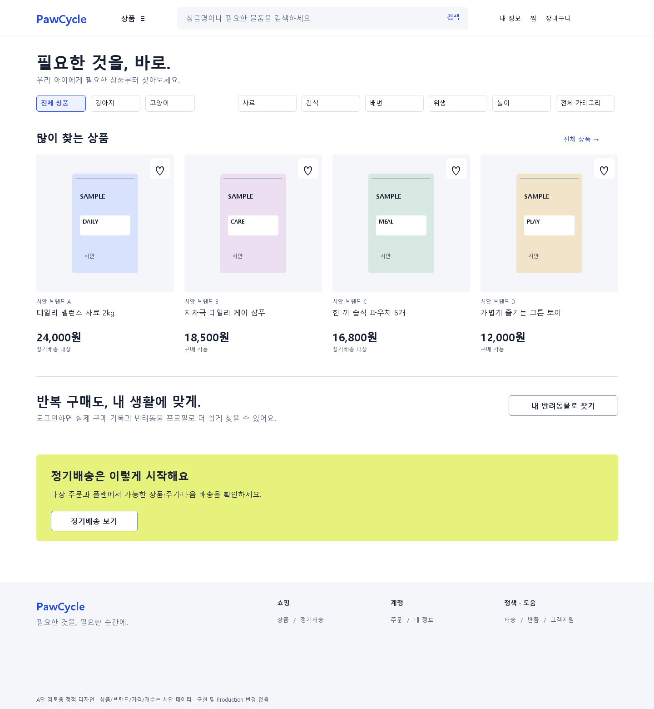
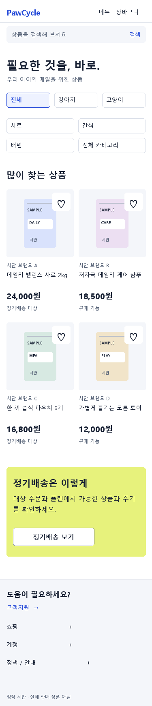
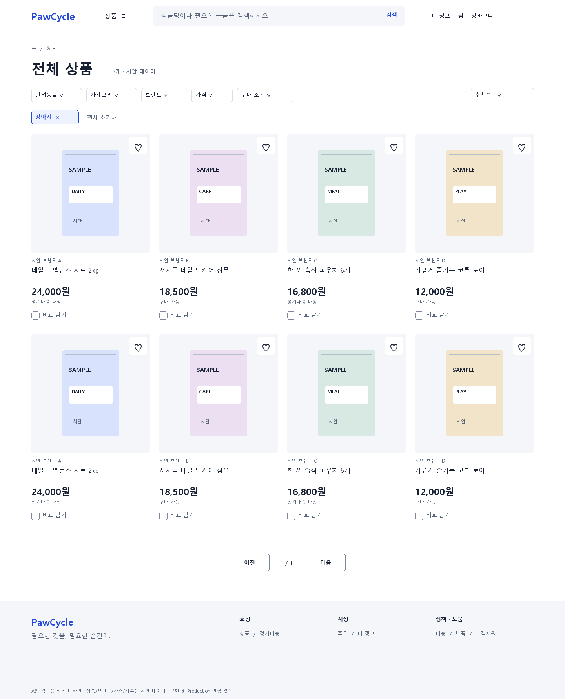
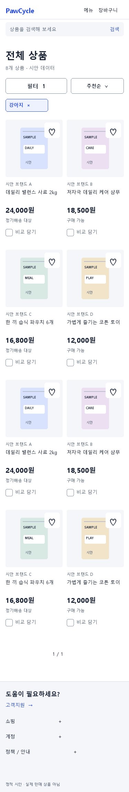
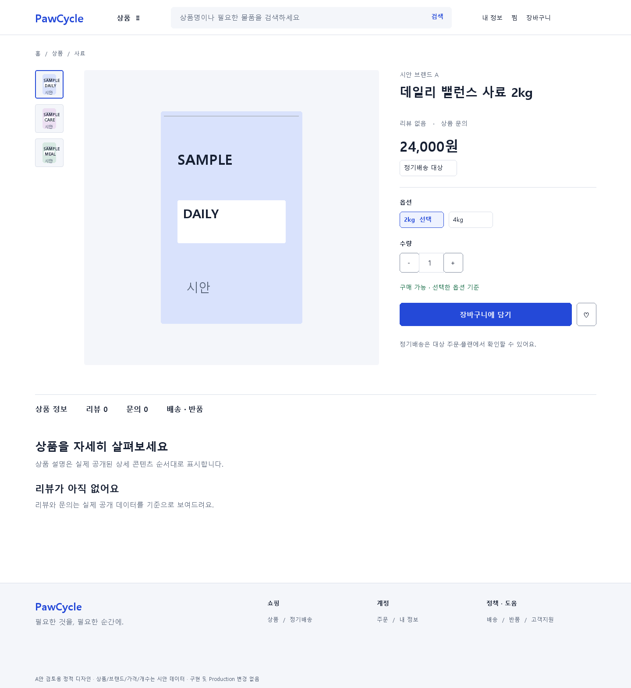
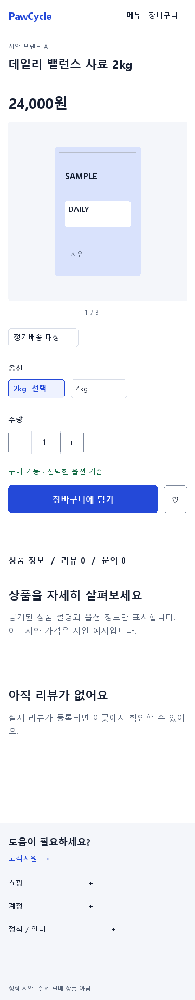
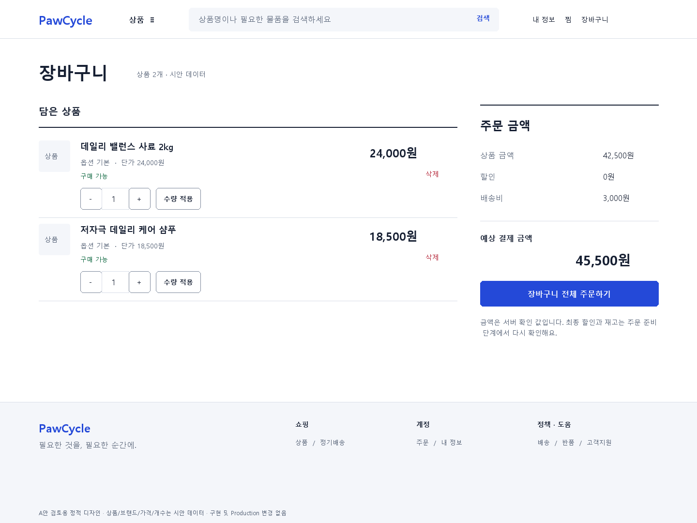
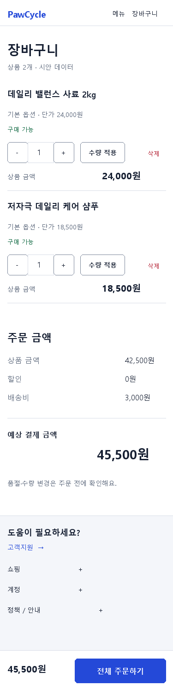
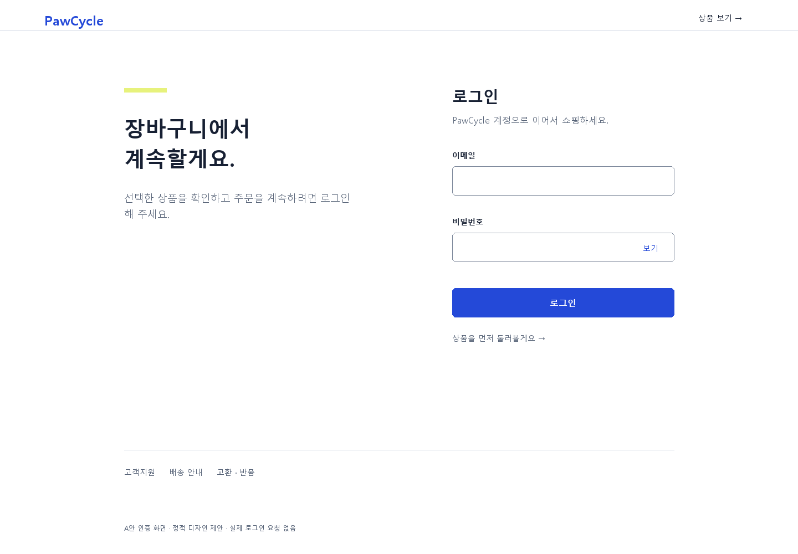
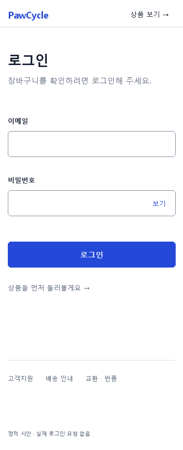

# Customer Commerce Screen Redesign · R0 구조 탐색 기록

**현재 상세 visual 검토본은 [R1 6개 화면](review-r1.md)과 [Customer family](customer-page-families.md)다.** 아래 치수·도형 보드는 R0 구조 탐색 기록으로 보존한다. R1의 imagery/색/치수/native semantics/text-only fallback이 우선한다. R0 box만으로 Design Approval을 요구하지 않는다.

**A안 상세 제안, 미승인.** [세 방향 비교](README.md), [공통 토큰](visual-system.md), [상태·반응형 계약](interaction-responsive.md). 시안 상품/가격은 Production에 없는 디자인 예시다. 정적 보드의 간략한 labels보다 이 명세의 필드 조건·null·서버 권위 계약이 우선한다. 모든 이미지 하단에 시안 표시를 둔다.

## 1. 기능과 데이터 경계

| 사용자 기능 | 확인한 권위 입력 | 디자인 경계 |
| --- | --- | --- |
| 상품 탐색/필터/정렬 | [API-009](../../api/API-009-mvp4-recommendation-and-product-discovery-api.md), [ProductFilters](../../../frontend/src/lib/api.ts), [ProductController](../../../backend/src/main/java/com/pawcycle/backend/catalog/product/api/ProductController.java) | petType/category/subcategory/brand/facet/min/max/subscribable/purchasable/page/size/sort. brand/category는 단일 값. facet counts 없음 |
| PDP/사진/옵션/재고 | [ProductDetail](../../../frontend/src/lib/api.ts), [선택 panel](../../../frontend/src/components/product-purchase-panel.tsx) | 실제 optionGroups/selectedOptions·SKU 구매 가능 값. 임의 할인/옵션·배송 약속 금지 |
| Review/Q&A | [API-010](../../api/API-010-mvp4-product-detail-trust-api.md) | delivered 구매자 review, Q&A 답변 후 수정/삭제 금지. 익명 공개 필드 유지 |
| 인기·맞춤·연관·함께 보는 상품 | [API-012](../../api/API-012-mvp4-final-product-backend-api.md) | endpoint 순서·실제 결과 사용. 0개면 section 숨김, AI 실패로 구매 막지 않음 |
| Cart/Checkout/찜 | [Commerce client 계약](../../../frontend/src/lib/commerce-final-api.ts) | 전체 cart 주문, 서버 pricing/version, CSRF·idempotency. Cart image URL 필드 없음 |
| Login returnTo | [PS-003](../../product/PS-003-ux-product-decisions.md), [sanitizer](../../../frontend/src/lib/frontend-utils.ts) | 허용 내부 GET path만. query/form 복구·자동 mutation 없음 |
| 정기배송 시작 | [API-012 주문별 subscription-options](../../api/API-012-mvp4-final-product-backend-api.md) | 기존 Plan/Pet/주문 경로 유지. PDP에 가짜 월정액·구독할인 buy toggle 생성 금지 |

새 visual은 기존 기능 삭제 승인이 아니다. 비교, pet profile, 주문, 구독, AI 비교/요약, 리뷰/Q&A, 알림 등의 기존 경로는 navigation·관련 section에서 접근 가능해야 한다. 이 문서는 5개 대표 화면에 집중하며 나머지 관리 화면을 구현하거나 전면 설계 완료했다고 주장하지 않는다.

## 2. Home — 소개에서 쇼핑으로

Current Problem → [P01/P09](production-audit.md)의 큰 텍스트 Hero·구독 중복 안내·빈 선반. Reference → B01/B02 상품 중심, B06 종별 탐색. **새 설계는 Hero를 없앤다.**

### 1440 viewport composition

| 순서 / 위치 | 콘텐츠와 placement | hierarchy / CTA |
| --- | --- | --- |
| 1 / y0–80 | 단일 masthead, wordmark·전체 카테고리·search·account·찜·cart | search를 가장 넓은 control, logo는 Hero 대용 아님 |
| 2 / y112 | h1 `필요한 것을, 바로.` + 짧은 설명1줄 | 36/44, 기능의 목적만. 큰 소개 paragraph 없음 |
| 3 / y188 | 전체/강아지/고양이 GET 탐색 링크, 실제 category strip | 종 선택을 프로필 생성처럼 설명하지 않음 |
| 4 / 약y300 | `많이 찾는 상품` + 4열×최대2행 인기 API | image1:1·판매가. 상품 링크가 primary 탐색 action |
| 5 / 상품 뒤56 | 로그인 회원이면 `다시 살 때가 됐나요?` 실제 reorder-timing; 이어서 pet 기반 추천 | 서버 결과 없으면 생략, 과거 주문을 근거 없이 만들지 않음 |
| 6 / 다음56 | `정기배송은 이렇게 시작해요` 1개의 낮은 citron 설명 band | `정기배송 보기` secondary; 할인·도착예정 약속 없음 |
| 7 / 다음56 | Footer support+실제 정책/쇼핑/계정 링크 | 별도 Help hero 없음 |

로그인 안 된 사용자의 개인화 광고 card는 상품 전에 배치하지 않는다. 상품 뒤 `내 반려동물에 맞춰 찾기` text action→로그인 `/pets` returnTo. 로그인되어 pet이 없으면 등록 경로, pet이 있으면 선택 후 실제 추천. 현재 profile을 알 수 없을 때 임의 pet명/다음 배송일 표시 없음.

Populated: 최소 상품 4개를 한 viewport 900~1000px 안에서 사진·이름·가격까지 읽을 수 있는 목표. 8개 미만이면 받은 수만 그리며 빈 card를 채우지 않는다. 사진 미존재는 중립 슬롯으로, `인기`도 API section 맥락이지 모든 card에 BEST badge 부착 아님.

Empty catalog: discovery와 인기 결과가 모두 비어 있으면 category 준비 메시지와 큰 빈 추천 section을 여러 번 쌓지 않는다. 제목→전체/DOG/CAT links→`상품을 준비하고 있어요` min280 block→정기배송 안내(짧은 링크)→Footer. 미필터 PLP를 조회해 실제0이 확인된 경우에만 카탈로그 준비 상태를 확정한다. 추천만0일 때는 `추천 없음`과 `전체 상품` 링크로, 전체 catalog가 비었다고 단정하지 않는다.

Loading: category row skeleton과 인기 card skeleton 독립. Error: 검색/전체 상품 link는 유지, 실패한 module만 retry. 성공 로그인/데이터 갱신이 갑자기 페이지 맨 위로 scroll하지 않음.

### Mobile 320/375

Header56+search48 → title28 → pet GET links → category2×2(최대4, 전체보기) → product2열 → reorder/personalized(조건부) → 짧은 배송 band → Footer accordion. category가 없으면 그 자리의 준비 label 한 줄. 320에서도 기존 Hero처럼 한국어 문장이 한 음절씩 갈라지지 않도록 title 짧게, keep-all. 관리 안내를 image보다 크게 만들지 않는다. 고정 bottom navigation 없음.

## 3. PLP — 조건보다 결과를 넓게

Current Problem → P02/P04/P07, 설명형 제목·검색2개·sidebar form. Reference → B02 selected filter·result count, B05 검색의 위치. **고정 sidebar를 완전히 없앤다.**

### 1440 composition

Header80 → breadcrumb y112(홈/상품/선택 category) → title36/44 y148(`전체 상품`, category명, 또는 `“검색어” 검색 결과`)·결과수14/20 → toolbar y220 → selected chips y276(있을 때) → grid 약y340 → pagination → Footer.

- toolbar left: petType/category/brand/price/구매조건(+실제 facet) popover triggers, right sort160. gap8, 가로폭 초과 시 마지막 filters는 `상세 필터` drawer로 묶고 label을 찌그러뜨리지 않음.
- grid4열, width302, gap24. borderless card. 구매 불가 상품도 API 목록에 있으면 상세 진입 가능, CTA와 상태만 구분. price가 없다고 상품을 임의 숨기지 않음.
- selected chips에 raw DOG/CAT 대신 강아지/고양이, brand/category 표시명. totalElements는 API. 결과가 늦게 오면 0개를 먼저 보여주지 않고 `불러오는 중`.
- compare 선택은 각 card 하단, 2~3개부터 비교 action. 주된 상품 link와 찜 click 충돌 없음.
- pagination은 12개씩, mobile도 동일. page changing이 filter값을 잃지 않음.

| 상태 | 구체 문구·배치·회복 |
| --- | --- |
| populated | toolbar+chips 아래 실제 상품 grid, 이름2줄·가격·상태. 선택 필터와 상품의 일치 책임은 서버 |
| unfiltered empty | `상품을 준비하고 있어요` / `현재 공개된 상품이 없습니다. 궁금한 점은 고객지원에서 확인해 주세요.` / 고객지원·홈. `필터를 줄이세요` 금지 |
| no-result | `찾는 상품이 없어요` / `검색어나 선택한 조건을 바꿔 보세요.` / `필터 초기화`(q유지), `검색까지 초기화`(q제거) |
| loading | 첫 조회12 card skeleton, header와 조건 유지. 변경 조회도 같은 영역 skeleton·status 1개 |
| error | `상품을 불러오지 못했어요`+retry. empty로 위장하지 않음 |
| invalid price | popover 안 필드 error, apply 차단, 결과·URL 불변 |

### 320/375/768 차이

Header search 1개→title28+count→필터/정렬 2controls 한 줄→chips wrap→2열 grid. 수십 filter trigger를 가로 scroll 강요하지 않고 modal drawer에 묶는다. drawer header64/scroll body/footer76+safe-area, 각각 44h rows. 768은3열 card·compact toolbar, 1024는3열+desktop popovers, 1440은4열. 상세 치수는 Responsive 표가 권위다.

## 4. PDP — 이미지, 선택, 확정 가격

Current Problem은 populated Production에서 **UNVERIFIED**. 기능만 코드·API로 확인. Reference B02의 gallery/구매 판단 구분에서 출발해, 현재 section-card 배치를 기본으로 하지 않는다.

### 1440 composition

Header80 → breadcrumb y112 → y160부터 thumb64 / gap48 / gallery672 / gap48 / buy448. gallery 정사각, buy column은 card 테두리 없음. buy 순서는 brand→전체 상품명28/36→rating anchor→짧은 설명→선택된 SKU 가격/비교가/할인율→옵션 그룹→수량→품절/가능 표시→52h 담기+44 찜. 구매 미완료 옵션이 있으면 CTA `옵션을 선택해 주세요` disabled 및 안내, 기본 첫 SKU 자동 선택하지 않음.

gallery 아래 지역 내 anchor nav `상품 정보 / 리뷰 N / 문의 N / 배송·반품`. 임의 역할 tab으로 콘텐츠를 언마운트하지 않고 같은 문서의 anchor navigation. 긴 본문 plain text detailSections 순서, HTML injection 없음. buy column은 viewport 높이보다 짧을 때만 top104 sticky; 길면 flow, 내부 scroll로 옵션을 가두지 않음.

- `정기배송 대상`은 작은 badge와 `구독은 대상 주문·플랜에서 확인해요` 설명 link. 같은 SKU의 일회 구매/월구독 가격 toggle은 계약에 없어 만들지 않음.
- 선택 가능한 옵션 조합에만 state 제공. 불가능 조합은 선택불가 label과 이유. quantity≤availableQuantity, purchasable가 false면 재입고 알림 버튼을 만들지 않고 관련 상품/전체 목록 link.
- 가격이 선택마다 달라지면 aria-live로 `선택한 옵션, N원, 구매 가능` 한 문장. 대표가격을 확정 결제금액으로 표시하지 않음.
- reviews: average null이면 별점없음, count0이면 `아직 리뷰가 없어요`. 작성은 서버의 구매/배송 eligibility에 따라 안내, 존재만으로 승인된 작성권한 추정 금지. Q&A 답변 후 수정/삭제 금지 보존.
- 기존 AI 리뷰 요약/비교/assistant가 제공되는 영역은 상품 facts/원문 이후 보조 영역. unavailable은 중립 안내, 원문 review/상품표시는 계속. 가격/재고·의학 권고 생성하지 않음.
- related/complementary는 제공된 API 결과만 각각 최대6, 각각 heading이 의미를 구분. 응답0이면 hidden, recommendation error가 구매 차단하지 않음.

### Mobile

compact Header56 → breadcrumb/caption → 상품명22/30·가격28/36 → gallery full content width → thumb/pager → 옵션/수량/CTA → 정보·리뷰·문의·배송 안내 → 관련 상품 → Footer. desktop buy 정보를 이미지 뒤에 통째로 밀지 않고 제목/가격을 앞쪽에 꺼내 식별을 먼저 한다. 375의 fixed bar는 원래 action이 안 보일 때만, 상태는 원래 action과 동일. 상세 읽기 중 옵션 선택 action을 누르면 옵션 heading으로 이동. 768은2영역/flow CTA, 320은 모든 선택 label wrap.

Loading: gallery square와 buy skeleton. Not found: `상품을 찾을 수 없어요`+상품목록, 없는 상품에 제목/가격 만들지 않음. image error: 중립 slot. Detail API error: 전체 retry. review error: 해당 section retry. empty SKU: `현재 구매 가능한 옵션이 없습니다`, 담기 disabled. 찜 error는 독립 feedback, 담기 실패는 선택 유지+inline retry.

## 5. Cart — 상품 행과 금액의 역할 분리

Current: 비회원 진입 P11 직접 확인, populated UI는 코드 기반. Reference는 B02 상품/가격 위계 원리만이며 타사 Cart 실화면 비교는 미검증. **전체 section-card를 상품 행과 열린 결제 요약으로 대체한다.**

### 1440 composition

Header80 → `장바구니` h1/전체 수량 y124 → y208 본문864 + gap48 + summary368. 왼쪽 heading `담은 상품`과 row separator. row min128: R1에서는 glyph 없이 상품명·SKU 중심 text-only 행, product name·skuName·unitPrice, 가운데 quantity144+적용, 오른쪽 lineAmount24/30와 삭제44. unavailable은 상품명 아래 warning, 행을 숨기지 않음.

오른쪽 `주문 금액`은 카드 shadow 없이 top ink2 line, pad24 top. originalAmount→discountAmount→shippingFee→paymentAmount 순, 아래 CTA52 `장바구니 전체 주문하기`. 가격/재고는 서버 응답, client sum으로 공식 금액 재계산 금지. CTA는 전체 주문만. 판매자/배송그룹·일부 선택 checkbox 없음.

- 수량 초안과 확정 수량을 다르게 표시, pending draft가 있으면 summary에 `수량 변경을 적용해 주세요`, checkout link 차단. 적용 실패는 행에 retry, 합계는 마지막 확정값이라는 label 유지.
- 삭제 confirm에 상품명. 삭제 성공 후 다음 행 제목 또는 empty heading에 focus; toast는 부가적인 확인. 막 삭제한 상품을 자동 다시 담는 undo 기능은 없음.
- 하나라도 구매불가면 checkout CTA disabled+`구매할 수 없는 상품을 확인해 주세요`; 해당 행으로 이동 link. 정상 상품을 몰래 골라 주문하지 않음.
- empty: 전체폭 중앙 icon32+`장바구니가 비어 있어요`+`상품 둘러보기`, summary/sticky 제거. 로그인 필요: 같은 공간 neutral icon·설명·로그인 returnTo/cart·상품보기, 오류 alert로 취급하지 않음.
- loading: row3개 skeleton+summary values skeleton, 0원/무료배송 임시 표시 없음. error: cart load 재시도; 단일 행 실패와 전체 로드 실패 분리.

### Mobile

header56 → h1 → 상품명·옵션·단가 → 다음 줄 quantity/적용 → row 합계/삭제 → 다음 row. 320에서는 control 행을2줄로 분리, 제목을128px 칸에 가두지 않음. summary 본문에 전체 명세, fixed bar에는 합계+전체 주문만. 공통 Footer는 bar에 가리지 않게 padding. 768은 summary를 본문 아래, fixed bar없음. 1024부터 side summary. 화면에 단가·수량·행 금액·최종 금액이 서로 다르게 label된다.

## 6. Login — 복귀 목적에 맞는 인증 공간

Current P06/P09: center card, 구독전용 설명·shopping shell. Reference B04의 surface 전환 원리만 ADAPT, 외부 로그인 화면을 관찰했다고 주장하지 않음.

### 1440 composition

전용 header56: wordmark+`상품 보기` link. 전체 category/search/cart nav 없음. max992, margin auto, y152부터 left496 / gap96 / form400. left는 큰 마케팅 카드 대신 작은 citron line와 `장바구니에서 계속할게요` 맥락 title, 다음 행동을 2문장 이내로 설명. right는 borderless form: 로그인28/36→helper→email label/input52→password label/input52/show44→CTA52→상품보기 link. outer background white, radius card 없음, focus-visible 충분한 공간.

returnTo별 copy: `/cart`=`장바구니를 확인하려면 로그인해 주세요`, `/checkout`=`주문을 계속하려면 로그인해 주세요`, `/subscriptions...`=`정기배송을 확인하려면 로그인해 주세요`, 그 외=`PawCycle 계정으로 로그인해 주세요`. 원래 목적을 유효한 path로만 설명, URL raw string을 제목에 출력하지 않음.

- email autocomplete=username, password=current-password. placeholder에 중요한 안내 안 넣음. 비밀번호 보기/숨기기44 toggle+aria-pressed, 잠깐 보기로 자동 전송 없음.
- signup/social login/password reset는 실제 경로/계약 미확인. 시안에 작동 버튼으로 넣지 않는다. account recovery 요구는 support link와 별도 Product 결정.
- loading: 로그인 상태 조회중 form skeleton, submitting은 로그인 중+spinner. field·보안 오류 후 입력 유지, 이메일 존재 구분 금지. 인증 성공은 검증된 returnTo로 replace, 상태 변경 자동 실행 없음.
- 이미 로그인: `이미 로그인되어 있어요`/계속하기/상품보기. 잘못된 returnTo는 `/products` fallback, 필터가 로그인 뒤 자동 복원된다는 약속 없음.

### Mobile

56h header→32 gap→h1·목적문구→24 gap form→compact support footer. 왼쪽 설명 column·citation·장식 panel은 제거. 320 form288, 375 form343, 768 form400. keyboard가 올라와도 submit/field error를 scroll해 볼 수 있고 body fixed 금지. native password manager·붙여넣기 가능. 에러 summary 링크가 해당 input으로 이동한다.

## 7. Checkout과 공통 영역

R0에서는 Checkout이 대표 이미지 밖이었다. R1에서는 [독립 Desktop](visuals/r1-checkout-desktop.png)·[Mobile](visuals/r1-checkout-mobile.png)과 상태 계약을 추가했다. 아래는 구조 탐색 당시 기록이다. desktop max1280, h1 아래 main864/summary368. main: 배송지 선택(기존 saved address radio list, 등록 경로)→주문 상품 읽기 전용 행→쿠폰 styled native select. summary: 예상금액·할인 확정 시점·배송비·전체 금액→`주문 및 결제 준비`52. 좁은 오른쪽 rail에 배송지/쿠폰까지 넣지 않는다.

준비 성공 후 화면 제목은 `결제수단을 선택해 주세요`, 확정 가격+Toss widget+결제대기 주문 확인. `결제 완료` 아님. Toss 성공/실패/UNKNOWN은 기존 계약 유지, 사용자가 명시적으로 실행해야 한다. 375 순서는 배송지→상품→쿠폰→명세→action, 고정 action 조건은 Cart와 동일. 품절/version변경이면 해당 상품 및 재조회 action, 쿠폰 오류가 할인된 금액으로 진행하지 않게 한다. 인증/empty/loading/error는 Cart와 같은 의미 체계를 쓰되 주문 맥락 문구로 분리한다.

Header·Category·Footer는 [Visual System](visual-system.md#5-filternavigationfooter), close/scroll/focus는 [Interaction](interaction-responsive.md) 적용. 정책 콘텐츠/운영 연락처는 실제 입력 없이 창작하지 않는다.

## 8. Proposal / 승인 필요한 항목

| 항목 | 기본안 / 분리 이유 |
| --- | --- |
| 실상품 사진과 촬영 기준 | 기존 catalog image만. 시안의 도형은 실제 사진 승인 대체 불가. 외부 쇼핑몰 이미지 재사용 금지 |
| Cart thumbnail 보강 | R1 기본 text-only 상품 행. 공개 detail GET으로 thumbnail을 보강하는 안은 별도 FE 비용/에러 검토 필요 |
| 새 웹폰트 | 기본 system stack. 별도 asset/font loading 승인 전 추가 안 함 |
| B editorial 캠페인 | 실제 merchandising API/운영 콘텐츠 없음. 선택 시 운영/범위 별도 결정 |
| 정책/회원가입/비밀번호 복구 | 실제 route·제품정책 미확인. 필요해도 가짜 action으로 채우지 않음 |
| populated·인증 화면 최종 visual 확인 | 운영 상품 생성이나 로그인 없이 이번에는 정적 예시로만 검토. 허용된 staging fixture/별도 인증 증거로 후속 검증 |

디자인 승인 전 구현자에게 넘어가는 산출물은 **구현 지시서가 아니라 승인 검토 자료**다. 선정되지 않은 B/C를 A와 섞거나 부족한 계약을 디자인으로 확정하지 않는다.
