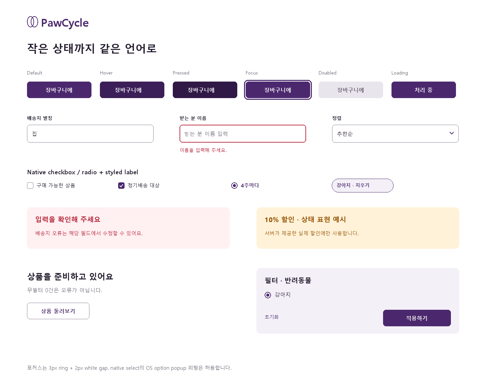

# New PawCycle Visual Design System — A R1 상세 검토안

**PROPOSED / A 선택 미승인.** [B/C 비교](README.md#세-가지-visual-direction--아직-미선택). 이 파일의 값은 구현 시 임의 결정을 줄이기 위한 디자인 명세이며 CSS·컴포넌트를 구현하지 않았다. 모든 px는 CSS px. 사용자 확대 설정을 막지 않고 구현 시 typography는 rem으로 대응한다.

## 1. 원칙과 Foundation

white canvas, 짙은 ink, 구매 action의 aubergine, 설명용 apricot 한 구획. [R1 Identity](review-r1.md)의 두 궤도·사진·타이포와 함께 적용한다. Green은 성공 상태에만 제한한다. 상품 grid는 card 테두리와 그림자 없이 열린 면으로 둔다. 가격·옵션·품절·다음 action이 브랜드 수사보다 먼저 읽힌다. 기울어진 badge, glass, gradient, 자동 carousel, 배경용 반려동물 사진은 기본 설계에 없다.

### Color

| Token | 값 | 용도 / 허용 조합 |
| --- | --- | --- |
| canvas | `#FFFFFF` | 모든 페이지 본문 |
| surface | `#F3F0F7` | 이미지 slot, Footer, 조용한 구획 |
| elevated surface | `#FFFFFF` | popover, drawer, dialog |
| primary | `#4B286D` | primary button·active·link; text white |
| primary-hover / pressed | `#3C1F58` / `#301847` | action 배경 변화 |
| secondary | `#241C2E` | strong text, secondary button border·text |
| accent | `#F3B88F` | 반복 구매 설명 band 한 곳, text `#241C2E`; 할인색 아님 |
| success / soft | `#146B45` / `#EAF6EE` | 성공 icon+label, `담았어요` |
| warning / soft | `#805000` / `#FFF3D6` | 변경 확인·재고 경고 |
| error / soft | `#B42336` / `#FFF0F2` | 오류·destructive 전용. 할인/프로모션 사용 금지 |
| commerce.sale / soft | `#955000` / `#FFF2D8` | 서버가 제공한 실제 할인·promotion. error token/alert와 분리 |
| text-primary | `#241C2E` | 제목·판매가·본문 |
| text-secondary | `#68616F` | helper·brand·caption |
| disabled background / text | `#E9E5ED` / `#68616F` | disabled control, opacity로 전체를 흐리지 않음 |
| border | `#DED8E4` | 장식 divider·image boundary |
| control-border | `#887D92` | 입력·선택의 인지 가능한 경계 |
| focus | `#4B286D` | 3px solid + 2px white gap; 어두운 면에서는 white gap 유지 |
| selected / hover surface | `#EFE8F5` / `#F3F0F7` | 선택 list/row와 hover |
| scrim | `rgba(36,28,46,0.40)` | modal 뒤 배경, text 표시 금지 |

일반 텍스트 대비 ≥4.5:1, 큰 텍스트/의미 있는 icon/control 경계 ≥3:1을 목표로 한다. `border`는 단독 input 경계로 쓰지 않는다. 상태는 text·icon·shape와 같이 표현한다. 선택은 fill+check+font-weight, error는 outline+message, active nav는 underline+`aria-current`다. 실제 계산값은 [검증 기록](validation.md)에 남긴다. 사진 위에 작은 흰 글씨를 얹지 않는다.

### Typography

기본 stack: `system-ui, -apple-system, BlinkMacSystemFont, "Segoe UI", "Apple SD Gothic Neo", "Malgun Gothic", "Noto Sans KR", sans-serif`. 신규 font 다운로드/의존성 없음. 시안은 로컬 Malgun Gothic으로 렌더링하며 실제 OS별 glyph 차이는 승인 시 확인한다. Pretendard를 이미 설치된 웹폰트로 가정하지 않는다. B의 명조는 선택 시 별도 font 검토가 필요하다.

| Role | ≥1024 size/line | <1024 size/line | weight / 기타 |
| --- | --- | --- | --- |
| display | 44/52 | 32/40 | 700, 짧은 소개에만. A Home에는 page-title 사용 |
| page title | 36/44 | 28/36 | 700, 1개 h1 |
| section title | 24/32 | 22/30 | 700 |
| card title | 18/26 | 18/26 | 700, 상품명과 분리 |
| product title | 16/24 | 14/20 | 500, 2줄; PDP에서는 28/36, mobile 22/30 |
| price | 24/30 | 20/26 | 700, tabular nums; PDP 32/40, mobile 28/36 |
| body | 16/26 | 16/26 | 400 |
| label | 14/20 | 14/20 | 600 |
| helper | 14/22 | 14/22 | 400 |
| caption / compare-at | 12/18 | 12/18 | 400, 본문 대용 금지 |

제목 letter-spacing -0.02em, 본문 0, 가격 -0.01em. 한국어 `keep-all`, 긴 URL/토큰은 `overflow-wrap:anywhere`. 상품명만 최대 2줄 clamp하되 링크 accessible name은 전체 상품명이며 PDP에서 전체 표시. helper/error/금액은 clamp 금지. 금액은 숫자+원 1단위로 묶되 320에서 다음 줄로 전체 이동 가능. 잘못된 `0원` fallback 금지.

### 공간·형태·레이어

- spacing: 4/8/12/16/24/32/40/48/56/64. 독립 action hit area 간 최소 8.
- page max-width 1280, ≥1440 양옆80, 1024 양옆32, 768 양옆24, 320/375 양옆16. 유효 폭은 [Responsive](interaction-responsive.md) 표 참조.
- radius: image 8, control 8, badge 4, desktop panel 12, mobile top-sheet corners 16. pill은 pet segment/작은 chip 일부에만, 모든 card에 적용하지 않음.
- borders: divider 1px border; control 1px control-border; selected 2px primary(레이아웃 크기 유지). product card 외곽선·그림자 없음.
- shadow: card none; popover `0 8px 24px rgba(36,28,46,.12)`; dialog `0 16px 48px rgba(36,28,46,.18)`; sticky는 1px separator만.
- category asset이 없으면 text-only 링크가 기본이다. 임시 generic glyph/emoji로 채우지 않는다. 브랜드 궤도는 category icon이 아니다.
- icons: 기존 사용 가능한 SVG/inline path 재사용, stroke 1.75, 기본20, 보조16, empty32. 새 icon library 설치 안 함. emoji를 UI icon으로 사용하지 않음.
- layers: content0, sticky header20, sticky purchase25, popover40, scrim60, drawer/dialog70, toast80. modal 중 background action bar와 toast는 focus를 받지 않음.
- motion: hover/pressed color120ms ease-out; popover opacity120ms; drawer translate/opacity180ms cubic-bezier(.2,.8,.2,1); focus ring 즉시; reduced-motion이면 transform 제거·0ms 상태 변경. 의미 없는 bounce/확대 없음.

## 2. Button과 상태 규칙

기본 48h (small44h), horizontal padding16, gap8, radius8, font14/20 600. large52h/pad20/font16, icon20. icon button44×44(그림20), destructive 확인은44h. icon 단독에는 접근 가능한 이름이 필요하다. Loading 전후 폭 동일, spinner16과 `처리 중` label, 중복 submit 방지.

| 종류 | default | hover | pressed | 사용 |
| --- | --- | --- | --- | --- |
| primary | primary fill / white / border transparent | primary-hover | primary-pressed | 화면 주목적 1개, CTA |
| secondary | white / ink / control-border1 | hover-surface / ink | border / ink | 돌아가기·보조 확인 |
| tertiary | selected-surface / primary / none | `#E6DAEE` | `#D8C6E5` | filter·보조 좁히기 |
| ghost | transparent / ink / none | hover-surface | border-surface | 닫기·정렬·낮은 우선순위 |
| destructive | white / error / error1 | error-soft | error fill / white | 삭제 확인. 일반 row는 text+icon, 남용 금지 |
| icon | white / ink / border1 | hover-surface | selected-surface | 찜·닫기·이전/다음 |

모든 종류 공통: focus-visible=3px focus/offset2, disabled=disabled bg/text·pointer action 차단(링크 disabled는 href 제거 및 설명), loading=크기 유지·`aria-busy`·동일 원인 중복 클릭 차단. Hover가 disabled/loading을 덮지 않는다. pressed는 실제 pointer/Space down 동안만, selected와 혼용하지 않는다. 선택형 button은 selected fill/check + `aria-pressed`. 단순 action에는 selected 상태 N/A. 성공은 button 영구 녹색 변경 대신 toast+해당 상태를 갱신한다.

## 3. Form과 선택 컨트롤

시맨틱 input/select 사용 여부와 시각 외형은 별개다. 브라우저 기본 외형을 완료 디자인으로 남기지 않는다. label은 항상 보이고 placeholder로 대신하지 않는다.

| Component | 치수·구성 | 선택/상태와 동작 |
| --- | --- | --- |
| text input | 48h(인증52), width100%, pad12, border1 control-border, radius8, font16/24; label 위8 | hover ink border, focus primary border+ring, entered ink text, error error border+helper, disabled fill; loading trailing spinner·기존 입력 유지 |
| search | 48h, 20 search icon left16, input min-width0, clear44·submit44 right, radius8 | active 입력은 제출 전 draft. clear는 입력만 지우고 focus 유지. Enter/검색 click 제출, spinner는 조회 중. 자동완성 없음 |
| styled native select | trigger48h, min-width160, text16/24, chevron16 right12, label 연결 | 단순 정렬/쿠폰의 기본 후보. OS option popup 외형과 기본 keyboard 허용, native disabled/selected 보존. custom listbox를 강제하지 않음 |
| checkbox | 시각20×20, radius4, 1px control-border; label 포함44h hit row, gap8 | checked primary fill+white check; indeterminate 필요시 dash. focus는 전체 hit row. 비활성 이유 helper. filter 변경에는 checkbox 아닌 single select인 brand와 혼동 금지 |
| radio | visual20 circle, selected primary border2+8 dot; row44h | 선택지마다 전체 row click, 화살표 이동. 선택정보는 dot와 text 모두. cart 선택주문에는 사용 금지 |
| switch | visual40×24, thumb20, 전체 hit44h, label gap12 | on primary/white thumb, off control-border/white; Space 전환·checked. 즉시 적용되는 2-state UI 설정 전용. filter draft에는 사용 안 함. 현재 배치 없음, component 정의만 |
| price pair | 2개 48h input, 각 flex1/min-width0, 사이 `~`16, 하단 원 단위 label | min/max 0 이상, 빈 값=범위 없음. max<min이면 양쪽 error 연결, apply 금지, blur/submit validation; max 없는 가격도 허용 |
| quantity stepper | minus44/input56/plus44, total144×44, number16 tabular | 정수 ≥1, 서버 availableQuantity 이하. 감소/증가 disabled 이유, direct typing 가능. 상품 row에서는 명시적 `적용`으로 서버 갱신 |

Validation: 최초 blur 또는 submit에 표시하고 이후 입력 시 관련 오류만 재평가한다. required는 label에 `필수`, 오류는 field 아래4, helper14/22. submit 실패는 form 상단 summary와 field link, summary focus(-1), `aria-invalid`, `aria-describedby`. 서버 오류는 내부 code 대신 승인된 사용자 설명. 인증 오류로 계정 존재 여부를 드러내지 않는다. 정상 typing에 매번 live announcement 하지 않는다. 요청 실패가 입력을 지우지 않는다.

## 4. Commerce 컴포넌트

### Product Card

grid 너비에서 자연 확장하며 image→brand→name→price→trust/status 순서. 외곽 background transparent, radius0, shadow none, image만 radius8. 1440에서 302w, 1024에서302.7w, 768에서229.3w, 375에서165.5w, 320에서138w. image 1:1, `contain`, pad20 desktop/12 mobile, surface background. 서로 다른 aspect 상품을 임의 cover crop하지 않는다.

| 부분 | 상세 |
| --- | --- |
| image | 실제 thumbnail만 사용. 실패하면 같은 크기 surface+`이미지 준비 중` text; 상품 제목 accessible name은 유지. generic 패키지나 동물 사진으로 대체 금지 |
| wishlist | 오른쪽 위8, button44 square, heart20, white fill. unchecked outline; checked primary fill-heart+`찜 해제`. image/link와 별도 button, 중첩 link 금지 |
| brand | image 아래12, 12/18 secondary, null이면 슬롯 제거(가짜 brand 없음) |
| name | brand 아래4, desktop16/24·mobile14/20 500, 2줄 slot; 상품명 전체 link 이름 |
| price | name 아래8, 24/30 desktop·20/26 mobile 700. 대표가격 `…원부터`는 여러 SKU의 대표가일 때만. null은 `가격 확인 필요` |
| original / discount | compareAtPrice가 판매가보다 클 때만 12/18 strike, discountRate가 서버에 있을 때 commerce.sale색14/20. 클라이언트 할인율 생성 금지 |
| rating | 12/18, 실제 average와 reviewCount. reviewCount=0은 `리뷰 없음`, 별점0.0 강제 금지 |
| subscription | `정기배송 대상` neutral outlined badge, hasSubscribableSku=true 때만. 자동 할인·PDP 즉시 구독 의미 없음 |
| stock | purchasable=false면 image bottom `현재 구매 불가` band+text. image opacity0.65 가능하나 가격·이름은 대비 유지. 없는 availableQuantity를 목록에서 추정 금지 |
| badges | 높이24/pad6/radius4/font12, 최대2개, 길면 wrap. 판매 가능·정기배송 등 사실만. 베스트/NEW/최저가 임의 계산 금지 |
| compare | 별도 44h checkbox row `비교 담기`, 실제 비교 기능 2~3개 제약 보존. 데스크톱 hover 때만 등장시키지 않음 |

Card hover: 제목 underline + image boundary를 control-border로, transform/zoom 없음. focus: 링크 영역 3px ring; wishlist/비교 각각 분리 tab stop. card 전체 onclick 중첩 없음. disabled card 자체는 없음(품절도 상세 열림). skeleton은 image square+brand1줄+name2줄+price1줄·동일 높이, shimmer 대신 정적 surface. metadata/찜 실패가 상세 link를 막지 않음.

### Category와 추천

- A R1 category: 실제 discovery name/slug의 text-only link가 기본. desktop4열/모바일2열, min44h, label15/22+이동 chevron, 하단 divider. asset mapping이 승인될 때만 icon20을 보조로 추가한다. 임시 generic glyph/emoji 없음. hover surface, selected underline+현재 위치, loading은 줄 길이만 예약, empty는 전체 상품 링크. 임의 상품 수·taxonomy·개인화 효과 없음.
- 추천 module: heading24/32, 보조문구14/22, `전체 상품` ghost link, 아래24에 동일 product grid. public popular API 결과를 순서대로 최대8개(2행), 0개면 module 전체 숨김. 실패는 그 구획의 짧은 retry, 나머지 Home 유지. personalized는 본인 pet 선택/데이터 있을 때만. AI 이름으로 확정 품질·의학 효과 주장 금지.
- PDP gallery: thumb64×64, gap12, selected primary2; image 실제 순서. 화살표44 target, 이미지순번 caption. 이미지 0개면 square slot; 이미지1개면 pager/thumb 숨김. 확대는 정적 보기 modal로 Proposal 가능하나 기본은 제공 이미지 전환만.
- Cart row: 공개 Cart 응답에는 이미지 URL이 없다. R1 기본은 glyph 없는 text-only 상품 행. 상세 GET 보강으로 실상품 이미지 표시하는 안은 **FE 설계 검토 Proposal**이며 별도 승인 전 기본 계약에 포함하지 않음. 총액·재고 계산에 상세 조회 결과 사용 금지.

## 5. Filter·Navigation·Footer

Filter bar: 44h controls, gap8, 아래12 selected chips. `반려동물`, `카테고리`, `브랜드`, `가격`, `구매 조건`, 필요시 category facet. desktop popover min280/max360w, max480h, pad16, title16/24, row44, footer reset/apply44. radio list로 brand 1개 선택, list 내부 local name filter48은 이미 받은 discovery 범위만 검색. unknown count 표시 금지.

선택 chip: min visual32h, padding8 10, label14/20, icon16, effective44h target. 삭제 icon hit44를 확보할 수 없는 작은 chip은 label 전체가 remove button. 긴 chip은 max-width100%·2줄 허용. all-clear44h link. default border1, hover selected-surface, pressed #E6DAEE, focus ring, loading 관련 요청 spinner는 toolbar 1개. chip은 committed 값만 보여주며 draft와 섞지 않는다.

Header desktop: R1 높이88, max1280 content, logo152, gap24, category96, search flex(min240/max640), account44, wishlist44, cart44+count. 실제 viewport가 좁으면 검색 flex가 줄며 1024 최소 영역에 맞춘다. 하나의 search form. Header 외부 navigation text row를 다시 만들지 않는다. 현재 상품 nav 역할은 category trigger 옆 `상품` label/underline로 표현한다. Home으로 돌아가는 logo, 계정 메뉴 `/my`, `/orders`, `/subscriptions`, `/pets`, `/addresses`, `/billing-methods`, `/notifications`는 기존 경로를 유지한다.

Cart count: 숫자20min×20, font12/18, 99 이상 `99+`, accessible name은 전체 수량. anonymous에는 count를 숨기고 `장바구니, 로그인 필요`; loading에는 0 대신 작은 dash+`확인 중`; error는 숫자 숨김+`개수 확인 실패`, click은 가능. 성공 mutation 후 GET cart 합계로 갱신, 단순 optimistic +1 금지.

Footer: canvas와 구분되는 surface, top border1, padding48 desktop/24 mobile. 첫 row 브랜드와 `도움이 필요하세요? 고객지원` action. 아래 쇼핑(`/products`,`/subscriptions`), 계정(`/orders`,`/my`), 정책/안내(`/shipping`,`/returns`,`/faq`,`/notice`) 3열. 홈페이지와 중복 help section 없음. 이용약관·개인정보처리방침의 독립 route는 확인되지 않아 가짜 href·법적 문구 작성 금지, 확정 콘텐츠/경로는 Product 결정으로 분리. support 전화·운영 시간·사업자번호도 입력 근거 없으면 표시하지 않는다. mobile은 44h accordion heading, support는 접지 않는다. Login에는 고객지원·배송/반품 안내 link만 있는 compact footer.

## 6. Feedback·Overlay 상태

| Component | 규격 | 상태/회복 |
| --- | --- | --- |
| catalog empty | min-height280, max480 text, icon32, title22/30, body16/26, gap12/24; 외곽 card 없음 | 무필터0: `상품을 준비하고 있어요`, 고객지원/홈. 검색0: `찾는 상품이 없어요`, 검색 수정/필터 초기화. 오류와 분리 |
| loading | 초기 square skeleton grid, role=status 1개 | layout 예약, skeleton aria-hidden. 장시간에도 fictitious progress% 금지 |
| error | error-soft pad16, icon20, title16/24, body14/22, retry44 | 실패한 구획만. 데이터 없는 전체 실패는 page heading 아래; retry는 동일 조회만 |
| toast | desktop max360w bottom24/right24, mobile 좌우16/action bar 위12; pad16/radius8 | success 4초, status polite. action 필요 시 persistent inline banner도 제공. 실패/결제 상태는 toast만 사용 금지 |
| banner | width100%, pad16, gap12, icon20 | 품절·version변경 등, 원인+복구 action. 중요 경고는 dismiss하지 않음 |
| dialog | desktop max480w, mobile 좌우16, max-height calc(100dvh-32), pad24, title22/30 | 열 때 heading/첫 안전 action, trap, Escape/outside 규칙. destructive는 취소 default, 삭제 확인44 |
| drawer | mobile full width, bottom anchored, max90dvh, top radius16; header64, body scroll, footer76+safe-area | draft 편집, footer reset/apply. Escape/outside/close는 미적용 값 폐기. dirty 상태를 몰래 적용하지 않음 |
| category overlay | desktop640w,max480h,pad24, shadow popover; mobile 전체 menu drawer | empty에도 회복 link. open/close state aria-expanded, 클릭 진입, hover만으로 열지 않음 |

modal/dialog 자체의 hover·pressed는 N/A, 내부 버튼은 공통 상태를 따른다. skeleton에는 hover/focus/선택 없음. 오류 text에는 focus ring을 억지로 붙이지 않고 summary focus 시에만 표시한다. 전체 화면의 의미 있는 상태가 표에 명시되어야 하며 단순히 모든 요소에 같은 animation을 적용하지 않는다.

[R0 상태 구조 기록](visuals/states.png)은 옛 palette의 탐색 보드로만 보존한다.

[R0 필터·drawer 구조 기록](visuals/overlays.png). 현재 R1 색·치수와 native semantics가 우선하며 옛 glyph/blue를 구현 기본으로 복원하지 않는다.

시각 보드는 핵심 구성과 위계를 표현하는 정적 도식이다. hit-area, hover animation, 실제 sticky 활성 구간을 실행하는 UI가 아니다. R1 화면 치수는 review-r1, 컴포넌트 상태는 이 문서, 데이터·행동은 API 및 interaction 계약을 따른다. R0 도형과의 차이를 이유로 옛 visual을 복원하지 않는다.
