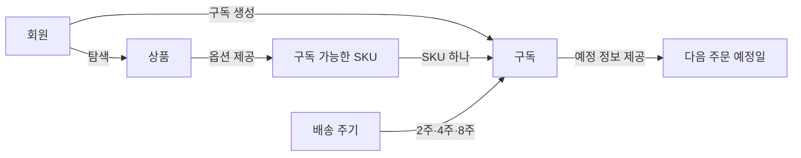

# PS-001 1차 MVP 흐름

## 제품 범위 도식



이 도식은 첫 번째 수직 MVP에서 다루는 제품 개념과 관계만 보여준다. 배송 주기와 다음 주문 예정일은 구독을 설명하는 제품 개념 또는 값이며, 별도 엔티티로 확정하지 않는다.

다음 주문 예정일은 구독 생성일에 회원이 선택한 배송 주기를 더해 계산하는 표시용 예정 정보다. 실제 정기 주문 자동 생성과 배송 처리는 첫 번째 수직 MVP 범위에 포함하지 않는다.

## 사용자 흐름 도식


이 도식은 로그인한 회원이 SKU 하나를 대상으로 구독을 만들고 결과를 확인하는 대표 흐름을 보여준다. 회원은 배송 주기를 2주, 4주, 8주 중 하나로 선택한다.

일반 구매, 결제, 재고, 실제 배송, 정기 주문 자동 생성, 구독 변경 흐름은 첫 번째 MVP 도식에 포함하지 않는다.

## 텍스트 블록 도식

```text
┌──────────────┐
│ 회원 로그인  │
└──────┬───────┘
       │ 상품 탐색
       ▼
┌──────────────┐
│ 상품         │
└──────┬───────┘
       │ SKU 선택
       ▼
┌────────────────────┐
│ 구독 가능한 SKU    │
└─────────┬──────────┘
          │ 수량·배송 주기 선택
          │ 배송 주기: 2주·4주·8주
          ▼
┌────────────────────┐
│ 구독 생성           │
│                    │
│ 구독 회원           │
│ 대상 SKU 하나       │
│ 수량                │
│ 배송 주기           │
│ 다음 주문 예정일    │
└─────────┬──────────┘
          ▼
┌────────────────────┐
│ 자신의 구독 확인    │
└─────────┬──────────┘
          ▼
┌────────────────────┐
│ 다음 주문 예정일    │
│ 확인               │
└────────────────────┘
```

이 도식은 문서만으로도 대표 흐름을 읽을 수 있도록 같은 내용을 텍스트 블록으로 표현한다. 도식 안의 항목은 제품 관점의 개념과 사용자 행동이며, 데이터베이스나 애플리케이션 구성 요소를 뜻하지 않는다.

첫 번째 수직 MVP에는 다음 배송 예정일을 제공하지 않는다. 주문 예정일과 배송 예정일의 용어 구분, 날짜 계산 책임과 저장 방식은 후속 DOMAIN-001에서 구체화한다.
