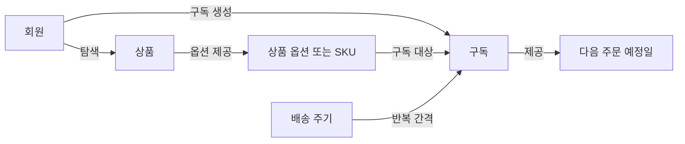

# PS-001 1차 MVP 흐름

## 제품 범위 도식



이 도식은 첫 번째 MVP에서 다루는 제품 개념과 관계만 보여준다. 배송 주기와 다음 주문 예정일은 구독을 설명하는 제품 개념 또는 값이며, 별도 엔티티로 확정하지 않는다.

## 사용자 흐름 도식


이 도식은 로그인한 회원이 SKU 하나를 대상으로 구독을 만들고 결과를 확인하는 대표 흐름을 보여준다. 일반 구매, 결제, 재고, 실제 배송, 구독 변경 흐름은 첫 번째 MVP 도식에 포함하지 않는다.

## 텍스트 블록 도식

```text
┌──────────────┐
│ 회원         │
└──────┬───────┘
       │ 상품 탐색
       ▼
┌──────────────┐
│ 상품         │
└──────┬───────┘
       │ 옵션 선택
       ▼
┌────────────────────┐
│ 상품 옵션 또는 SKU │
└─────────┬──────────┘
          │ 수량·배송 주기 선택
          ▼
┌────────────────────┐
│ 구독 생성           │
│                    │
│ 구독 회원           │
│ 대상 SKU            │
│ 수량                │
│ 배송 주기           │
│ 다음 주문 예정일    │
└─────────┬──────────┘
          ▼
┌────────────────────┐
│ 자신의 구독 확인    │
└────────────────────┘
```

이 도식은 문서만으로도 대표 흐름을 읽을 수 있도록 같은 내용을 텍스트 블록으로 표현한다. 도식 안의 항목은 제품 관점의 개념과 사용자 행동이며, 데이터베이스나 애플리케이션 구성 요소를 뜻하지 않는다.
